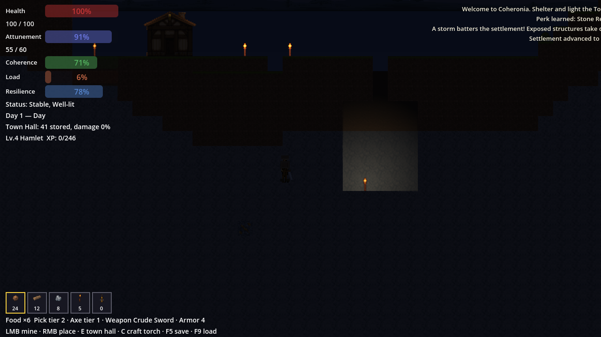
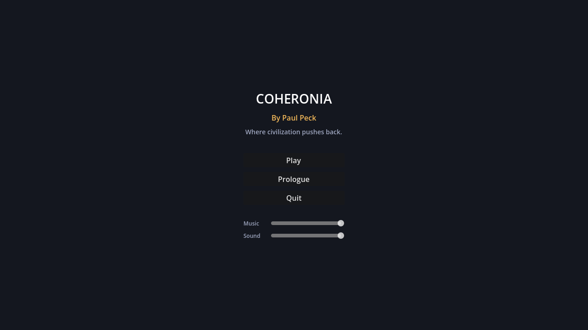

# Coheronia

**A side-view survival settlement sandbox where your civilization pushes back.**

Dig, build, and light a frontier settlement Terraria-style — then keep it alive as a tiny civilization sim scores your shelter, food, light, and defenses in real time and answers with settlers, raids, and storms.


`Godot 4.6 · GDScript · data-driven design · 257-check self-verifying test suite · adaptive music · image-first art pipeline`

## What it is

Coheronia sits between a survival sandbox and a civilization pressure sim. Minute to minute you mine tunnels, roof the hall, place torches, and haul food home. The settlement model turns those physical acts into three live pressures — **Coherence, Load, and Resilience** — computed from real world state (shelter blocks, light sources, stockpile, threats), never faked. A coherent, fed, lit settlement attracts settlers and ratchets from Camp to Hamlet to Village; a neglected one starves, empties, and cracks under night raids and storms.

It is also a **portfolio project in AI-orchestrated software engineering**: every increment was planned from a task queue, implemented, reviewed by an independent agent pass, verified by an automated in-engine test suite that has grown from 62 to 257 checks, and shipped with a signed evidence ledger. The full audit trail lives in this repo.

## Screenshots

| | |
|---|---|
| <br>*Night, torchlight, and real-time light occlusion* | <br>*Backpack + a 12-slot equipment model (weapon, tools, armor, rings, amulet)* |
| <br>*Town Hall: stockpile grid and forge stations with crafted states* | <br>*Skill tree: level-earned points, prerequisites, one live lane* |
| <br>*Character creation: 5 playable species with live effects, body variants, appearance, traits, roles* | <br>*World builder: presets, six difficulty axes, rule toggles, generation controls* |
| <br>*Roof-aware cave darkness: dig deep and daylight stays behind you; a torch holds the dark off locally* | <br>*Title screen: prologue replay, and the Music/Sound sliders wired to the adaptive score* |

*The in-world sprites, item icons, enemies, five player species, Town Hall, and parallax backdrops are real generated pixel art. The rendering path is image-first with a per-asset color/shape fallback, so anything not yet authored — player-gear overlays, opening-cinematic cels, UI icons — still renders from code and can be replaced one PNG at a time without touching game logic.*

## Feature highlights

- **Persistent shell** — characters and worlds are separate persistent objects. Characters own their backpack, hotbar, tools, and 12 gear slots and carry them between worlds; each world file owns its terrain history, settlement, threats, and progression.
- **Deterministic, configurable world generation** — seed + settings always produce the same world: terrain amplitude/frequency, ore/tree/bush density on independent seed channels, three world sizes, and unified leafy trees the player walks in front of and harvests for wood, so the surface stays walkable.
- **Survival loop with teeth** — hardness-timed mining with crack-stage feedback, tool tiers (forged pick, axe, crude sword and armor with flat mitigation), berry bushes that need soil and regrow, food, health, i-frames, collapse penalties, and passive recovery near the hall.
- **A settlement that reacts** — day/night cycle, night threats scaled by six difficulty axes, raiders drawn to fat stockpiles, cave crawlers underground, storms mitigated by real roof coverage, population 1–8 that eats, leaves, and arrives based on computed Coherence.
- **A world with depth** — a parallax scenic backdrop behind everything, natural backing walls revealed by mining (deterministic from the seed, provably unable to affect collision or lighting), and roof-aware cave darkness at any hour: dig deep and the daylight stays behind you unless you open a shaft to the sky, while your torches hold the dark off locally.
- **An adaptive score** — one original suite composed as a single piece in four states (day, night, underground, crisis) plus six phase-locked stems, switching seamlessly at the next musical bar from real game state: pressure builds it toward crisis with hysteresis so the music never thrashes, the hearth harmony swells with settlement Coherence, the work pulse follows your pick, the fracture layer wakes only at the collapse edge — and it all crossfades home when the settlement holds. Event stingers (dawn, nightfall, raid, attunement, base advance) ring out over a brief music-bus duck without ever stopping the score, Music/Sound sliders on the title screen set the runtime buses, and the whole director keeps breathing through pause. Native Godot `AudioStreamInteractive` + `AudioStreamSynchronized` — no middleware.
- **Progression stack** — six XP types feed player levels; levels grant perk points spent in a visual skill tree; base levels gate population; Attunement (the magic resource) regenerates and powers a first light-pulse ability, with ancestry/equipment/perk hooks already live.
- **Animated opening cinematic** — an eight-scene, ~42s founding myth plays before the title on first launch (any key advances, Esc skips, replayable from the menu): a DOS-style plotted world with keyframed puppet acting — roads unravel, the five peoples gather at a fire, builders raise the first hall beam by beam, the founder kneels and the world answers — rendered entirely in code at 640×360 with hard camera cuts and engine-rendered text: *COHERONIA · By Paul Peck · Where civilization pushes back.*
- **Everything is data** — blocks, recipes, enemies, 12 ancestries, XP curves, base levels, perk lanes, equipment, world presets, and item metadata are JSON authorities validated by a repo linter; most balance changes never touch code.

## Characters are data

A character is a persistent object that outlives any single world, and it is
defined entirely in JSON — the creation screen above is just a view onto these
files. Three authorities drive it:

- **[`data/character_data.json`](data/character_data.json)** — the creation
  contract: player tuning defaults, the five playable species, body variants,
  the trait pool (pick up to two), starter roles, and skin/trim appearance
  palettes.
- **[`data/ancestries.json`](data/ancestries.json)** — twelve ancestry
  definitions with lore, effect keys, spawn bands, and biome affinities; the
  five above are live and playable, the rest are validated data awaiting their
  phases (deep variants, gnome, lizardfolk, dragonkin).
- **[`data/player_visuals.json`](data/player_visuals.json)** — the 16×32 body
  rig: per-species skin palettes and regions, appearance recolor, and the
  optional gear/tool-swing overlay conventions.

A trait, a role, and a body rig look like this — no code changes to add or
tune one:

```jsonc
// data/character_data.json
{ "id": "miner", "display_name": "Born Miner",
  "description": "+20% mining speed.", "effects": { "mine_speed_mult": 1.2 } }

{ "id": "homesteader", "display_name": "Homesteader",
  "description": "Starts with building materials.",
  "starting_items": { "dirt": 10, "wood": 5 } }

// data/player_visuals.json — the dwarf body rig
"dwarf": {
  "skin_palette": ["f3ab36", "ca811c"],
  "skin_regions": [[6, 8, 6, 5], [1, 18, 4, 7], [10, 18, 4, 7]],
  "shoulder": [5, -3], "torso_size": [12, 8], "feet_width": 5
}
```

Characters own their backpack, hotbar, tools, 12 equipment slots, ancestry,
role, and traits and carry them between worlds; each world file owns its
terrain history, settlement, and progression. Persistence lives in
`user://shell.json` (profile + characters), separate from
`user://worlds/<id>.json`.

## The engineering story

This repo doubles as an experiment in disciplined AI-driven development:

- **Self-verifying build.** A smoke suite runs the *real game* — real input map, real physics, real saves — and asserts 257 checks: mining frame counts, save/load round-trips, legacy-save migrations, UI panel contents, a player physically walking past a tree, armor math to the decimal, a next-bar music crossfade actually reaching the requested clip, a game event firing its stinger. Every feature lands with new checks; the suite has never been allowed to stay red.
- **Evidence over claims.** Every increment ships with a run ledger in [`.project/runs/`](.project/runs/) recording scope, decisions, review findings and their resolutions, and validation output — plus machine-readable packets in `.project/atlas_outbox/` and `.project/boh_outbox/`.
- **Independent review loop.** Each change was reviewed by a separate agent pass before commit; findings (from save-corruption edge cases to invisible-tint rendering bugs) are documented and fixed in the ledgers.
- **Task queue discipline.** Work follows [`docs/FABLE_TASK_QUEUE.md`](docs/FABLE_TASK_QUEUE.md) one bounded increment at a time — FQ-00 through FQ-09 plus the FQ-09R/S/V/C/W/A/M and U0–U3 refinements (skill-tree star map, variant art pools, the opening cinematic, backdrops and cave darkness, the asset roadmap, action effects, and the full adaptive-music arc) on top of the v0.1–v0.6 foundation, each documented in [`docs/HANDOFF.md`](docs/HANDOFF.md) and [`docs/VARIABLE_MATRIX.md`](docs/VARIABLE_MATRIX.md).

## Run it

Requires [Godot 4.6+](https://godotengine.org/). No plugins, no imports, no build step.

```powershell
& <path-to-godot-4.6> --path <this-repo-root>
```

Or open the folder in the Godot editor and press Play.

| Action | Input |
|---|---|
| Move / jump | A/D or arrows · Space |
| Mine / hit | Hold left mouse |
| Place block | Right mouse |
| Hotbar | 1–5 |
| Town Hall | E or T |
| Inventory / Skill tree | I / K |
| Eat food / Attunement pulse | H / R |
| Craft torch | C |
| Save / Load | F5 / F9 |
| Save & exit to shell | Esc |

**Verify the build** (validators + the 257-check in-engine suite):

```powershell
python scripts/validate_repo.py
python _protocol/Project_Ops_Capsule/scripts/capsule_doctor.py . --profile public_repo

$env:COHERONIA_SMOKE = "1"
Start-Process -FilePath "<path-to-godot-4.6>" -ArgumentList @("--path", "<this-repo-root>") -Wait
# results: user://smoke_results.json
```

**Regenerate the README screenshots** (staged capture tour — 9 shots; run windowed, not `--headless`, so the frame capture resolves):

```powershell
$env:COHERONIA_SHOTS = "1"
Start-Process -FilePath "<path-to-godot-4.6>" -ArgumentList @("--path", "<this-repo-root>") -Wait
# shots land in user://shots/ (Windows: %APPDATA%\Godot\app_userdata\Coheronia\shots)
# then copy the keepers into docs/screenshots/
```

## Architecture at a glance

```text
scenes/shell + scripts/shell     persistent shell: characters, worlds, world builder
scenes/main  + scripts/main      game root (day/night, storms, threats, progression),
                                 smoke suite, screenshot tour
scripts/world                    deterministic generation, block grid, lighting,
                                 data-authority registry
scripts/player                   movement, mining, combat, equipment, attunement, perks
scripts/settlement               Town Hall + the Coherence/Load/Resilience model
scripts/ui                       code-built HUD, icon-grid panels, skill tree
data/*.json                      the actual game design: blocks, recipes, enemies,
                                 ancestries, progression, equipment, presets, items
docs/                            handoff, variable matrix, task queue, future design
.project/                        run ledgers + evidence packets for every increment
```

Persistence: `user://shell.json` (profile + characters) and `user://worlds/<id>.json` (one file per world: config + terrain deltas + simulation state).

## Roadmap

The full adaptive-music arc, the opening cinematic, and the first real art pass
are done; the active queue ([`docs/FABLE_TASK_QUEUE.md`](docs/FABLE_TASK_QUEUE.md))
continues in bounded increments:

- **Next up — FQ-10: ore families and metallurgy** (copper/iron/coal/tin/silver/crystal as data, depth-banded generation), then the **station chain** (workbench, furnace, anvil, ingots).
- **Farming** on the bush-support groundwork (plantable, regrowable crops), and a **consolidated crafting menu**.
- **More enemies** from a 16-entry design roster (thornrat, ore_tick, raider_torchbearer … up to the hollow_king and world_worm bosses), each landing with its gameplay consumer.
- **Art backlog** (parallel, one PNG at a time via [`docs/ASSET_ROADMAP.md`](docs/ASSET_ROADMAP.md)): player-gear overlays, the remaining equipment icons, and the eight opening-cinematic cels.
- **Deeper systems** sketched in [`docs/FUTURE_PROGRESSION_RESEARCH_AND_BASE_LEVELS.md`](docs/FUTURE_PROGRESSION_RESEARCH_AND_BASE_LEVELS.md): the research bench MVP, perk-spending across more lanes, maps and scouting, underground-start generation for deep ancestries, and the civic layer (laws, districts, factions, legitimacy). Ancestries beyond the five playable ones exist as validated data awaiting their phases.

## Known limitations

Honest state of the build: some art is still code-drawn fallback (player-gear overlays, the opening-cinematic cels, and UI icons are not yet authored); the adaptive score ships but is one suite, tuned by ear and still balance-in-progress; settlers are abstract population, not NPCs; enemies walk-and-hop without pathfinding; there is one surface biome on finite maps (up to 360×100 tiles); and the inventory/equipment panels are read-only (no drag/drop yet).

---

*Built with the Project Ops Capsule protocol: every run records evidence; only signable runs update accepted truth.*
