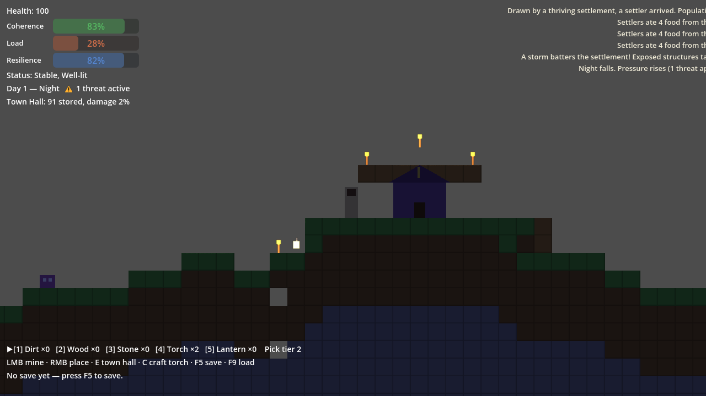

# Coheronia - v0.5 Enemies, Progression, and Ancestries

Coheronia is a Godot 4 side-view survival settlement sandbox inspired by the pleasures of Terraria-style digging/building, survival crafting, and civilization sims. The player is not just trying to survive as one person: the long-term fantasy is to carve out a place in a hostile world, rule a small civilization, and watch that civilization's needs, fears, politics, infrastructure, and defenses push back through play.



Today, the player reshapes terrain directly while managing a settlement through three systemic pressures: **Coherence / Load / Resilience**.

Current state: **v0.5 implemented and closed out** on Godot 4.6.1. The project launches into a persistent outer shell for characters, worlds, saves, and simulation settings. Each world is a configured simulation container: terrain seed, world size, generation variation, difficulty axes, rule toggles, save state, and summary metadata live together in `user://worlds/<id>.json`. On top of that, v0.5 brings the first slices of the three future design docs into live gameplay: data-driven enemies, player XP and base levels, and playable ancestries.

## Version Highlights

- v0.1: playable C/L/R vertical slice with movement, mining, block placement, torches, Town Hall stockpile, pressure events, HUD, and F5/F9 save/load.
- v0.2: tool-tier progression, ore gating, food loop, berry bushes, light occlusion, and threat persistence.
- v0.3: berry regrowth, dynamic population 1-8, storm hazard with roof mitigation, lanterns, and UX polish.
- v0.4: persistent shell, character creation/selection, world creation/selection, world size, presets, six difficulty axes, simulation rule toggles, per-block-type seed variation, and per-world save files.
- v0.5: data-driven enemies (surface slime, cave crawler, raider) with drops and difficulty-scaled density from `data/enemies.json`; player XP across six types with levels; base levels Camp -> Hamlet -> Village gating population growth; five playable ancestries with live player effects; full data models for all 16 enemies, 12 ancestries, research domains, and perk lanes.

## The Shell

The configured main scene is `res://scenes/shell/Shell.tscn`.

On launch:

1. Choose **Continue**, **Play**, or **Quit**.
2. Select or create a character.
3. Select or create a world.
4. Enter the playable settlement scene.

Character creation currently supports name, ancestry (human, dwarf, elf, goblin, orc), appearance, traits, and role/background. Ancestry effects are data-driven from `data/ancestries.json`: dwarves move and jump a little lower but mine stone and ore 20% faster, orcs carry +25 max health, elves jump higher, goblins run at 80% health, and humans learn 5% faster (all XP). The remaining seven ancestries (deep variants, gnome, lizardfolk, dragonkin) exist in data and unlock in later phases.

World creation supports:

- world name
- world size: small, medium, large
- seed, with 0 meaning random
- presets: Peaceful Builder, Folk Kingdom, Tyrant's Burden, Dark Frontier, Mythic Survival, Custom
- difficulty axes: enemy, ruler, survival, economy, social, subject impressionability
- environment danger
- generation controls: terrain amplitude/frequency, dirt depth, ore/tree/bush density, and independent ore/tree/bush seed channels
- simulation rules: food requirements, weather survival, lighting safety, darkness threat, enemy time scaling, plus reserved future social/survival toggles

Persistence lives in:

```text
user://shell.json
user://worlds/<id>.json
```

Esc in-game saves the current world and returns to the shell.

## Running

Open this folder as a Godot 4.6+ project and run the configured main scene.

From PowerShell:

```powershell
& <path-to-godot-4.6> --path <this-repo-root>
```

## Controls

| Action | Input |
|---|---|
| Move | A/D or arrow keys |
| Jump | Space |
| Mine / hit threat | Hold left mouse |
| Place selected block | Right mouse |
| Select hotbar slot | 1-5 |
| Interact with Town Hall | E or T |
| Craft torch | C |
| Save | F5 |
| Load | F9 |
| Debug overlay | F3 |
| Save and return to shell | Esc |

## Play Loop

Spawn near the Town Hall, mine dirt/wood/stone, gather food from berry bushes, place blocks and torches, shelter the hall, deposit resources, forge the tier-2 pick, mine ore, craft lanterns, feed the settlement, survive night slimes and the occasional raider, watch for cave crawlers underground, roof against storms, repair damage, and repeat. Everything you do earns XP (combat, labor, survival, civic, exploration, craft) toward player levels, and a sheltered, lit, fed settlement ratchets from Camp to Hamlet to Village, raising the population cap. C/L/R bars are computed from real world state, not decorative values.

## Design Direction

Coheronia is meant to sit between a survival sandbox and a civilization pressure sim. The world should feel physical and cozy in the minute-to-minute: mine a tunnel, roof a hall, place a torch, bring food home. Over time, those simple actions should become the foundation of rule: subjects need food and shelter, raids test defenses, scarcity stresses loyalty, darkness changes public safety, and the player's choices shape whether the settlement becomes a folk kingdom, a fragile frontier town, or a collapsing tyranny.

Planned civilization systems include subject roles, civic upgrades, ruler legitimacy, morale, loyalty, rebellion pressure, infrastructure needs, and events where enemies are not just monsters but political and social forces. The current v0.4 shell already stores many of these knobs as world rules so later gameplay can consume them without rewriting the save model.

Future design references:

- `docs/FUTURE_ENEMY_DESIGN.md`: planned enemy families, bosses, loot, density, and expansion order.
- `docs/FUTURE_ANCESTRIES_AND_BIOMES.md`: planned ancestry, biome, spawn, player-effect, and settlement-effect matrices.
- `docs/FUTURE_PROGRESSION_RESEARCH_AND_BASE_LEVELS.md`: planned player XP, base levels, research, laws, districts, factions, and world-scale progression.

As of v0.5 the first slices of all three documents are live: the three MVP enemies, player XP/base levels, and five Phase B ancestries. The full matrices (remaining enemies, bosses, deep ancestries, research, perks, laws, districts) are present as validated data models in `data/` but not yet live gameplay.

## Architecture

```text
scenes/shell/Shell.tscn          persistent shell entrypoint
scripts/shell/shell_ui.gd        title, character, and world screens
scripts/shell/game_state.gd      autoload: profile, characters, worlds
scripts/shell/world_config.gd    per-world simulation rules and defaults
scenes/main/Main.tscn            playable scene root
scripts/main/game_root.gd        day/night, storms, threats, population, flow
scripts/main/smoke_test.gd       automated acceptance smoke test
scenes/world/World.tscn          grid, TileMapLayer, lights
scripts/world/world.gd           mining, placement, deltas, regrowth
scripts/world/world_gen.gd       config-driven deterministic generation
scripts/world/block_registry.gd  data authority autoload
scripts/player/player.gd         movement, mining, placement, traits
scripts/save/save_manager.gd     per-world state collection/application
scripts/settlement/*.gd          Town Hall and C/L/R model
scripts/ui/hud.gd                code-built HUD
```

Data authorities:

- `data/blocks.json`: block behavior, drops, light, tags
- `data/recipes.json`: craft/forge recipes
- `data/settlement_rules.json`: C/L/R formulas, clamps, tick rate
- `data/world_settings.json`: sizes, defaults, presets, difficulty/rule/generation defaults
- `data/character_data.json`: species, traits, roles, appearances
- `data/enemies.json`: enemy defs, drops, spawn rules, density, difficulty scaling (loaded by `scripts/data/enemy_registry.gd`)
- `data/ancestries.json`: 12 ancestries with player/settlement effects and biome affinities (loaded by `scripts/data/ancestry_registry.gd`)
- `data/progression/*.json`: player XP events, base levels, research domains, perk lanes (loaded by `scripts/data/progression_registry.gd`)

## Validation

```powershell
python scripts/validate_repo.py
python _protocol/Project_Ops_Capsule/scripts/capsule_doctor.py . --profile public_repo
```

Automated smoke:

```powershell
$env:COHERONIA_SMOKE = "1"
& <path-to-godot-4.6> --path <this-repo-root>
```

When using the Windows GUI Godot binary from a non-interactive shell, prefer:

```powershell
$env:COHERONIA_SMOKE = "1"
Start-Process -FilePath "<path-to-godot-4.6>" -ArgumentList @("--path", "<this-repo-root>") -Wait
```

The smoke test exercises the real gameplay path and currently contains 90 checks covering shell persistence, world config, input bindings, movement, mining, tool tiers, food/regrowth, population, rule toggles, difficulty scaling, lanterns, C/L/R reactions, storm mitigation, threat persistence, save/load, world size, per-block seed variation, density controls, character trait effects, data-driven enemy spawning and drops, XP awards and level curve, base-level advancement and population gating, and ancestry player effects.

In addition to console `SMOKE` lines, it writes:

```text
user://smoke_results.json
user://smoke_screenshot.png   # windowed runs only
```

## Known Limitations

- Placeholder art: colored tiles and `_draw()` rectangles; no animation or audio.
- Population is still abstract; settlers are not simulated as NPCs.
- Enemy movement is simple walk/hop with no pathfinding; raiders walk at the hall, crawlers ambush underground.
- Base levels cap at Village (level 3) for now; Town, Keep, and City-State exist in data only.
- Perk lanes and research domains are validated data, not yet spendable/researchable in play.
- Pre-v0.4 standalone saves at `user://coheronia_save.json` are not migrated into the new shell world files.
- Several rule toggles are reserved for future systems: sleep, sickness, morale, loyalty decay, rebellion, ruler pressure growth, and scarcity growth.
- Social difficulty is stored but not yet consumed by a social simulation.
- A character entering a world last played by another character inherits that world's player state; traits and appearance come from the entering character.
- Terrain is finite, up to 360 x 100 tiles, with one surface biome.

## Protocol

This repo includes the Project Ops Capsule under `.project/` and `_protocol/Project_Ops_Capsule/`.

```text
Every run records evidence; only signable runs update accepted truth.
```

Run ledgers live in `.project/runs/`. Atlas/BOH packets live in `.project/atlas_outbox/` and `.project/boh_outbox/`.
