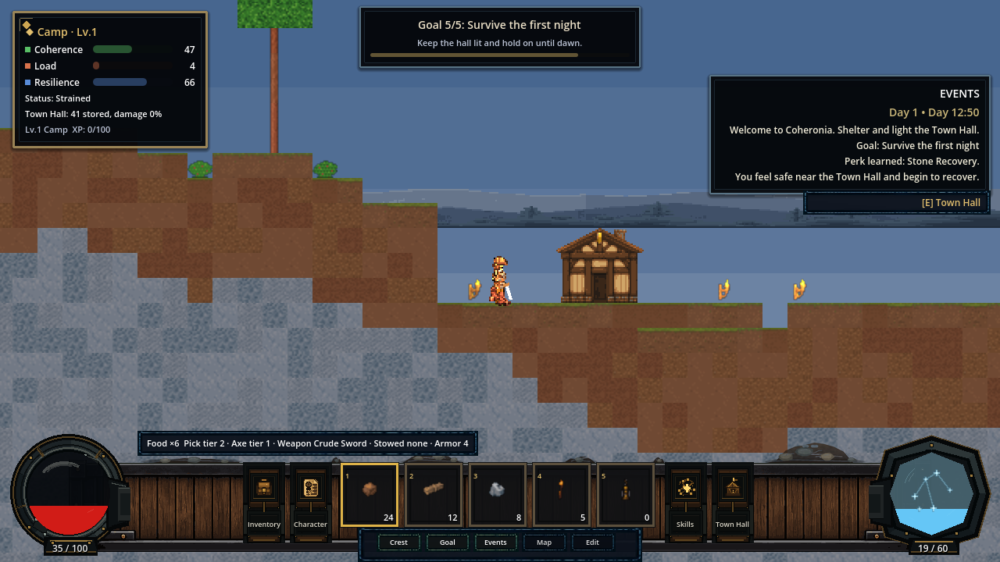

# Coheronia

**A side-view survival settlement sandbox where your civilization pushes back.**

Dig, build, and light a side-view frontier settlement — then keep it alive as a tiny civilization sim scores your shelter, food, light, and defenses in real time and answers with settlers, raids, and storms.


`Godot 4.6 · GDScript · data-driven design · 334-check in-engine smoke suite · adaptive music · layered image-first UI pipeline`

## What it is

Coheronia sits between a survival sandbox and a civilization pressure sim. Minute to minute you mine tunnels, roof the hall, place torches, and haul food home. The settlement model turns those physical acts into three live pressures — **Coherence, Load, and Resilience** — computed from real world state (shelter blocks, light sources, stockpile, threats), never faked. A coherent, fed, lit settlement attracts settlers and ratchets from Camp to Hamlet to Village; a neglected one starves, empties, and cracks under night raids and storms.

It is also a **portfolio project in AI-orchestrated software engineering**: every increment was planned from a task queue, implemented, reviewed by an independent agent pass, and checked by an automated in-engine suite that has grown from 62 to 334 checks. The maintained handoff and verification commands live in this repository.

## Screenshots

| | |
|---|---|
| <br>*Night, torchlight, and real-time light occlusion* | <br>*Town Hall: stockpile, station chain, and crafted-state controls* |
| <br>*Open the inventory with **I** to manage carried stacks, loadout slots, and the five-slot dock* | <br>*The native HUD keeps vessel fills, values, slots, icons, counts, and actions live at runtime* |

*The in-world sprites, every current inventory/live-drop icon, all six live enemy families, all ten player bodies, the Town Hall, parallax backdrops, eight opening-scene cel pools, and 120 body-specific crude-gear/tool overlays are real generated pixel art. High-repetition terrain, flora, ores, enemies, and player bodies also have runtime-selected visual pools. Missing or unresolved images keep a procedural fallback, while the primary dock uses a 19-asset layered kit whose runtime values and states remain separate from its PNG chrome.*


## 📖 Prologue

[](https://youtu.be/QQ2BuoXqErk)

Watch the opening cinematic and story introduction.

Direct link: [prologue](docs/screenshots/clips/coheronia.prologue.07162026.1125.mp4) 


## 🎮 Gameplay

[](https://youtu.be/-KxICidJK2A)

Watch the latest gameplay demonstration.

> **HUD note:** this gameplay video predates the current native HUD and inventory board. The screenshots above (captured 2026-07-17) are the accurate reference for the live interface.

Direct link: [gameplay](docs/screenshots/clips/coheronia.gameplay.07162026.1135.mp4)
---

## Explore the build wiki

[Open the Coheronia Wiki](docs/wiki/wiki.md) for the repo-backed reference on live systems, inventory and crafting routes, HUD asset rules, image coverage, planned data, and known limitations. GitHub renders this Markdown entrypoint directly; the repository also includes a richer local [visual wiki wrapper](docs/wiki/index.html).

## Feature highlights

- **Persistent shell and inventory** — characters and worlds are separate persistent objects. Characters own their backpack, dock layout, hotbar selection, tools, and 12 gear slots and carry them between worlds; the openable **I** inventory board exposes the loadout, backpack, item detail, sorting, and five-slot dock while each world file owns its terrain history, settlement, threats, and progression.
- **Deterministic, configurable world generation** — seed + settings always produce the same world: terrain amplitude/frequency, ore/tree/bush density on independent seed channels, three world sizes, and unified leafy trees the player walks in front of and harvests for wood, so the surface stays walkable.
- **Survival loop with teeth** — hardness-timed mining with crack-stage feedback, tool tiers (forged pick, axe, crude sword and armor with flat mitigation), a metallurgy chain that smelts depth-banded ores into ingots at the furnace and forges iron gear at the anvil, berry bushes that need soil and regrow, plantable farming (till soil, sow seeds, ripen, harvest food) as a reliable food path, food, health, i-frames, collapse penalties, and passive recovery near the hall.
- **A settlement that reacts** — day/night cycle, night threats scaled by six difficulty axes, raiders drawn to fat stockpiles (plus torchbearers that burn the hall faster), crop-eating thornrats that pressure your farms and ore ticks that cling to the veins, cave crawlers underground, storms mitigated by real roof coverage, population 1–8 that eats, leaves, and arrives based on computed Coherence.
- **A world with depth** — a parallax scenic backdrop behind everything, natural backing walls revealed by mining (deterministic from the seed, provably unable to affect collision or lighting), and roof-aware cave darkness at any hour: dig deep and the daylight stays behind you unless you open a shaft to the sky, while your torches hold the dark off locally.
- **An adaptive score** — one original suite composed as a single piece in four states (day, night, underground, crisis) plus six phase-locked stems, switching seamlessly at the next musical bar from real game state: pressure builds it toward crisis with hysteresis so the music never thrashes, the hearth harmony swells with settlement Coherence, the work pulse follows your pick, the fracture layer wakes only at the collapse edge — and it all crossfades home when the settlement holds. Event stingers (dawn, nightfall, raid, attunement, base advance) ring out over a brief music-bus duck without ever stopping the score, Music/Sound sliders on the title screen set the runtime buses, and the whole director keeps breathing through pause. Native Godot `AudioStreamInteractive` + `AudioStreamSynchronized` — no middleware.
- **Progression stack** — six XP types feed player levels; levels grant perk points spent in a visual skill tree; base levels gate population; Attunement (the magic resource) regenerates and powers a first light-pulse ability, with ancestry/equipment/perk hooks already live.
- **Animated opening cinematic** — an eight-scene, ~42s founding myth plays before the title on first launch (any key advances, Esc skips, replayable from the menu): a DOS-style plotted world with keyframed puppet acting — roads unravel, the five peoples gather at a fire, builders raise the first hall beam by beam, the founder kneels and the world answers — rendered entirely in code at 640×360 with hard camera cuts and engine-rendered text: *COHERONIA · By Paul Peck · Where civilization pushes back.*
- **Learns as you play** — a compact, state-driven goal panel walks the first loop (gather → light the hall → deposit → forge a tool/build a station → survive the night) from real game state, not scripted tutorial text: it advances only when you actually do the thing, never regresses, re-derives the right step after a save/reload, and tucks away with a keypress (**O**).
- **Scoutable world** — a schematic map panel (**M**) reveals the world band by band *as you explore* — nothing is X-rayed. It marks the Town Hall, your position, ore pockets, and live enemy pressure inside scouted bands only; discovered regions persist compactly in the world save, and the explorer "Biome Reveal" perk widens each step's scouted band. Map and Events are independent movable modules and can remain open together.
- **Authored visual coverage with real variety** — all data-referenced blocks, inventory/live-drop icons, and live enemies now have canonical pixel art; seventeen high-repetition block ids carry three deterministic per-cell looks, every enemy family carries three lifetime-stable looks, and every player body offers two authored alternatives beyond its canonical form. Items deliberately stay canonical-only so a stack never changes icon during a refresh.
- **Everything is data** — blocks, recipes, enemies, 12 ancestries, XP curves, base levels, perk lanes, equipment, world presets, and item metadata are JSON authorities validated by a repo linter; most balance changes never touch code.

## Characters are data

A character is a persistent object that outlives any single world, and it is
defined entirely in JSON — the creation screen above is just a view onto these
files. Three authorities drive it:

- **[`data/character_data.json`](data/character_data.json)** — the creation
  contract: player tuning defaults, the five playable species, body variants,
  the trait pool (pick up to two), starter roles, and skin/trim appearance
  palettes.
- **[`data/ancestries.json`](data/ancestries.json)** — twelve ancestry
  definitions with lore, effect keys, spawn bands, and biome affinities; the
  five above are live and playable, the rest are validated data awaiting their
  phases (deep variants, gnome, lizardfolk, dragonkin).
- **[`data/player_visuals.json`](data/player_visuals.json)** — the 16×32 body
  rig: per-species skin palettes and regions, appearance recolor, and the
  optional gear/tool-swing overlay conventions.

A trait, a role, and a body rig look like this — no code changes to add or
tune one:

```jsonc
// data/character_data.json
{ "id": "miner", "display_name": "Born Miner",
  "description": "+20% mining speed.", "effects": { "mine_speed_mult": 1.2 } }

{ "id": "homesteader", "display_name": "Homesteader",
  "description": "Starts with building materials.",
  "starting_items": { "dirt": 10, "wood": 5 } }

// data/player_visuals.json — the dwarf body rig
"dwarf": {
  "skin_palette": ["f3ab36", "ca811c"],
  "skin_regions": [[6, 8, 6, 5], [1, 18, 4, 7], [10, 18, 4, 7]],
  "shoulder": [5, -3], "torso_size": [12, 8], "feet_width": 5
}
```

Characters own their backpack, hotbar, tools, 12 equipment slots, ancestry,
role, and traits and carry them between worlds; each world file owns its
terrain history, settlement, and progression. Persistence lives in
`user://shell.json` (profile + characters), separate from
`user://worlds/<id>.json`.

## The engineering story

This repo doubles as an experiment in disciplined AI-driven development:

- **Self-verifying build.** A smoke suite runs the *real game* — real input map, real physics, real saves — and now asserts 334 checks: mining frame counts, save/load round-trips, legacy-save migrations, UI panel contents, simultaneous Map/Events state, native HUD-kit layering and themed-asset fallback, a player physically walking past a tree, armor math to the decimal, a next-bar music crossfade actually reaching the requested clip, and a game event firing its stinger. The 2026-07-17 inventory-focused smoke passed 5/5; the full suite is currently 332/334 while its music clip-switch and inventory drag/sort checks are repaired.
- **Evidence over claims.** Increment scope, decisions, review findings, and validation state are summarized in [`docs/HANDOFF.md`](docs/HANDOFF.md). Historical raw protocol artifacts are still tracked; their fit with the current public-repository profile is explicitly flagged for owner review rather than silently presented as settled policy.
- **Independent review loop.** Each change was reviewed by a separate agent pass before commit; findings (from save-corruption edge cases to invisible-tint rendering bugs) are documented and fixed in the ledgers.
- **Task queue discipline.** Work follows [`docs/FABLE_TASK_QUEUE.md`](docs/FABLE_TASK_QUEUE.md) one bounded increment at a time — FQ-00 through FQ-09 plus the FQ-09R/S/V/C/W/A/M and U0–U3 refinements (skill-tree star map, variant art pools, the opening cinematic, backdrops and cave darkness, the asset roadmap, action effects, and the full adaptive-music arc) on top of the v0.1–v0.6 foundation, each documented in [`docs/HANDOFF.md`](docs/HANDOFF.md) and [`docs/VARIABLE_MATRIX.md`](docs/VARIABLE_MATRIX.md).

## Run it

Requires [Godot 4.6+](https://godotengine.org/). No plugins, no imports, no build step.

```powershell
& <path-to-godot-4.6> --path <this-repo-root>
```

Or open the folder in the Godot editor and press Play.

| Action | Input |
|---|---|
| Move / jump | A/D or arrows · Space |
| Mine / hit | Hold left mouse |
| Place block | Right mouse |
| Hotbar | 1–5 |
| Town Hall | E or T |
| Inventory / Skill tree | I / K |
| Goals / Map | O / M |
| Eat food / Attunement pulse | H / R |
| Craft torch | C |
| Save / Load | F5 / F9 |
| Save & exit to shell | Esc |

**Verify the build** (validators + the 334-check in-engine suite):

```powershell
python scripts/validate_repo.py
python scripts/asset_audit.py --strict
python scripts/art/sync_hud_kit.py --verify-runtime
python _protocol/Project_Ops_Capsule/scripts/capsule_doctor.py . --profile public_repo

$env:COHERONIA_SMOKE = "1"
Start-Process -FilePath "<path-to-godot-4.6>" -ArgumentList @("--path", "<this-repo-root>") -Wait
# results: user://smoke_results.json
```

**Regenerate the README screenshots** (staged capture tour — 14 shots, including five HUD QA frames; run windowed, not `--headless`, so the frame capture resolves):

```powershell
$env:COHERONIA_SHOTS = "1"
Start-Process -FilePath "<path-to-godot-4.6>" -ArgumentList @("--path", "<this-repo-root>") -Wait
# shots land in user://shots/ (Windows: %APPDATA%\Godot\app_userdata\Coheronia\shots)
# then copy the keepers into docs/screenshots/
```

## Architecture at a glance

```text
scenes/shell + scripts/shell     persistent shell: characters, worlds, world builder
scenes/main  + scripts/main      game root (day/night, storms, threats, progression),
                                 smoke suite, screenshot tour
scripts/world                    deterministic generation, block grid, lighting,
                                 data-authority registry
scripts/player                   movement, mining, combat, equipment, attunement, perks
scripts/settlement               Town Hall + the Coherence/Load/Resilience model
scripts/ui                       layered HUD-kit assembly, movable modules,
                                 icon-grid panels, skill tree
data/*.json                      the actual game design: blocks, recipes, enemies,
                                 ancestries, progression, equipment, presets, items
docs/                            handoff, variable matrix, task queue, future design
.project/                        historical protocol records; public-profile
                                 governance review is pending
```

Persistence: `user://shell.json` (profile + characters) and `user://worlds/<id>.json` (one file per world: config + terrain deltas + simulation state).

## Roadmap

The full adaptive-music arc, the opening cinematic, and the first real art pass
are done; the active queue ([`docs/FABLE_TASK_QUEUE.md`](docs/FABLE_TASK_QUEUE.md))
continues in bounded increments:

- **Shipped since the last art pass** — **FQ-10–15** added ore families, metallurgy stations, farming, three pressure-specific enemies, deterministic visual pools, the state-driven goal panel, and persistent scouting. **FQ-16–21** added the player-state dock, movable HUD modules, dock navigation, runtime vessels, and several painted-chrome experiments. The current stabilization pass supersedes the fragile sliced-band path with a native 19-asset HUD kit, keeps Map and Events independent, and retains the older constructions only as fallbacks.
- **Next up** — big-ticket playability items from `docs/FABLE_TASK_QUEUE.md`: a pause/settings/keybinds panel, save-slot management, build-preview placement tint, a local quest/contracts layer on the goal system, and a subject/NPC labor MVP.
- **More enemies** from a 16-entry design roster (mini-bosses and the hollow_king / world_worm bosses remain), each landing with its gameplay consumer, and a **consolidated crafting menu**.
- **Art backlog** — polish the current HUD chrome one contract-safe PNG at a time via the [`HUD Asset Replacement Studio`](docs/wiki/hud_asset_replacement_studio.md); extend body-specific gear beyond the currently covered crude armor, pick, and axe families; refine action poses; and expand opening-scene animation only where it improves the existing authored cel pools.
- **Deeper systems** sketched in [`docs/FUTURE_PROGRESSION_RESEARCH_AND_BASE_LEVELS.md`](docs/FUTURE_PROGRESSION_RESEARCH_AND_BASE_LEVELS.md): the research bench MVP, perk-spending across more lanes, underground-start generation for deep ancestries, and the civic layer (laws, districts, factions, legitimacy). Ancestries beyond the five playable ones exist as validated data awaiting their phases.

## Known issues and limitations

- **Gear presentation is not fully reliable yet.** The repository ships 120 body-specific PNGs for crude helmet/torso/feet overlays and three-phase basic-pick, forged-pick, and crude-axe swings. During some character/load transitions a matching overlay can fail to appear or align correctly, leaving the procedural fallback or an incomplete-looking character. Equipment data and effects still load; the defect is visual.
- **Tool and weapon motion needs another pass.** Pick and axe art currently snaps through three authored poses. The anchors, arc continuity, mirroring, and timing need polish, and the sword does not yet have an equivalent authored attack sequence.
- **The HUD architecture is stabilized, but the art is provisional.** The primary dock now separates static chrome from runtime values and uses JSON-owned native geometry. Some framed panel states still show padding, masking, or oversized opaque-region defects, particularly in automated captures; the legacy painted/sliced constructions remain fallback code, not the target design.
- **Two full-smoke assertions are currently red.** The live clip-switch and inventory drag/sort checks failed in the 2026-07-17 332/334 full run. The focused inventory smoke passed 5/5, and the fresh inventory/HUD capture tour completed; the broader failures still need a runtime repair before the suite can be called fully green.
- **Several systems remain intentionally shallow.** Inventory/equipment is read-only with no drag/drop or unequip flow; settlers are abstract population rather than NPCs; enemies walk and hop without pathfinding; the adaptive score is one suite still being balanced; and current finite maps have one surface biome.

---

*Built with the Project Ops Capsule protocol: every run records evidence; only signable runs update accepted truth.*
