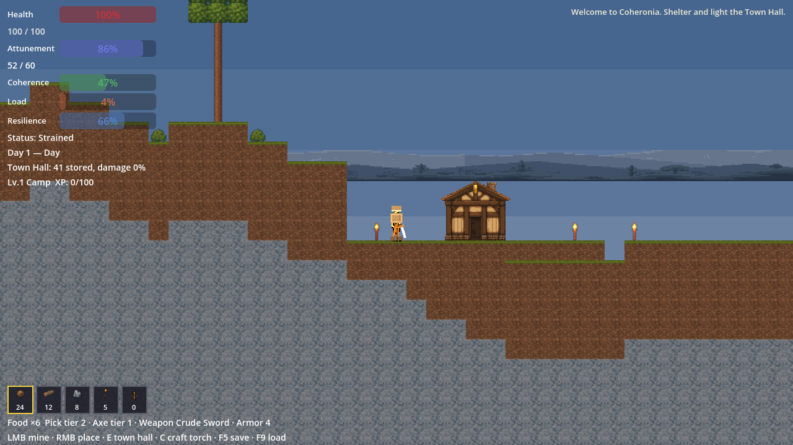
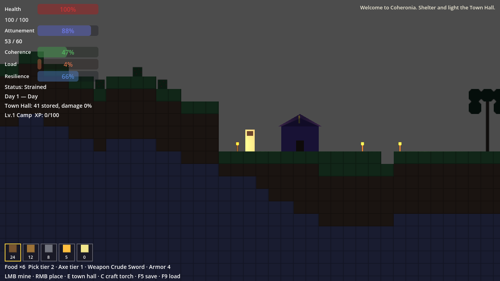
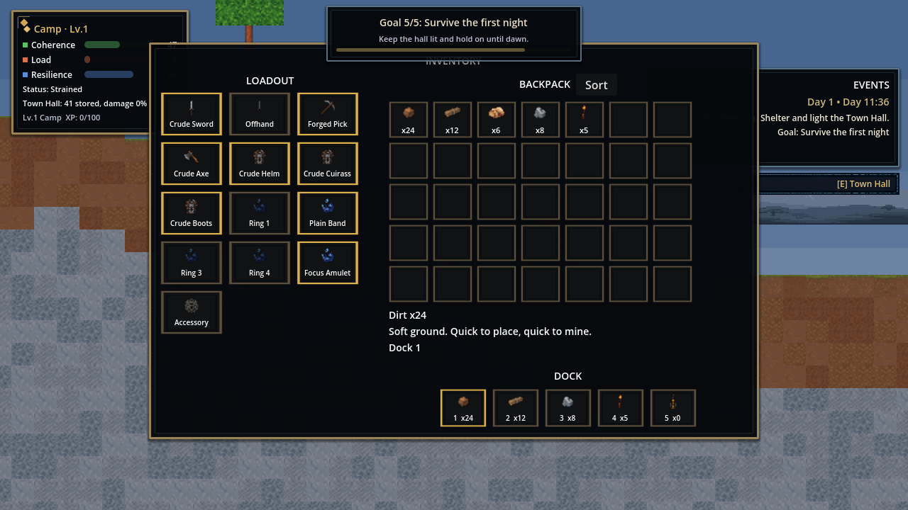
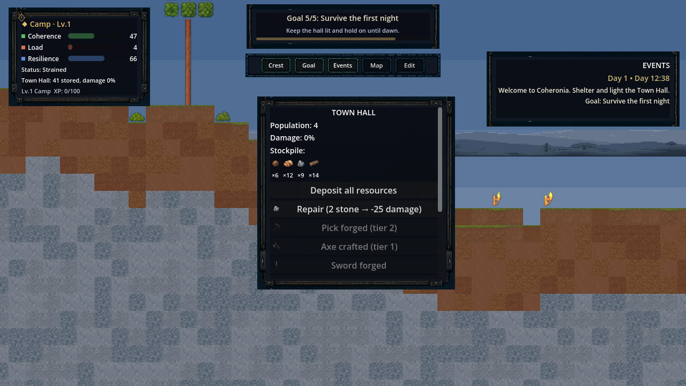
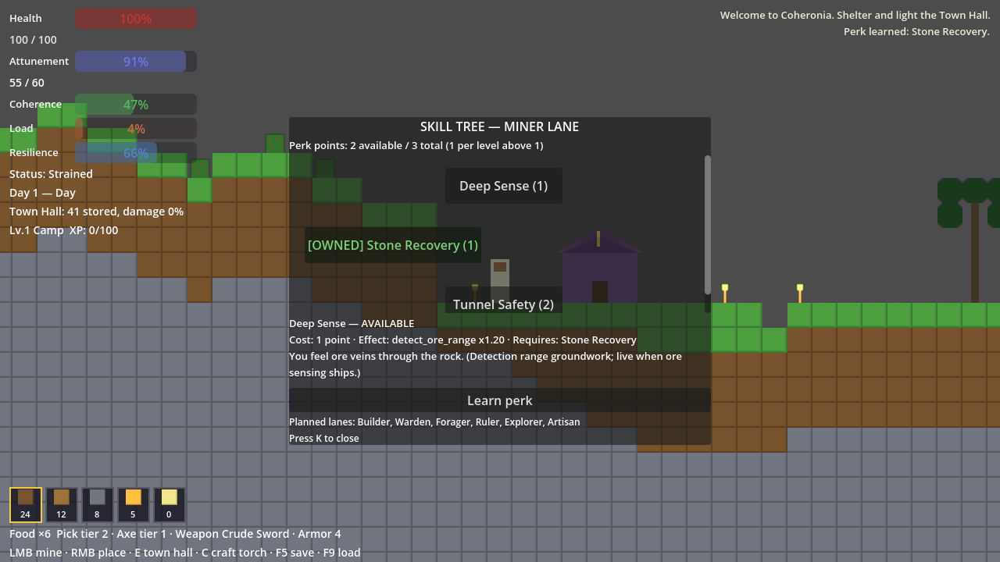
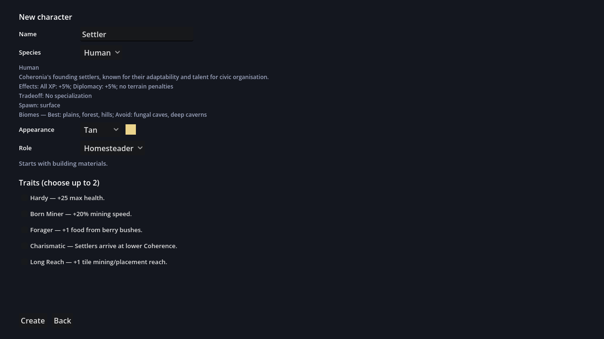
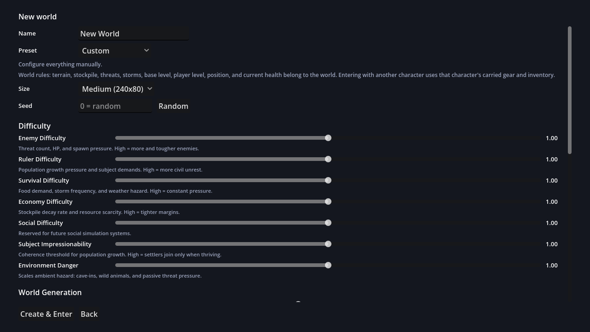

# Coheronia

**A side-view survival settlement sandbox where your civilization pushes back.**

Dig, build, and light a frontier settlement Terraria-style — then keep it alive as a tiny civilization sim scores your shelter, food, light, and defenses in real time and answers with settlers, raids, and storms.



`Godot 4.6 · GDScript · data-driven design · 203-check self-verifying test suite · fallback art pipeline`

## What it is

Coheronia sits between a survival sandbox and a civilization pressure sim. Minute to minute you mine tunnels, roof the hall, place torches, and haul food home. The settlement model turns those physical acts into three live pressures — **Coherence, Load, and Resilience** — computed from real world state (shelter blocks, light sources, stockpile, threats), never faked. A coherent, fed, lit settlement attracts settlers and ratchets from Camp to Hamlet to Village; a neglected one starves, empties, and cracks under night raids and storms.

It is also a **portfolio project in AI-orchestrated software engineering**: every increment was planned from a task queue, implemented, reviewed by an independent agent pass, verified by an automated in-engine test suite that has grown from 62 to 203 checks, and shipped with a signed evidence ledger. The full audit trail lives in this repo.

## Screenshots

| | |
|---|---|
| <br>*Night, torchlight, and real-time light occlusion* | <br>*Backpack + a 12-slot equipment model (weapon, tools, armor, rings, amulet)* |
| <br>*Town Hall: stockpile grid and forge stations with crafted states* | <br>*Skill tree: level-earned points, prerequisites, one live lane* |
| <br>*Character creation: 5 playable ancestries with live effects, traits, roles* | <br>*World builder: presets, six difficulty axes, rule toggles, generation controls* |

*All rendering is intentional placeholder art (generated tiles and swatches) — an image-first asset pipeline with per-asset color fallback is already wired, so real art can land one PNG at a time without touching code.*

## Feature highlights

- **Persistent shell** — characters and worlds are separate persistent objects. Characters own their backpack, hotbar, tools, and 12 gear slots and carry them between worlds; each world file owns its terrain history, settlement, threats, and progression.
- **Deterministic, configurable world generation** — seed + settings always produce the same world: terrain amplitude/frequency, ore/tree/bush density on independent seed channels, three world sizes, and unified leafy trees the player walks in front of and harvests for wood, so the surface stays walkable.
- **Survival loop with teeth** — hardness-timed mining with crack-stage feedback, tool tiers (forged pick, axe, crude sword and armor with flat mitigation), berry bushes that need soil and regrow, food, health, i-frames, collapse penalties, and passive recovery near the hall.
- **A settlement that reacts** — day/night cycle, night threats scaled by six difficulty axes, raiders drawn to fat stockpiles, cave crawlers underground, storms mitigated by real roof coverage, population 1–8 that eats, leaves, and arrives based on computed Coherence.
- **Progression stack** — six XP types feed player levels; levels grant perk points spent in a visual skill tree; base levels gate population; Attunement (the magic resource) regenerates and powers a first light-pulse ability, with ancestry/equipment/perk hooks already live.
- **Animated opening cinematic** — an eight-scene, ~42s founding myth plays before the title on first launch (any key advances, Esc skips, replayable from the menu): a DOS-style plotted world with keyframed puppet acting — roads unravel, the five peoples gather at a fire, builders raise the first hall beam by beam, the founder kneels and the world answers — rendered entirely in code at 640×360 with hard camera cuts and engine-rendered text: *COHERONIA · By Paul Peck · Where civilization pushes back.*
- **Everything is data** — blocks, recipes, enemies, 12 ancestries, XP curves, base levels, perk lanes, equipment, world presets, and item metadata are JSON authorities validated by a repo linter; most balance changes never touch code.

## The engineering story

This repo doubles as an experiment in disciplined AI-driven development:

- **Self-verifying build.** A smoke suite runs the *real game* — real input map, real physics, real saves — and asserts 203 checks: mining frame counts, save/load round-trips, legacy-save migrations, UI panel contents, a player physically walking past a tree, armor math to the decimal. Every feature lands with new checks; the suite has never been allowed to stay red.
- **Evidence over claims.** Every increment ships with a run ledger in [`.project/runs/`](.project/runs/) recording scope, decisions, review findings and their resolutions, and validation output — plus machine-readable packets in `.project/atlas_outbox/` and `.project/boh_outbox/`.
- **Independent review loop.** Each change was reviewed by a separate agent pass before commit; findings (from save-corruption edge cases to invisible-tint rendering bugs) are documented and fixed in the ledgers.
- **Task queue discipline.** Work follows [`docs/FABLE_TASK_QUEUE.md`](docs/FABLE_TASK_QUEUE.md) one bounded increment at a time — ten increments (FQ-00 … FQ-09) so far on top of the v0.1–v0.6 foundation, each documented in [`docs/HANDOFF.md`](docs/HANDOFF.md) and [`docs/VARIABLE_MATRIX.md`](docs/VARIABLE_MATRIX.md).

## Run it

Requires [Godot 4.6+](https://godotengine.org/). No plugins, no imports, no build step.

```powershell
& <path-to-godot-4.6> --path <this-repo-root>
```

Or open the folder in the Godot editor and press Play.

| Action | Input |
|---|---|
| Move / jump | A/D or arrows · Space |
| Mine / hit | Hold left mouse |
| Place block | Right mouse |
| Hotbar | 1–5 |
| Town Hall | E or T |
| Inventory / Skill tree | I / K |
| Eat food / Attunement pulse | H / R |
| Craft torch | C |
| Save / Load | F5 / F9 |
| Save & exit to shell | Esc |

**Verify the build** (validators + the 190-check in-engine suite):

```powershell
python scripts/validate_repo.py
python _protocol/Project_Ops_Capsule/scripts/capsule_doctor.py . --profile public_repo

$env:COHERONIA_SMOKE = "1"
Start-Process -FilePath "<path-to-godot-4.6>" -ArgumentList @("--path", "<this-repo-root>") -Wait
# results: user://smoke_results.json
```

**Regenerate the README screenshots** (staged capture tour — 8 shots including a title-screen extra not used below):

```powershell
$env:COHERONIA_SHOTS = "1"
Start-Process -FilePath "<path-to-godot-4.6>" -ArgumentList @("--path", "<this-repo-root>") -Wait
# shots land in user://shots/ (Windows: %APPDATA%\Godot\app_userdata\Coheronia\shots)
# then copy the keepers into docs/screenshots/
```

## Architecture at a glance

```text
scenes/shell + scripts/shell     persistent shell: characters, worlds, world builder
scenes/main  + scripts/main      game root (day/night, storms, threats, progression),
                                 smoke suite, screenshot tour
scripts/world                    deterministic generation, block grid, lighting,
                                 data-authority registry
scripts/player                   movement, mining, combat, equipment, attunement, perks
scripts/settlement               Town Hall + the Coherence/Load/Resilience model
scripts/ui                       code-built HUD, icon-grid panels, skill tree
data/*.json                      the actual game design: blocks, recipes, enemies,
                                 ancestries, progression, equipment, presets, items
docs/                            handoff, variable matrix, task queue, future design
.project/                        run ledgers + evidence packets for every increment
```

Persistence: `user://shell.json` (profile + characters) and `user://worlds/<id>.json` (one file per world: config + terrain deltas + simulation state).

## Roadmap

The active queue continues with ore families and metallurgy, station chains (workbench/furnace/anvil), farming on the bush-support groundwork, more enemies from a 16-enemy design roster, maps and scouting, and the civic layer (laws, districts, factions, legitimacy) sketched in [`docs/FUTURE_PROGRESSION_RESEARCH_AND_BASE_LEVELS.md`](docs/FUTURE_PROGRESSION_RESEARCH_AND_BASE_LEVELS.md). Ancestries beyond the five playable ones (deep variants, gnome, lizardfolk, dragonkin) exist as validated data awaiting their phases.

## Known limitations

Placeholder art and no audio (pipeline ready); settlers are abstract population, not NPCs; enemies walk-and-hop without pathfinding; one surface biome on finite maps (up to 360×100 tiles); panels are read-only (no drag/drop yet).

---

*Built with the Project Ops Capsule protocol: every run records evidence; only signable runs update accepted truth.*
