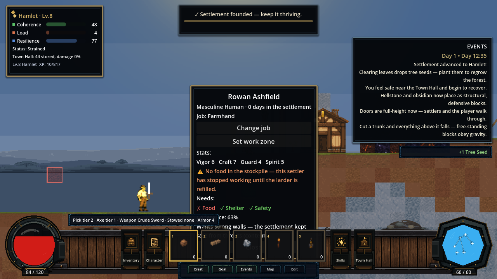
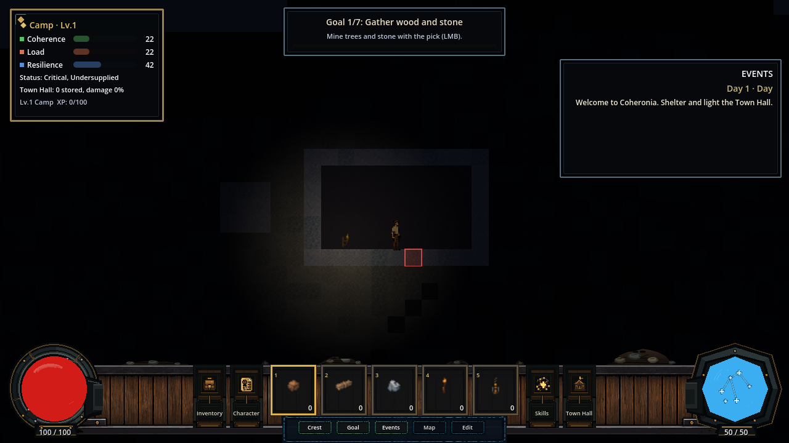
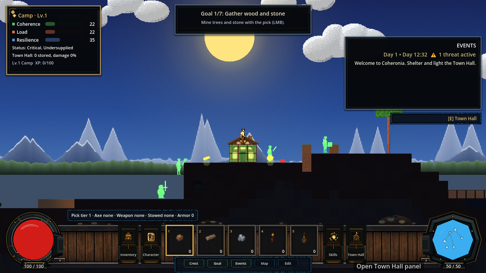

# Coheronia — Systems-Driven Survival Settlement Sandbox

Dig, build, and light a side-view frontier settlement — then keep it alive as a tiny civilization sim scores your shelter, food, light, and defenses in real time and answers with settlers, raids, and storms. Visible citizens with their own ancestries, names, and stats farm, haul, repair, and **defend** the settlement, working against the same world you dig.


`Godot 4.6 · GDScript · data-driven design · procedural world depths · leveled liquid physics · adaptive music · large in-engine smoke suite`

### Watch it

**📖 Prologue** — the opening cinematic and story intro:

[](https://youtu.be/QQ2BuoXqErk)

**🎮 Gameplay** — the latest gameplay demonstration: [youtu.be/uR5a-ZjHHEc](https://youtu.be/uR5a-ZjHHEc)

Pick the section that fits you:

- **[🎮 For players](#players)** — how to run it, the controls, the loop, and a look at the world.
- **[🛠️ For developers](#developers)** — architecture, data authorities, the repo layout, and how to build & verify.
- **[🧭 How it's built](#how-its-built)** — the engineering approach, verification, and evidence trail.
- **[📓 Changelog](#changelog)** · **[🗺️ Roadmap](#roadmap)** · **[⚠️ Known issues](#known-issues)**

---

<a name="players"></a>
<details open>
<summary><h2>🎮 For players</h2></summary>

### What it is

Coheronia sits between a survival sandbox and a civilization pressure sim. Minute to minute you **mine tunnels, roof the hall, place torches, and haul food home**. The settlement quietly grades everything you build into three live pressures — **Coherence, Load, and Resilience** — computed from the real world (shelter blocks, light sources, stockpile, threats). A coherent, fed, lit settlement attracts settlers and grows from **Camp → Hamlet → Village**; a neglected one starves, empties, and cracks under night raids and storms.

Dig straight down and the world becomes a **vertical descent** — stone, then deepstone, then a **hell biome** of hellstone, obsidian, and pooled **lava** that flows, glows, and burns. Water flows too, fills lakes, and turns lava into obsidian on contact. Swim in it, drown in it, scoop it into a bucket.

### Run it

Requires [Godot 4.6+](https://godotengine.org/). No plugins, no imports, no build step.

```
<path-to-godot-4.6> --path <this-repo-root>
```

Or open the folder in the Godot editor and press **Play**. On first launch a short animated prologue plays — press any key to advance, **Esc** to skip.

### Controls

| Action | Key(s) |
|---|---|
| Move left / right | **A** / **D**  (or **←** / **→**) |
| Jump · swim up in liquid | **Space**  (hold to swim up) |
| Mine block · attack enemy | **Left mouse**  (hold) |
| Place block · use held item (bucket, sapling, door) | **Right mouse** |
| Farm — till soil, plant a seed, harvest | **G** |
| Select hotbar slot | **1 – 9** |
| Interact — Town Hall, doors | **E** |
| Town Hall panel | **T** |
| Inventory | **I** |
| Crafting | **C** |
| Skills (your Calling) | **K** |
| Map | **M** |
| Goals | **O** |
| Eat food | **H** |
| Attunement — resonance pulse (reveals nearby objects of interest through the fog) | **R** |
| Swap weapon | **W** |
| **Zoom the view in / out** | **Mouse wheel**, or **+** / **−** |
| **Fullscreen** | **F11** |
| Quick save · load | **F5** / **F9** |
| Pause — settings, keybinds, save, restore, quit | **Esc** |

**Esc** opens a real pause menu (it closes an open panel first). Its **Settings** screen holds **View Zoom** and **Fullscreen** toggles, Music/SFX volume, and full keyboard **rebinding** — all saved to your profile. Prefer more of the map on screen? Scroll out, or drag the **View Zoom** slider.

### The first loop

The in-game **Goals** panel (**O**) walks you through all **seven** objectives from real progress — it only advances when you actually do the thing:

1. **Gather** wood and stone (hold **Left mouse** on trees and rock).
2. **Light the hall** — craft torches (**C**) and place them (**Right mouse**).
3. **Deposit** resources at the Town Hall (**E** / **T**).
4. **Forge a tool or build a station** at the unified crafting panel (**C**).
5. **Survive the night** — threats scale after dark; torches, walls, and a defender hold the line.
6. **Build a house** — wall in a room with a door (craft doors with **C**) to raise settlement housing.
7. **Post a defender** — open the Town Hall (**E**) and cycle a settler to **Defender** to guard the walls.

### A look at the world

| | |
|---|---|
| <br>*Night falls — torchlight holds the line* | <br>*Dig deep enough and you reach the hell biome — hellstone, obsidian, and pooled lava* |
| <br>*Water flows and fills lakes* | <br>*Swim below the surface and your Breath gauge drains — surface before it runs out* |
| <br>*A visible farmhand works the land and stocks the larder* | <br>*Click any settler to see its name, ancestry, job, and stats* |
| <br>*Press **C** — every recipe grouped by station, with have/need per input* | <br>*Open the inventory with **I** — drag and drop stacks, gear, and the hotbar dock* |
| <br>*Your **Calling** (**K**) — a constellation of tiered skills you click star-by-star, every one wired to a real effect* | <br>*Create a world — size, seed, preset, difficulty, and rule toggles* |
| <br>*Fog of war — you see only what's in line of sight; explored terrain lingers as a dim silhouette* | <br>*The Attunement resonance pulse (**R**) lights up objects of interest — hall & settlers green, enemies red, ore/items gold — with a countdown on the status HUD* |

### What you can do

- **Mine, build, and light** a side-view world with hardness-timed mining, crack-stage feedback, tool tiers, and torches/lanterns that carve real light out of the dark.
- **See only what you can perceive** — a 360° line-of-sight **fog of war** veils the unseen and keeps explored terrain as a dim remembered silhouette (creatures and effects need current sight). The **Attunement resonance pulse** (**R**) briefly lights up nearby enemies, settlers, items, structures, and ore veins *through* the dark, its countdown shown on a status-effect HUD. Dark-adapted ancestries see farther underground, and the whole veil is a world rule you can switch off.
- **Descend** through deterministic strata into caves and a hell biome; **lava and water** flow as real fluids, fill lakes, react into obsidian, and can drown or burn you.
- **Grow a settlement** that reacts: a day/night cycle, night raids drawn to fat stockpiles, crop-eating thornrats, cave crawlers, storms mitigated by real roof coverage, and a population that arrives and leaves based on how well you're doing.
- **Assign settlers** to four jobs — **farmhand**, **hauler**, **repairer**, and **defender** — and give any of them a work zone to tend.
- **Craft a full gear ladder** — crude → bronze → iron → deep obsidian/hellstone weapons and armor, plus silver/crystal rings and an ember amulet — by smelting depth-banded ores at the furnace and forging at the anvil and workbench.
- **Farm** a renewable food supply (till soil, sow seeds, harvest, replant) and a **renewable forest** (plant tree seeds that grow back).
- **Grow your character** across a permanent **Calling** (Oathbound, Wayfarer, or Runewright) with two Paths of tiered skills, plus scouting, the Attunement resonance pulse, and directed **Contracts**.

### Who you are — ancestries & Callings

At character creation you pick a playable **ancestry** and a permanent **Calling**, then grow that Calling's skill tree as you level.

**Ancestries** — five playable peoples, each with its own look and innate bent (further ancestries exist as validated data awaiting their phases):

| Ancestry | Bent |
|---|---|
| **Human** | Adaptable founding settlers with a talent for civic organisation. |
| **Dwarf** | Mountain-born craftspeople, at home among stone halls and ore routes. |
| **Elf** | Forest-keepers who thrive in harmony with the land. |
| **Orc** | Frontier-hardened warriors built for rough, contested ground. |
| **Goblin** | Resourceful scavengers who turn ruins into workshops and traps. |

**Callings** — one permanent identity chosen at creation, each an innate effect plus **two Paths of twelve tiered skills** (24 per Calling; every skill wired to a real gameplay effect). Open the tree with **K** — a clickable **star constellation**; spend points as you level, with reachability-safe tier gates.

| Calling | Innate | Two Paths |
|---|---|---|
| **Oathbound** — sworn defender | Takes reduced damage from enemies, and the protection strengthens while the settlement is under assault. | **Warden** (defense & resilience) · **Vanguard** (weapon power) |
| **Wayfarer** — ranging explorer | Moves faster beyond the walls and permanently reveals more of the map. | **Prospector** (mining & ore) · **Trailseeker** (mobility & scouting) |
| **Runewright** — keeper of hearth & resonance | Structure repairs restore more health, and Attunement bonuses reach further. | **Hearthwright** (repair & building) · **Resonant** (Attunement & the light-pulse) |

</details>

---

<a name="developers"></a>
<details>
<summary><h2>🛠️ For developers</h2></summary>

Coheronia is a data-driven Godot 4.6 project: blocks, recipes, enemies, equipment, ancestries, progression, and world presets are JSON authorities, and the systems read from them. State ownership is explicit, and an in-engine smoke harness exercises the real game.

### Architecture at a glance

| Concern | Implementation | Where |
|---|---|---|
| **Simulation from world state** | Shelter, light, stockpile, threats, and population feed Coherence, Load, and Resilience — computed from real world state, never faked. | [`scripts/settlement/`](scripts/settlement) · [`docs/VARIABLE_MATRIX.md`](docs/VARIABLE_MATRIX.md) |
| **Visible subject simulation** | A bounded citizenry with four assignable jobs works against the same world/stockpile authorities as the aggregate sim; the abstract population stays the single food-accounting authority, so a settler is never charged food twice. | [`scripts/entities/subject.gd`](scripts/entities/subject.gd) · [`scripts/world/world.gd`](scripts/world/world.gd) |
| **Persistent state ownership** | Characters own inventory, loadout, and progression (they carry between worlds); worlds own terrain deltas and settlement simulation. | [`scripts/shell/`](scripts/shell) · [`scripts/inventory/`](scripts/inventory) |
| **Data-first design** | Blocks, recipes, enemies, equipment, ancestries, and world presets are JSON authorities validated by a repo linter; most balance changes never touch code. | [`data/`](data) · [`scripts/validate_repo.py`](scripts/validate_repo.py) |
| **Procedural world depths** | Deterministic terrain from a seed: fraction-based strata (stone → deepstone → hell), a mixed cavern/tunnel carve pass, lava/water as data-driven blocks. Saves store `world_seed` + player edits only; a `gen_version` stamp keeps existing worlds byte-identical as the generator evolves. | [`scripts/world/world_gen.gd`](scripts/world/world_gen.gd) · [`data/world_settings.json`](data/world_settings.json) |
| **Leveled liquid physics** | Lava and water flow as a deterministic, mass-conserving cellular automaton: per-cell fill level, pour-down/equalize-sideways, sleep-when-settled, partial-fill rendering, a lava+water→obsidian reaction, and a scoop/pour bucket. Generated liquid is sealed in rock (mine to release). | [`scripts/world/fluid_sim.gd`](scripts/world/fluid_sim.gd) · [`data/blocks.json`](data/blocks.json) |
| **Runtime UI composition** | HUD chrome is separate from live values; inventory mutations are validated at the UI boundary. | [`scripts/ui/hud.gd`](scripts/ui/hud.gd) · [`scripts/ui/inventory_slot_cell.gd`](scripts/ui/inventory_slot_cell.gd) |
| **Verification as a feature** | Validators and an in-engine smoke harness exercise saves, physics, UI, and system contracts. | [`docs/HANDOFF.md`](docs/HANDOFF.md) · [`scripts/main/smoke_test.gd`](scripts/main/smoke_test.gd) |

### Characters are data

A character is a persistent object that outlives any single world, defined entirely in JSON — the creation screen is a view onto these files. No code changes to add or tune a trait, a Calling, or a body rig:

```jsonc
// data/character_data.json
{ "id": "miner", "display_name": "Born Miner",
  "description": "+20% mining speed.", "effects": { "mine_speed_mult": 1.2 } }

{ "id": "oathbound", "display_name": "Oathbound",
  "description": "Sworn defender of the settlement.",
  "paths": ["warden", "vanguard"],
  "innate": { "name": "Resolve",
              "description": "Reduces hostile-creature damage; stronger during a settlement assault." } }

// data/player_visuals.json — the dwarf body rig
"dwarf": {
  "skin_palette": ["f3ab36", "ca811c"],
  "skin_regions": [[6, 8, 6, 5], [1, 18, 4, 7], [10, 18, 4, 7]],
  "shoulder": [5, -3], "torso_size": [12, 8], "feet_width": 5 }
```

Three authorities drive it: [`data/character_data.json`](data/character_data.json) (creation contract, species, traits, Callings, palettes), [`data/ancestries.json`](data/ancestries.json) (twelve ancestries — five live, the rest validated data awaiting their phases), and [`data/player_visuals.json`](data/player_visuals.json) (the 16×32 body rig). Persistence lives in `user://shell.json` (profile + characters), separate from `user://worlds/<id>.json`.

### Repo layout

```text
scenes/shell + scripts/shell     persistent shell: characters, worlds, world builder
scenes/main  + scripts/main      game root (day/night, storms, threats, progression),
                                 smoke suite, screenshot tour
scripts/world                    deterministic generation, block grid, lighting, fluids,
                                 data-authority registry
scripts/player                   movement, mining, combat, equipment, attunement, perks
scripts/entities                 visible subject actors: bounded roam, jobs, stats
scripts/settlement               Town Hall + the Coherence/Load/Resilience model
scripts/ui                       layered HUD-kit assembly, movable modules, panels
data/*.json                      the actual game design: blocks, recipes, enemies,
                                 ancestries, progression, equipment, presets, items
docs/                            handoff, variable matrix, task queue, wiki, design
```

```text
data/*.json ───────► registries / validators ───────► world, player, settlement systems
shell profile ─────► character state ───► inventory / equipment / dock ───► runtime HUD
world save ─────────► terrain deltas + simulation ───► smoke harness + evidence docs
```

Persistence: `user://shell.json` (profile + characters) and `user://worlds/<id>.json` (one file per world: config + terrain deltas + simulation state).

### Build & verify

No build step — run it straight from the project:

```powershell
& <path-to-godot-4.6> --path <this-repo-root>
```

Validators plus the in-engine smoke suite (run windowed so the frame capture and rendering checks resolve):

```powershell
python scripts/validate_repo.py
python scripts/asset_audit.py --strict
python scripts/art/sync_hud_kit.py --verify-runtime
python scripts/art/verify_gear_alignment.py

$env:COHERONIA_SMOKE = "1"
Start-Process -FilePath "<path-to-godot-4.6>" -ArgumentList @("--path", "<this-repo-root>") -Wait
# results: user://smoke_results.json
```

The smoke suite asserts hundreds of checks against the real game (input map, physics, saves) and is windowed-clean; the **windowed run is canonical** (frame-capture and renderer checks need a real surface). One check, `r06_texture_prep_delegates`, is renderer-dependent and is skipped under the *headless* display server (a texture-scaling detail with no window), so a headless run reports one skip and no failures. GitHub Actions builds and smokes both a Linux/X11 export and a Windows export — launching the exported artifact in smoke mode — on every push; CI is the current pass/fail evidence.

### Regenerate the screenshots

The staged capture tour renders the README shots to `user://shots/` and quits. Run it **windowed** (not `--headless`) so the frame capture resolves; the camera uses your saved **View Zoom**, so shots reflect the in-game view.

```powershell
$env:COHERONIA_SHOTS = "1"
Start-Process -FilePath "<path-to-godot-4.6>" -ArgumentList @("--path", "<this-repo-root>") -Wait
# shots land in %APPDATA%\Godot\app_userdata\Coheronia\shots
# copy the keepers into docs/screenshots/, then re-import: <godot> --headless --import --path <repo>
```

### Explore the build wiki

[Open the Coheronia Wiki](docs/wiki/wiki.md) for the repo-backed reference on live systems, inventory and crafting routes, HUD asset rules, image coverage, planned data, and known limitations. GitHub renders this Markdown entrypoint directly; the repo also includes a richer local [visual wiki wrapper](docs/wiki/index.html).

</details>

---

<a name="how-its-built"></a>
<details>
<summary><h2>🧭 How it's built</h2></summary>

Coheronia is an experiment in disciplined, AI-orchestrated development — every increment is scoped, implemented against explicit data authorities, reviewed independently, and checked in-engine. The repository exposes both the playable architecture and the evidence trail behind it.

- **Self-verifying build.** A smoke suite runs the *real game* — real input map, real physics, real saves — and asserts hundreds of checks across mining, save/load round-trips, legacy migrations, UI panel contents, HUD-kit layering, physics traversal, armor math, the Calling identity system (three Callings → six Paths → 72 tiered skills, all wired to real hooks), the full metal-gear ladder, adaptive-music transitions, the character-rendering contract, the visible-subject labor loop, directed-goal contracts, the procedural world depths (fractional strata, caves, and the hell/lava biome in every world size), the leveled liquid physics (lava and water pour, conserve mass, settle, react into obsidian, and burn the player and enemies), level-aware submersion with a breath/drowning gauge, plant-on-tilled-soil farming, per-column underground depth shading, and event stingers. The windowed run is canonical and clean; the exported artifact runs green with six `res://` fixture checks skipped only under read-only export. The verifier is fail-closed — a crash, compile error, or nonzero exit fails even if a stale results file says PASS.
- **Evidence over claims.** Increment scope, decisions, review findings, and validation state are summarized in [`docs/HANDOFF.md`](docs/HANDOFF.md) and traced in [`docs/VARIABLE_MATRIX.md`](docs/VARIABLE_MATRIX.md) (every variable, its authority, and its consumers).
- **Independent review loop.** Each change was reviewed by a separate agent pass before commit; findings (from save-corruption edge cases to invisible-tint rendering bugs) are documented and fixed in the ledgers.
- **Task queue discipline.** Work follows [`docs/FABLE_TASK_QUEUE.md`](docs/FABLE_TASK_QUEUE.md) one bounded increment at a time, each documented in the handoff and variable matrix.
- **Determinism & save-safety.** Terrain regenerates from `world_seed` + player edits, gated by a `gen_version` stamp so existing worlds stay byte-identical as the generator evolves; saves are atomic with `.bak` recovery and are never silently discarded on corruption.

</details>

---

<a name="changelog"></a>
<details>
<summary><h2>📓 Changelog</h2></summary>

Dated shipped milestones, newest first (full detail in [`docs/HANDOFF.md`](docs/HANDOFF.md)):

- **2026-08-26 — HUD Phase C: dock-wing Crest & Events, compact command tray.** The **Crest** and **Events** readouts are now built into the two wooden dock wings instead of floating over the world. The **left wing** shows the three settlement pressures as **vertical instrument gauges** in a recessed brass socket — Coherence, Load, and Resilience, each with an authored metric icon, a bottom-to-top fill, and its exact value. The **right wing** is a compact **journal**: an icon+value header (`[journal] Day  ·  [clock] HHMM` military time) over the **three most-recent events**, each led by an authored category icon (raids, storms, dawn/nightfall, arrivals, construction, goals…) and a concise summary; clicking a wing opens the full detail, and one paired record keeps the complete history. The module toolbar is trimmed to hug **Goal / Map / Edit**. The old **top-right contextual popups are gone** entirely — no more "Dirt ×0" selected-item toast, "[E] Town Hall" prompt, "Game saved" toast, or "+N Item" pickup toast; the hotbar, inventory, docked journal, and pause menu already carry that information. All gameplay screenshots regenerated against the docked HUD. Source smoke **582/582**; Linux + Windows CI (the rare `perception_resonance_e2e_through_fog` check is a known intermittent, tracked with a per-entity failure breakdown).
- **2026-08-20 — Perception veil + Attunement resonance.** A new **fog of war** (world rule `fog_of_war`, **on by default**, unchecked in world settings to disable). A tile-aligned **360° line-of-sight** model (recursive shadowcasting, `scripts/world/perception.gd`) grades every cell into *visible* (full render), *remembered* (a dim, desaturated silhouette of terrain you've seen — persisted per world), or *unseen* (a near-black veil), rendered by the shared cave shader with a soft radial sight rim; creatures, loose items, and live effects need **current** sight. Sight range is a composable resolver — a day/night base **plus a dark-adapted "dark sight"** bonus some ancestries keep underground, with gear/weather/Calling hooks reserved. The formerly-inert Attunement pulse (**R**) becomes a **resonance ping**: it lights up every object of interest on screen — enemies (red), settlers & town hall (green), items/ore (gold), doors/stations (cyan), liquid hazards (amber) — *through* the veil and out of sight, via a silhouette-masked recolor shader for creatures and a batched additive fill for terrain, all fading over a ~10 s countdown shown on a new **status-effect HUD** element. Windowed smoke **568/568**. (Known limit: sun/torch light still leaks through 1×1 diagonal block seams — a pre-existing 2D-lighting detail, not the veil.)
- **2026-08-19 — Atmospheric biome backdrop + softer lighting.** Replaced the flat scenic backdrop with a **data-driven, biome-aware parallax sky** and toned down harsh 2D lighting. A new procedural generator (`scripts/art/gen_backgrounds.py`, numpy/Pillow, palettes sampled from the prologue) authors each biome's layers — a graded sky with a horizon glow, **chunky pixel-art cumulus clouds** (elliptical, dithered volume shading lit from overhead), and stacked **angular snow-capped mountain ranges** with atmospheric perspective and a dithered pixel treatment shared across mountains, treeline, and clouds. Layers scroll at independent, whole-pixel parallax (no jitter) and use wide, mismatched tiling periods so repetition isn't visible. The whole thing is defined in **`data/biomes.json`** (`world_backdrop.gd` renders it; the validator and asset audit are biome-driven), so new biomes are a data entry plus art — the structure ships now with one `surface` biome. **Lighting:** torch/lantern, lava, and the sun's broad daytime pool were softened (and the glow core eased) so lights no longer blow out the stone and characters next to them; and the **sun/moon now render in the world canvas behind terrain** (occluded by blocks, still bright via an ambient un-tint) instead of drawing over everything. Windowed smoke **559/559**.
- **2026-08-19 — Genesis-style FM music suite.** Replaced the placeholder score with an authored **16-bit-console synth** suite while leaving the adaptive engine untouched. A new numpy renderer (`scripts/audio/gen_music.py`) synthesizes the sound of the era — **YM2612-style FM voices** (a sine carrier phase-modulated with a bright-attack modulation-index envelope for the round basses, glassy bells, and warm pads) plus **SN76489-style PSG** square-wave arpeggios and noise percussion — in a warm RPG/pastoral voice across the four contexts (bright day, reflective night, dark underground, driving crisis), the six phase-locked settlement stems, and five event stingers. Everything renders to the exact 72 BPM / 16-bar / 48 kHz grid the director and asset verifier require (seamless loops, non-clipping stem mixes). This also **restores the layered stem bed**, which the old wrong-length stems had silently disabled. Windowed smoke **559/559**; `verify_music_assets.py` green.
- **2026-08-18 — Operator bug-fix & polish pass.** Five play-tested fixes, no balance change. **Menu wheel guard:** scrolling to the bottom of an open menu (HUD editor, crafting, any inventory-class modal) no longer silently re-zooms the world behind it — the wheel is captured while a menu is open (`+`/`-`/`F11` still work). **Lava-slime simmer:** the molten `lava_slime` now releases **one bubble at a time on a 2.4–5.0 s random gap** instead of a constant fizz. **Sealed generated liquids (`gen_version 5`):** the world-gen seal pass now also walls the non-solid decoration faces (trees/bushes) the fluid sim quietly flows through, so a generated pool no longer floods the moment you mine an adjacent block; existing worlds regenerate byte-identically. **Interior sun & moon light:** a cavern or building with a window, doorway, or cave mouth now catches sun/moonlight — the cave-depth shader marches a cheap line-of-sight toward the body, so any unobstructed slant path admits light (roofed-over cells still stay dark). **Constellation skill tree:** the skills screen is redrawn as a **clickable star-map** — each skill is a star placed by tier and joined into per-Path constellations; owned stars glow, the next-available ones twinkle, and clicking a star opens the same learn/inspect readout. Windowed smoke **552/552**.
- **2026-08-14 — Windows CI gate + smoke-suite decomposition (S-07.3).** Two developer-facing changes, no gameplay/save/gen change. **CI now also builds a real Windows export and launches the exported `.exe` in smoke mode on every push** — the actual ship target is verified end-to-end, alongside the existing Linux/X11 job. And the monolithic smoke harness was split behind a shared context object: `smoke_test.gd` **7,454 → 4,596 lines**, with every cleanly-separable domain lifted into a focused `scripts/main/smoke/*.gd` module (audio, citizens, contracts, crafting/farming, enemies, equipment, goal-panel, liquid/traits, map/scouting, persistence, progression, settings, settler-crew). Check names, count, and order are preserved; the tightly-coupled sections are deliberately left in the coordinator. Windowed smoke **552/552**.
- **2026-08-12 — Art pass: filled the remaining sprite gaps.** Authored art for the last code-drawn subjects — the `lava_slime` and `raider_sapper` enemies (with variants), the `door`/`door_open`/`tree_sapling` blocks and their `door`/`tree_seed` inventory icons, the reserved goals/settings/drag-state UI icons, **worn-armor overlays for the bronze/iron/hellstone tiers across all ten bodies**, idle-pose swords, and dedicated inventory icons for the equipment and tool tiers (so a forged pick now reads apart from a basic one). Includes a door variant-coherence fix so a full-height door shows a single consistent open leaf. Screenshots regenerated. Windowed smoke **552/552**.
- **2026-08-12 — Background & underground light legibility (S-07.1c follow-up).** Play-testing at native size drove a short lighting pass. The scenic backdrop no longer shows **black through surface ponds** (its under-earth fill anchors to the wall line, not the water top); the backing walls **receive light again** and are lifted off near-black; the cave-depth shader is **ambient-only** (a `light()` function lights each tile's true albedo) so an underground torch is no longer suppressed by depth and **reads from a cave mouth**; the depth transition is **eased** so walls don't pop as you move; and **torches/lanterns are shadowless soft glows** so the rock they're carved into can't clip their own light (the sun/moon keep their shadows, so daylight still stops at the surface). Windowed smoke **551/551**.
- **2026-08-11 — S-07 stabilization: presentation & consistency.** A polish pass with no gameplay, save/gen, or balance change. **S-07.1b:** a responsive **640×360 character-creation** layout, a modal dim-scrim **taste knob**, a **swing-arc strike FX**, and an authored **four-tier sword swing family** (`sword_crude`/`iron`/`bronze`/`obsidian`, all species/variants/phases). **S-07.1c:** fresh enemies spawn at **full health** (no phantom hurt bars on frail foes); the settler defender's sword marker reads **blade-up**; placed torches/lanterns provably cast light and survive load and light underground; the **raider torchbearer carries a torch** that moves with it (visual only, no settlement scoring); mining the top block now reveals a **backing wall instead of a black gap**; and **lava lights are thinned** to a sparse grid so a lava lake stops over-brightening next to torch lights. Windowed smoke **550/550**.
- **2026-08-06 — Performance, underground generation & view settings.** Three fixes. **Performance:** the biggest framerate drain was that every farmhand settler (and every crop-eating threat) scanned the *entire* world cell grid — up to ~100k cells — *every physics frame* to find the nearest crop/soil in its work zone; the searches now iterate only the bounded work-zone rect (same result, a fraction of the cost). **Underground lava & enemies (new `gen_version 4`):** generated lava now **pools to a depth in coherent lakes** instead of scattering single-cell blocks, tiny liquid pockets are pruned, and cave enemies only spawn in a genuine open-air chamber (existing worlds byte-identical). **View settings:** set **how much of the map is on screen** (camera zoom) and toggle **fullscreen** as persisted preferences — a Settings slider/toggle plus live **mouse-wheel / `+` / `-`** zoom and **`F11`** in-game. Source smoke **532/532** (windowed clean).
- **2026-08-05 — The Calling system.** Turned the vestigial "role" concept into a real, character-owned identity — three permanent Callings (**Oathbound**, **Wayfarer**, **Runewright**), each with an innate effect and two Paths of twelve tiered skills, **every one wired to a real gameplay hook**. Progression carries between worlds; a reachability-safe tier gate never forces an inert purchase. Source smoke **529/529**. Authority: [`docs/CALLING_EFFECT_MATRIX.md`](docs/CALLING_EFFECT_MATRIX.md).
- **2026-08-04 — Underground lighting, fixed.** A mined shaft viewed from the surface now reads **dark**, lit only where light actually reaches, via a per-column depth shader that keeps normal 2D lighting. Source smoke **509/509**.
- **2026-07-31 — Settler work + panel clarity.** Farmhands replant from a seed pouch; any settler can be given a drag-to-define **work zone**; needs read as green ✓ / red ✗ chips with fix-it reasons; ore falls when undermined. Source smoke **508/508**.
- **2026-07-30 — Settlement Coherence (M1–M5).** Turned the abstract population into a **bounded, persistent citizenry**: home/guard posts, movement clamps, transferable stockpile, doors, housing that caps growth, ancestry identities, a **defender** role, wall-breaking raiders, a lava slime, and a sun/moon lunar cycle. Plus a lighting/sky pass and full-height doors. Source smoke **498/498** (+56 checks).
- **2026-07-28/29 — Liquid Physics + World Depths.** Bigger, deeper worlds through data-driven strata into caves and a hell biome; lava and water as a leveled, mass-conserving fluid sim with lakes, a lava+water→obsidian reaction, sealed generated liquid, a scoop/pour bucket, swim/breath, and authored depth-block art with rising lava bubbles. Source smoke **418→442**.
- **2026-07-24 — Contracts + balance (R-09).** Data-driven directed goals with a persisted lifecycle that observes live state, a Contracts panel, and a deterministic balance report.
- **through 2026-07-24 — R-08 subject labor + R-00–07 foundations.** Visible farmhand/repairer/hauler settlers and a loose ground-drop layer; export-safe loading, atomic saves, pinned CI, the pause/settings/keybinds surface, and the unified crafting panel.
- **2026-07-21 — Presentation recovery (PR-00–08).** Character-rendering contract, gear resolution/alignment, directional action animation, the runtime-children Character panel, and the viewport-relative skill tree.

</details>

---

<a name="roadmap"></a>
<details>
<summary><h2>🗺️ Roadmap</h2></summary>

The full adaptive-music arc, the opening cinematic, and the first real art pass are done. Current work is tracked in [`docs/HANDOFF.md`](docs/HANDOFF.md) and the active [work order](docs/WORK_ORDER_S07_STABILIZE_POLISH_DECOMPOSE.md) — the project is in stabilization/release-hardening toward **v0.7-alpha**, not a new mechanics arc (the early [`docs/FABLE_TASK_QUEUE.md`](docs/FABLE_TASK_QUEUE.md) is a historical scoping record). Forward-looking directions:

- **Next up** — the next code arc is intentionally unselected; stabilization and playtesting come first.
- **More enemies** from a 16-entry design roster (mini-bosses and the hollow_king / world_worm bosses remain), each landing with its gameplay consumer.
- **Art backlog** — polish the HUD chrome one contract-safe PNG at a time; extend body-specific gear beyond the covered crude armor/pick/axe families; refine action poses.
- **Deeper systems** sketched in [`docs/FUTURE_PROGRESSION_RESEARCH_AND_BASE_LEVELS.md`](docs/FUTURE_PROGRESSION_RESEARCH_AND_BASE_LEVELS.md): a research bench, more perk lanes, underground-start generation for deep ancestries, and a civic layer (laws, districts, factions). Ancestries beyond the five playable ones exist as validated data awaiting their phases.

</details>

---

<a name="known-issues"></a>
<details>
<summary><h2>⚠️ Known issues</h2></summary>

- **Gear overlays resolve and align; motion polish continues.** Body-specific gear stays visible across load/world-transition/forge refreshes and seats correctly, and swings play a data-driven windup→impact→recovery joined by a swing-arc strike FX. Every sword tier now renders an authored swing family (all species/variants); what remains is optional art polish on the hand-authored pick/axe frames, which still snap through three poses.
- **The HUD architecture is stabilized, but the art is provisional.** The primary dock separates static chrome from runtime values; some framed-panel states still show padding/masking defects, and the legacy painted/sliced constructions remain fallback code.
- **Smoke is green, with one environment-specific check.** The canonical windowed run is clean (CI is the current evidence). `r06_texture_prep_delegates` is renderer-dependent and is skipped under the headless display server (a texture-scaling detail with no window), so a headless run reports one skip and no failures.
- **Several systems remain partly abstract.** Beyond the visible farmhand/repairer/hauler/defender settlers, the settlement is still driven by an abstract population count layered under the visible actors (the single food-accounting authority). Enemies walk and hop without pathfinding; the adaptive score is one suite still being balanced; and current finite maps have one surface biome.
- **Fog of war: light leaks through 1×1 diagonal block seams.** With the veil on, daylight and torch light slip through the zero-width corner where two blocks touch diagonally. This is the underlying 2D lighting (per-cell sun/moon shadow occluders meet only at corners; torches/lava are intentionally shadowless), **not** the perception veil, which samples per cell and is crisp. Deferred — see [Known Issues](docs/wiki/known_issues.md).

Full status: [`docs/wiki/known_issues.md`](docs/wiki/known_issues.md).

</details>
