# Coheronia — Systems-Driven Survival Settlement Sandbox

**A portfolio case study in data-driven Godot architecture, verified gameplay systems, and AI-orchestrated engineering.**

Dig, build, and light a side-view frontier settlement — then keep it alive as a tiny civilization sim scores your shelter, food, light, and defenses in real time and answers with settlers, raids, and storms. Those settlers are now stepping out of the numbers: the first **visible farmhand** walks the surface, harvests your ripe crops into the stockpile, and goes hungry when the food runs out — real work against the same world state that drives the aggregate simulation.

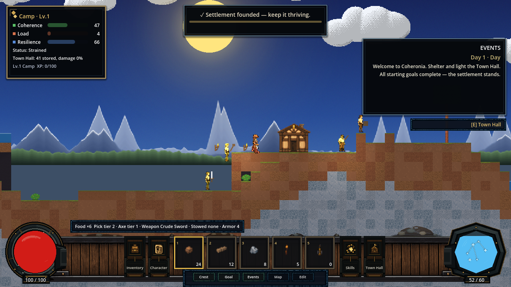

`Godot 4.6 · GDScript · data-driven design · 527-check in-engine smoke suite · procedural world depths · adaptive music · layered image-first UI pipeline`

## What it is

Coheronia sits between a survival sandbox and a civilization pressure sim. Minute to minute you mine tunnels, roof the hall, place torches, and haul food home. The settlement model turns those physical acts into three live pressures — **Coherence, Load, and Resilience** — computed from real world state (shelter blocks, light sources, stockpile, threats), never faked. A coherent, fed, lit settlement attracts settlers and ratchets from Camp to Hamlet to Village; a neglected one starves, empties, and cracks under night raids and storms. Those settlers are beginning to exist as persistent, visible actors: a farmhand who walks out and harvests crops into the stockpile, drawing on the same world-state authorities that drive the aggregate model rather than a parallel bookkeeping of its own.

It is also a **portfolio project in AI-orchestrated software engineering**: every increment is scoped in a task queue, implemented against explicit data authorities, reviewed independently, and checked in-engine. The repository exposes both the playable architecture and the evidence trail: state ownership, validation commands, variable matrix, handoff, and an inspectable project wiki.

## Portfolio lens

| Architecture concern | Concrete implementation | Evidence in this repository |
|---|---|---|
| **Simulation from world state** | Shelter, light, stockpile, threats, and population feed Coherence, Load, and Resilience. | [`scripts/settlement/`](scripts/settlement) · [`docs/VARIABLE_MATRIX.md`](docs/VARIABLE_MATRIX.md) |
| **Visible subject simulation** | A farmhand actor harvests ripe crops into the stockpile against the same world/stockpile authorities as the aggregate sim; the abstract population stays the single food-accounting authority, so a settler is never charged food twice. | [`scripts/entities/subject.gd`](scripts/entities/subject.gd) · [`scripts/world/world.gd`](scripts/world/world.gd) |
| **Persistent state ownership** | Characters own inventory, loadout, and progression; worlds own terrain deltas and settlement simulation. | [`scripts/shell/`](scripts/shell) · [`scripts/inventory/`](scripts/inventory) |
| **Data-first design** | Blocks, recipes, enemies, equipment, ancestries, and world presets are JSON authorities. | [`data/`](data) · [`scripts/validate_repo.py`](scripts/validate_repo.py) |
| **Procedural world depths** | Deterministic terrain from a seed: fraction-based strata (stone → deepstone → hell), a mixed cavern/tunnel carve pass, and lava/hell as data-driven blocks. Saves store `world_seed` + player edits only, and a `gen_version` stamp keeps existing worlds byte-identical as the generator evolves. | [`scripts/world/world_gen.gd`](scripts/world/world_gen.gd) · [`data/world_settings.json`](data/world_settings.json) |
| **Leveled liquid physics** | Lava and water flow as a deterministic, mass-conserving cellular automaton: per-cell fill level, pour-down/equalize-sideways, sleep-when-settled, partial-fill rendering, level-scaled glow, a lava+water→obsidian reaction, and a scoop/pour bucket (a filled bucket is its own `bucket_<liquid>` item with its own icon, and scooping draws a bucketful from the connected pool so even shallow water lifts). Generated liquid is sealed in rock (mine to release); worlds grow surface + underground lakes. A presentation-only overlay adds rising, bursting surface bubbles without touching the sim. Persisted with the terrain deltas. | [`scripts/world/fluid_sim.gd`](scripts/world/fluid_sim.gd) · [`scripts/world/lava_bubbles.gd`](scripts/world/lava_bubbles.gd) · [`data/blocks.json`](data/blocks.json) |
| **Swim, sink & breath** | Submerging past a liquid's *true surface level* (its fill height, not just the cell) slows movement and turns the player buoyant — hold jump to swim up and break the surface. A breath gauge drains while the head is under, drowns you once empty, and refills in air. All per-liquid and data-driven (thick lava crawls; water swims), with ancestry hooks — lizardfolk swim faster and never drown out of the box. | [`scripts/player/player.gd`](scripts/player/player.gd) · [`scripts/world/world.gd`](scripts/world/world.gd) · [`data/ancestries.json`](data/ancestries.json) |
| **Runtime UI composition** | HUD chrome is separate from live values; inventory mutations are validated at the UI boundary. | [`scripts/ui/hud.gd`](scripts/ui/hud.gd) · [`scripts/ui/inventory_slot_cell.gd`](scripts/ui/inventory_slot_cell.gd) |
| **Verification as a feature** | Validators and an in-engine smoke harness exercise saves, physics, UI, and system contracts. | [`docs/HANDOFF.md`](docs/HANDOFF.md) · [`scripts/main/smoke_test.gd`](scripts/main/smoke_test.gd) |

## Screenshots

*Captured from the live build (gameplay shots 2026-07-24; World Depths shots 2026-07-28; Liquid Physics + depth-block art shots 2026-07-29; underground-lighting before/after 2026-08-04).*

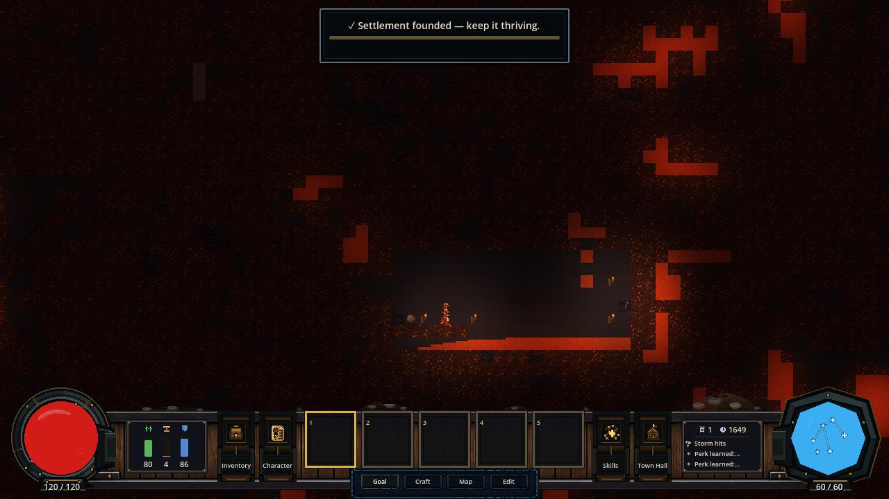
*New in the **World Depths** arc: every world is now a deep vertical descent. Dig down through stone into **deepstone**, then into a **hell biome** of hellstone and obsidian pooled with **lava** — a non-solid, light-emitting block that burns anything standing in it (routed through the same `take_damage` authority as combat). Mixed **caverns and winding tunnels** riddle the depths, and an unmineable **bedrock floor** bounds the world. The deepest band drives an ember ambient tint; lava now reads as a continuous molten body with a soft, level-scaled glow. **The depth blocks — deepstone, hellstone, and obsidian — are authored pixel art** (a finely mottled rock base with scattered mineral cracks/flecks, six per-cell variants each so the walls never tile into a repeating grid), and **hellstone and obsidian now drop their own item** when mined rather than generic stone.*

| 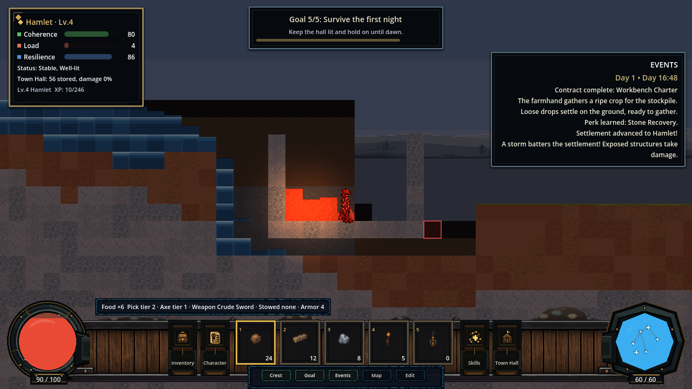<br>*Lava pouring* | 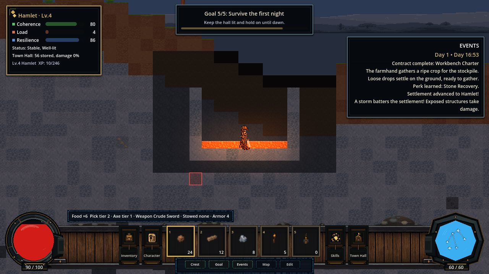<br>*Lava settled* |
| --- | --- |

*New in the **Liquid Physics** arc: lava is now a real **leveled fluid**. A deterministic, mass-conserving cellular automaton makes it flow, fall, and settle — each cell carries a fill level, pours down and equalizes sideways, and **sleeps** once level so a still world costs nothing. Generated liquid is **sealed inside solid rock**, so it sits inert until you **mine into it** — mining is what releases it. It renders at **partial fill** (submerged cells read full so a falling column is a continuous stream, not a ladder), glows **brighter the fuller it is**, floods through non-solid props like trees, and burns both the player **and enemies** through the shared `contact_damage` hazard.*

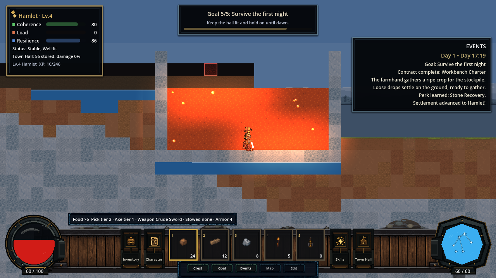
*The lava surface is alive: a presentation-only overlay spawns **sporadic bubbles that nucleate inside the lava, drift slowly upward, and burst at the surface** in a little splash of molten droplets. It scans only the lava cells in view and never touches the fluid state or the save, so it stays free of the deterministic sim.*

| 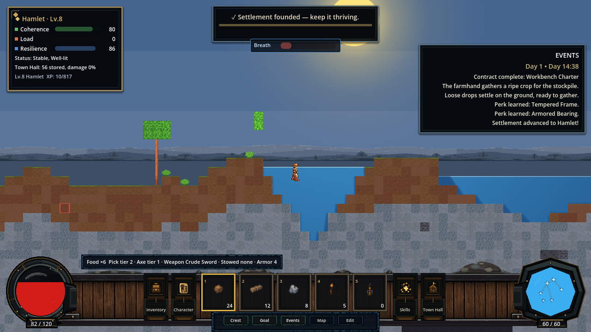<br>*Calm, uniform water — one body, not a grid of tiles* | 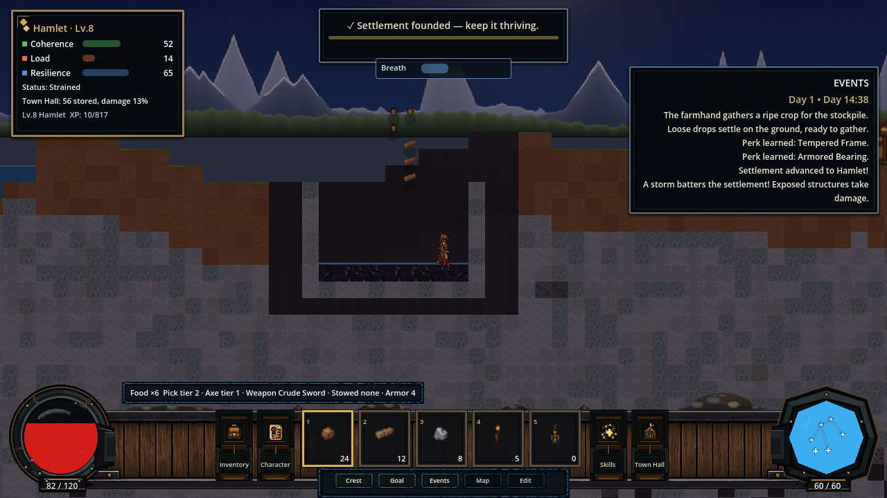<br>*Water + lava → obsidian* |
| --- | --- |

*Also new: **water**, a second liquid on the same engine (non-hazard). Worlds generate **lakes** — carved surface ponds and sealed underground pools — and **water + lava react into obsidian**, so channeling one into the other is a route to a mineable resource. Where the depth blocks want *variety* so rock never tiles into a grid, **water wants the opposite**: it is rendered as a single flat, uniform body so a pool reads as **one continuous thing spanning many cells**, with the only highlight a soft **waterline lightened just along the true surface** where it meets air (a per-liquid `liquid_surface_sheen` applied to the exposed top row only — never striped through the depth). A craftable **bucket** scoops a liquid and pours it elsewhere. Because the engine already carries density and flow-direction fields, gas remains a future data-only addition.*

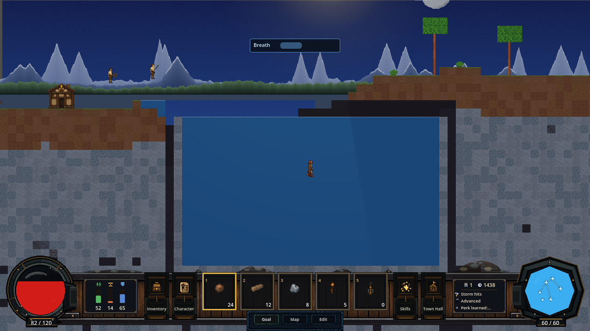
*New (2026-07-29): liquids now **behave** like liquids. Drop below a pool's **true surface level** and you move slowly and float — hold jump to **swim up** and break the surface. Stay under and the **Breath** gauge drains and then you drown, all tuned **per liquid** (thick lava crawls; water swims) with ancestry hooks so a lizardfolk breathes underwater. The waterline and fill height come straight from the leveled fluid sim, so a half-full cell submerges you only up to its actual surface.*

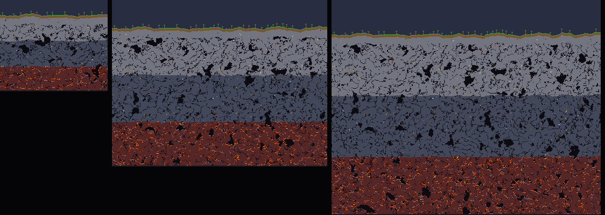
*The same progression scales to **every** world size (Small · Large · Vast shown, rendered straight from the generator). Strata are placed as **fractions of each world's depth**, so hell is the floor of every world rather than a feature of the largest one — asserted by the `wd_hell_in_all_sizes` smoke check. Terrain is regenerated deterministically from `world_seed`; only player edits are saved, so a huge world costs nothing extra on disk, and a `gen_version` stamp keeps existing worlds byte-identical.*

| 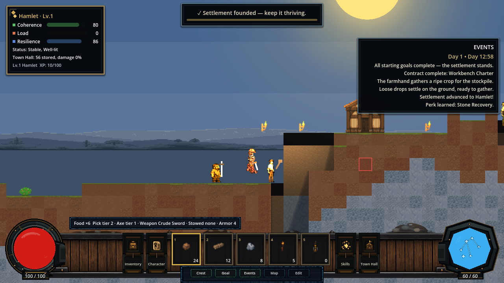<br>*Before — underground lit from the surface* | 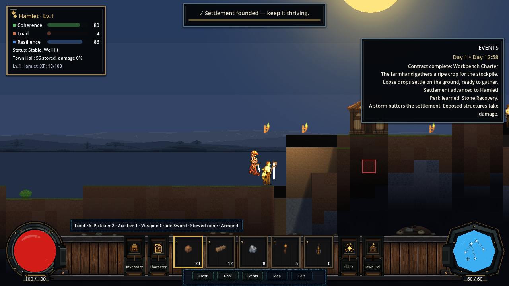<br>*After — underground reads dark* |
| --- | --- |

*New (2026-08-04): **underground lighting, fixed.** Stand on the surface at noon and a mined shaft now reads **dark** — lit only where light actually reaches (the surface lip, open shafts, and torch/lava pockets). The cause of the old "lit-from-the-surface" look was that darkness was a single global tint keyed to the **player's** depth, so while you stood on the surface the whole view — visible underground included — was daylight-tinted. The fix is a small **per-column depth shader** that darkens each terrain fragment by **its own** depth below the local sky line, and only *adds* the darkening the global ambient hasn't already applied at your depth — so nothing changes when you descend, entities are untouched, and torches still carve bright, readable pockets out of the dark.*

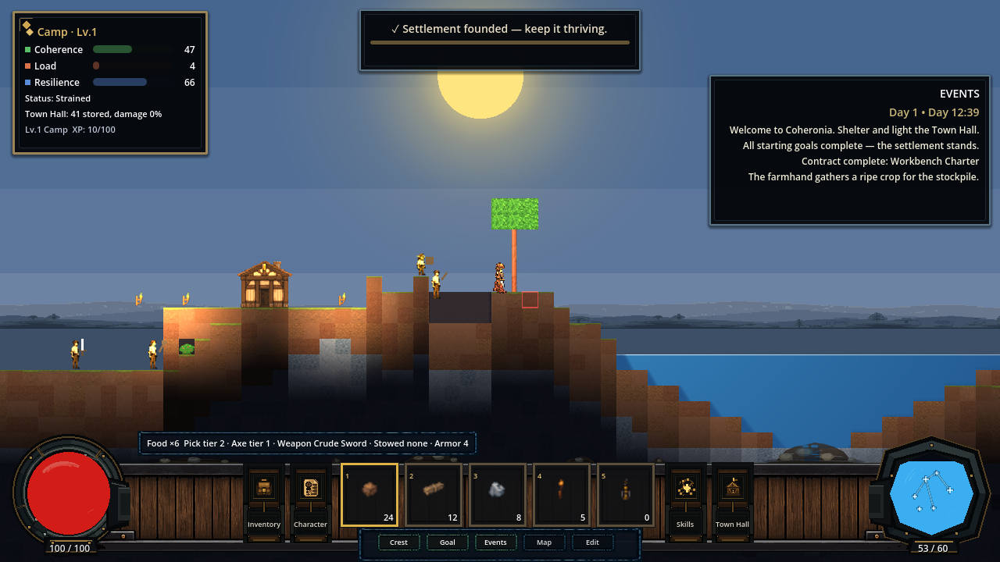
*New in R-08: a **visible farmhand settler** works the land beside the Town Hall — it walks to a ripe crop, harvests it into the stockpile (see the event log), and idles hungry if the settlement runs out of food. It is a concrete actor layered over the unchanged abstract population, which stays the single food-accounting authority.*

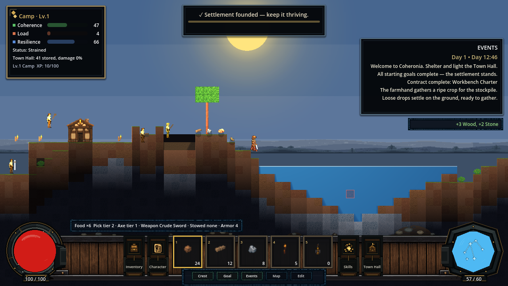
*Also new in R-08: **loose items now live on the ground.** Mining yield and enemy loot drop as physical items that fall under gravity and rest on the ground, drawn with the very same icons the inventory uses. The player auto-collects anything within reach (with a **"+N item"** pickup toast), and a **hauler** settler — a third assignable job beside the farmhand and repairer — carries whatever is left back to the Town Hall stockpile.*

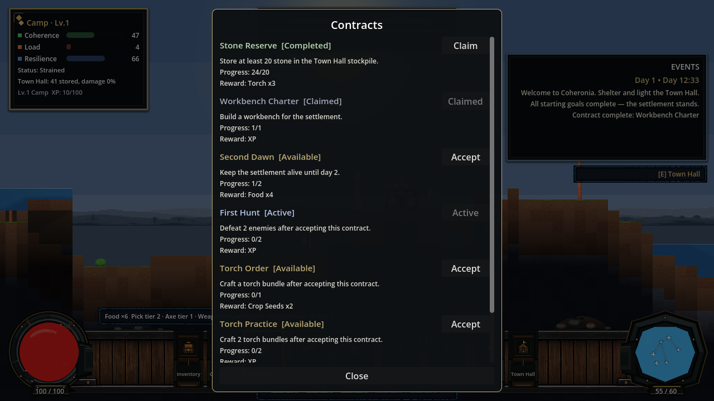
*New in R-09: **Contracts** are directed settlement goals that observe live world state instead of keeping shadow counters. The Town Hall panel exposes Accept/Claim actions, progress, status, and rewards for stockpile, station, survival, combat, and crafting objectives.*

| | |
|---|---|
| 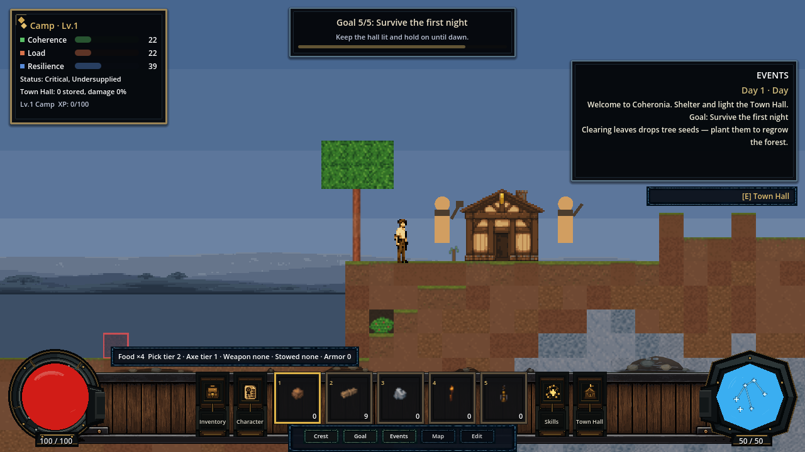<br>*New in the item-wiring pass: the **renewable tree loop**. Clearing leaves drops a **Tree Seed**; plant it on dirt or grass and it becomes a **Tree Sapling** that matures — reusing the crop timer and the same tree-geometry rule world-gen uses — into a full tree, saved and loaded like crops. Forests are no longer a finite resource.* | 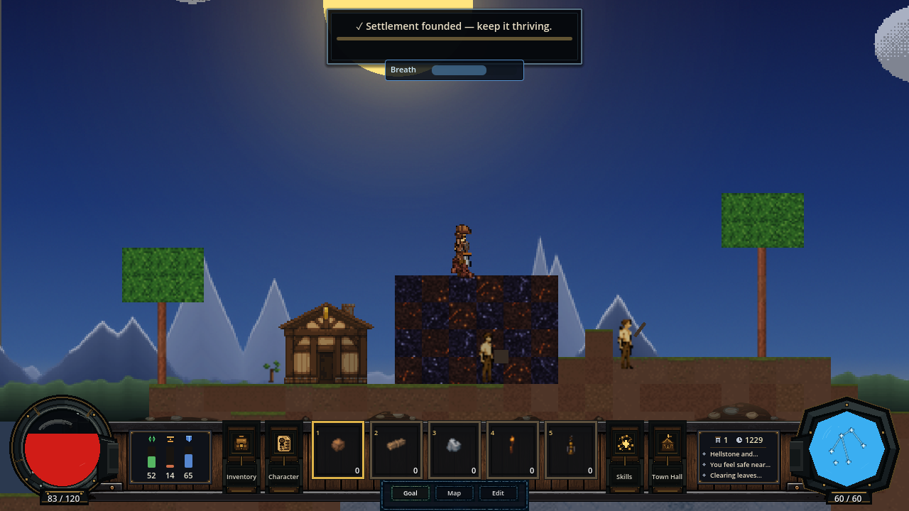<br>*Also from the item-wiring pass: **Hellstone and Obsidian now place as structural, defensive blocks** — their only missing connection was `is_placeable`, so mined deep-rock is a building material instead of a dead-end drop.* |

| | |
|---|---|
| 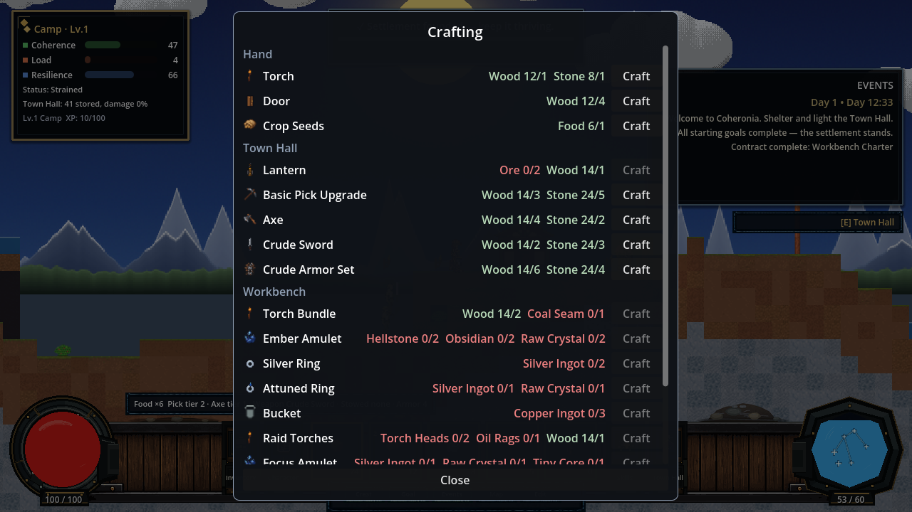<br>*Press **C** for the unified crafting panel — every recipe grouped by source (Hand, Town Hall, and each built station), with have/need per input and Build rows for stations you haven't raised yet* | 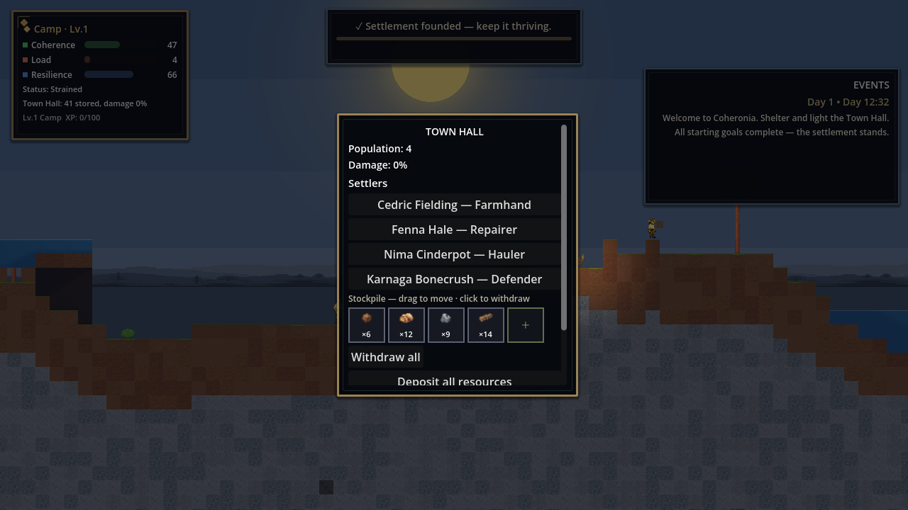<br>*The Town Hall now keeps deposit, settlement status, and structural repair; crafting and station building moved to the crafting panel* |
| 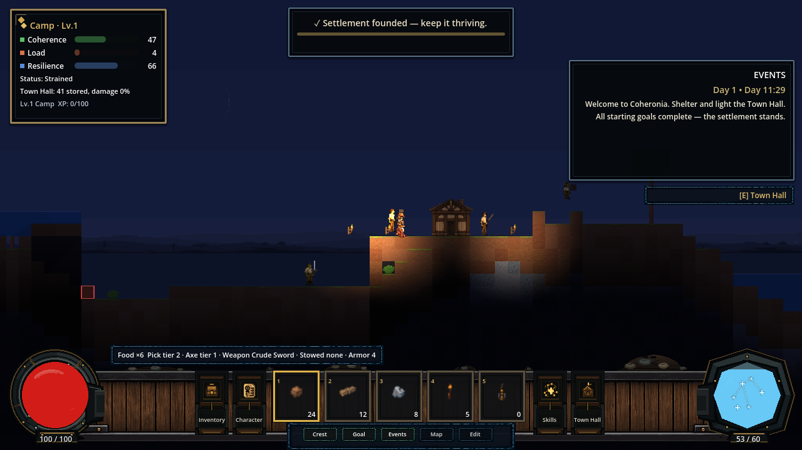<br>*Night, torchlight, and real-time light occlusion* | 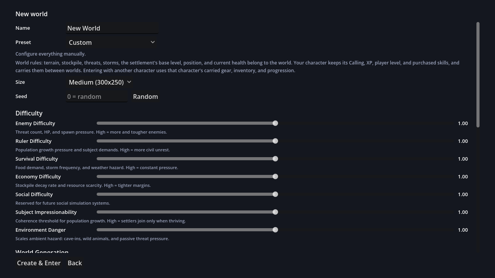<br>*World creation exposes size, seed, preset, difficulty, generation, and rule toggles — all data-driven* |
| 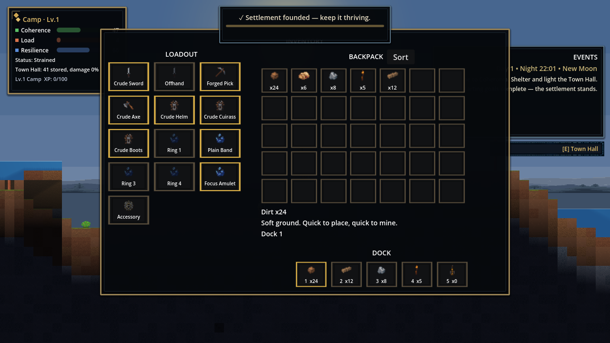<br>*Open the inventory with **I** to drag and drop carried stacks, dock assignments, and compatible equipment; use **Sort** to organize the backpack* | 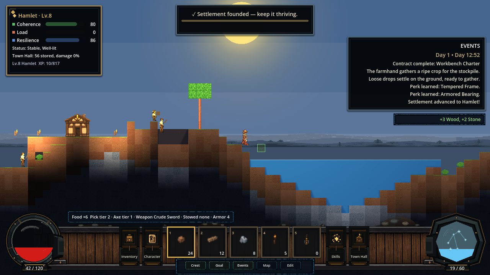<br>*The native HUD keeps vessel fills, values, slots, icons, counts, and actions live at runtime* |
| 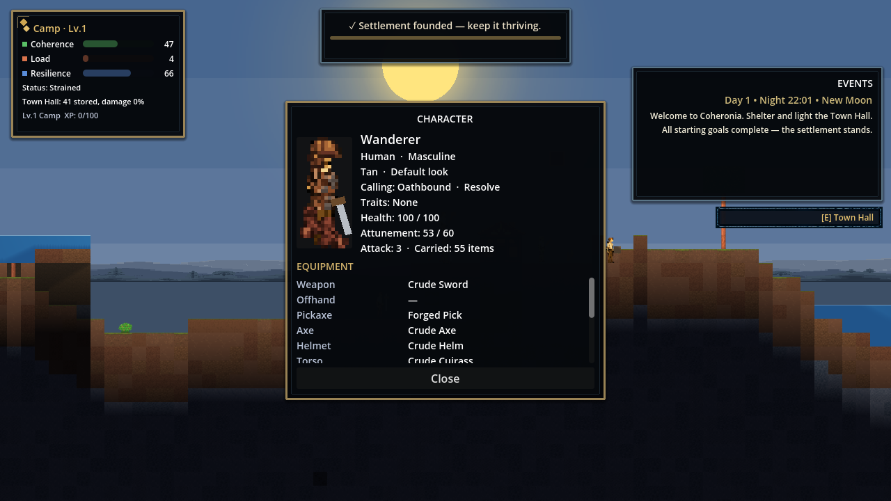<br>*The Character panel is rebuilt on runtime children — the composed figure renders through the same `PlayerVisual` the world draws, beside live identity, status, and all 13 equipment slots* | 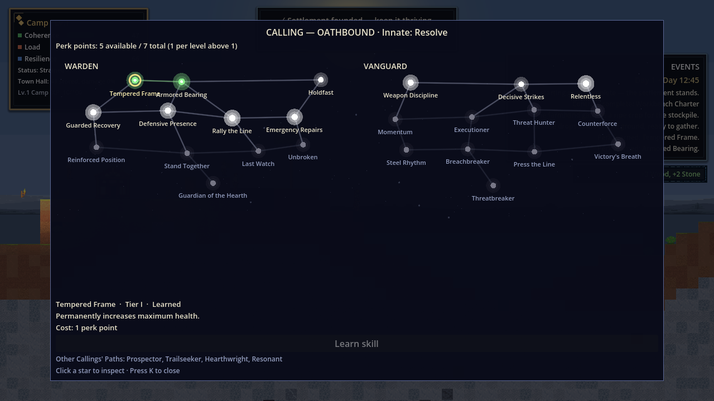<br>*The skill tree is a viewport-relative star map that scales from 640×360 to 1280×720; nodes, prerequisites, and perk spending come straight from JSON* |
| 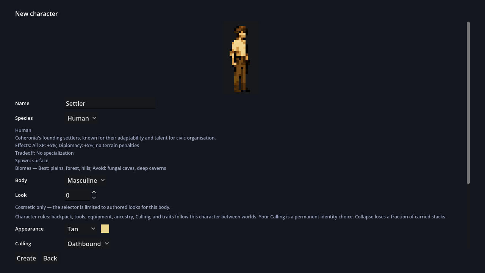<br>*Character creation shows a live figure through the shared render path — what you pick is what you get — in a scrolling form with a pinned Create/Back action row* | 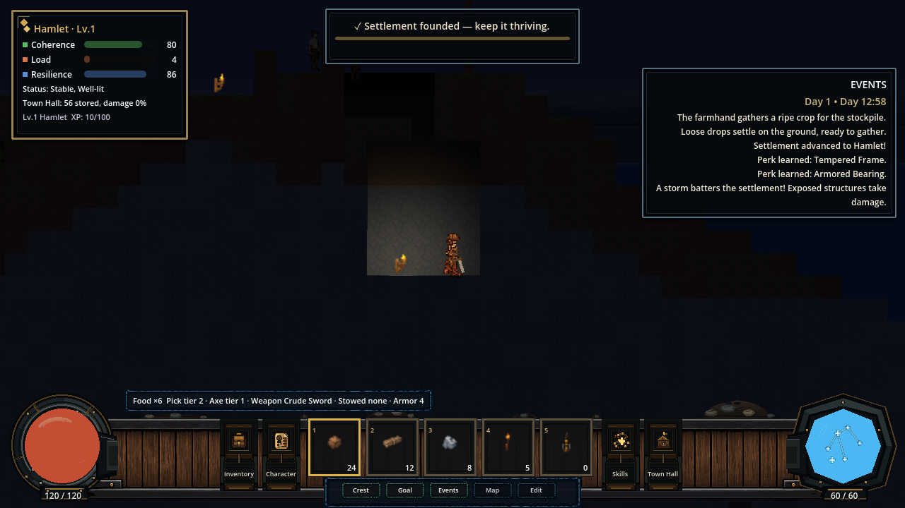<br>*Roof-aware cave darkness: dig deep and daylight stays behind you unless you open a shaft; torches hold the dark off locally* |

*The in-world sprites, every current inventory/live-drop icon, all six live enemy families, all ten player bodies, the Town Hall, parallax backdrops, eight opening-scene cel pools, and 120 body-specific crude-gear/tool overlays are real generated pixel art. High-repetition terrain, flora, ores, enemies, and player bodies also have runtime-selected visual pools. Missing or unresolved images keep a procedural fallback, while the primary dock uses a 19-asset layered kit whose runtime values and states remain separate from its PNG chrome.*


## 📖 Prologue

[](https://youtu.be/QQ2BuoXqErk)

Watch the opening cinematic and story introduction.

Direct link: [prologue](docs/screenshots/clips/coheronia.prologue.07162026.1125.mp4) 


## 🎮 Gameplay

[](https://youtu.be/ydgF0356CXw)

Watch the latest gameplay demonstration: [https://youtu.be/ydgF0356CXw](https://youtu.be/ydgF0356CXw)

> The screenshots on this page are the definitive reference for the current interface — the World Depths hell biome with its reworked depth-block art and the leveled lava with rising bubbles (2026-07-29), the multi-size cross-section (2026-07-28), and the native HUD and inventory board, the unified crafting panel, the repair-only Town Hall, the Contracts panel, the rebuilt Character panel, the viewport-relative skill tree, the contour backdrop, and the R-08 visible settlers with ground-drop loot (2026-07-24).

---

## Explore the build wiki

[Open the Coheronia Wiki](docs/wiki/wiki.md) for the repo-backed reference on live systems, inventory and crafting routes, HUD asset rules, image coverage, planned data, and known limitations. For a portfolio presentation with the visual wiki embedded, visit [Coheronia on ppeck.me](https://ppeck.me/projects/coheronia/). GitHub renders this Markdown entrypoint directly; the repository also includes a richer local [visual wiki wrapper](docs/wiki/index.html).

## Feature highlights

- **Persistent shell and inventory** — characters and worlds are separate persistent objects. Characters own their backpack, dock layout, hotbar selection, tools, and 12 gear slots and carry them between worlds; the openable **I** inventory board supports drag-and-drop backpack/dock organization, compatible equipment swaps, unequipping back to the backpack, item detail, sorting, and the five-slot dock. Characters also own their **Calling and progression** (XP, level, purchased skills), which travel between worlds; each world file owns its terrain history, settlement, threats, and its own base (settlement) level.
- **Deterministic, configurable world generation** — seed + settings always produce the same world: terrain amplitude/frequency, ore/tree/bush density on independent seed channels, three world sizes, and unified leafy trees the player walks in front of and harvests for wood, so the surface stays walkable.
- **Survival loop with teeth** — hardness-timed mining with crack-stage feedback, tool tiers (forged pick, axe, crude sword and armor with flat mitigation), a metallurgy chain that smelts depth-banded ores into ingots at the furnace and forges a full gear ladder — crude, bronze, iron, and deep obsidian/hellstone weapons and armor, plus silver/crystal rings and an ember amulet — at the anvil and workbench, berry bushes that need soil and regrow, plantable farming (till soil, then sow a seed straight onto the tilled row — surface, cave, or against a wall) as a reliable food path, deep water that slows and drowns you (swim up to surface before the breath runs out) unless your ancestry breathes underwater, food, health, i-frames, collapse penalties, and passive recovery near the hall.
- **A settlement that reacts** — day/night cycle, night threats scaled by six difficulty axes, raiders drawn to fat stockpiles (plus torchbearers that burn the hall faster), crop-eating thornrats that pressure your farms and ore ticks that cling to the veins, cave crawlers underground, storms mitigated by real roof coverage, population 1–8 that eats, leaves, and arrives based on computed Coherence.
- **Settlers that do real work (new)** — the first **visible farmhand** is a persistent actor that roams within a bounded radius of the Town Hall, walks to the nearest ripe crop, harvests it into the stockpile, and idles hungry when the settlement's food runs out. It is layered *on top of* the abstract population — that aggregate model stays the single food-accounting authority, so the same settler is never charged food twice — and its identity, job, hunger, and position persist in the world save.
- **A world with depth** — a parallax scenic backdrop behind everything, natural backing walls revealed by mining (deterministic from the seed, provably unable to affect collision or lighting), and roof-aware cave darkness at any hour: dig deep and the daylight stays behind you unless you open a shaft to the sky, while your torches hold the dark off locally.
- **An adaptive score** — one original suite composed as a single piece in four states (day, night, underground, crisis) plus six phase-locked stems, switching seamlessly at the next musical bar from real game state: pressure builds it toward crisis with hysteresis so the music never thrashes, the hearth harmony swells with settlement Coherence, the work pulse follows your pick, the fracture layer wakes only at the collapse edge — and it all crossfades home when the settlement holds. Event stingers (dawn, nightfall, raid, attunement, base advance) ring out over a brief music-bus duck without ever stopping the score, Music/Sound sliders on the title screen set the runtime buses, and the whole director keeps breathing through pause. Native Godot `AudioStreamInteractive` + `AudioStreamSynchronized` — no middleware.
- **Progression stack + Callings** — six XP types feed player levels; levels grant perk points; base levels gate population; Attunement (the magic resource) regenerates and powers a first light-pulse ability, with ancestry/equipment/perk hooks already live. On top of this sits the **Calling** — a permanent, character-owned identity chosen at creation (**Oathbound**, **Wayfarer**, or **Runewright**), each with an automatic **innate** effect and **two Paths** of tiered skills. Your Calling gates which two Paths you can invest in; tiers open by how many skills you've bought in that Path (II at 2, III at 6, capstone at 9), and the skill panel lays the two Paths out tier by tier. **Every skill is wired to a real hook** (no inert purchases): source-scoped hostile/hazard damage reduction, weapon-vs-hostile damage, movement, mining/harvest speed, extra-yield & seed return, scoped reach, Attunement-pulse tuning, structure-repair strength, and on-defeat restores. Progression is character-owned and carries between worlds; a reachability-safe tier gate never forces buying an inert skill. Full trace in [`docs/CALLING_EFFECT_MATRIX.md`](docs/CALLING_EFFECT_MATRIX.md).
- **Animated opening cinematic** — an eight-scene, ~42s founding myth plays before the title on first launch (any key advances, Esc skips, replayable from the menu): a DOS-style plotted world with keyframed puppet acting — roads unravel, the five peoples gather at a fire, builders raise the first hall beam by beam, the founder kneels and the world answers — rendered entirely in code at 640×360 with hard camera cuts and engine-rendered text: *COHERONIA · By Paul Peck · Where civilization pushes back.*
- **Learns as you play** — a compact, state-driven goal panel walks the first loop (gather → light the hall → deposit → forge a tool/build a station → survive the night) from real game state, not scripted tutorial text: it advances only when you actually do the thing, never regresses, re-derives the right step after a save/reload, and tucks away with a keypress (**O**).
- **Scoutable world** — a schematic map panel (**M**) reveals the world band by band *as you explore* — nothing is X-rayed. It marks the Town Hall, your position, ore pockets, and live enemy pressure inside scouted bands only; discovered regions persist compactly in the world save, and the Wayfarer Calling's reveal skills (Deep Surveying / Broad Horizon) widen each step's scouted band. Map and Events are independent movable modules and can remain open together.
- **Authored visual coverage with real variety** — all data-referenced blocks, inventory/live-drop icons, and live enemies now have canonical pixel art; seventeen high-repetition block ids carry three deterministic per-cell looks, every enemy family carries three lifetime-stable looks, and every player body offers two authored alternatives beyond its canonical form. Items deliberately stay canonical-only so a stack never changes icon during a refresh.
- **Everything is data** — blocks, recipes, enemies, 12 ancestries, XP curves, base levels, the three Callings and their six Paths of tiered skills, equipment, world presets, item metadata, and directed-goal contracts are JSON authorities validated by a repo linter; most balance changes never touch code.

## Characters are data

A character is a persistent object that outlives any single world, and it is
defined entirely in JSON — the creation screen above is just a view onto these
files. Three authorities drive it:

- **[`data/character_data.json`](data/character_data.json)** — the creation
  contract: player tuning defaults, the five playable species, body variants,
  the trait pool (pick up to two), the permanent Calling, and skin/trim appearance
  palettes.
- **[`data/ancestries.json`](data/ancestries.json)** — twelve ancestry
  definitions with lore, effect keys, spawn bands, and biome affinities; the
  five above are live and playable, the rest are validated data awaiting their
  phases (deep variants, gnome, lizardfolk, dragonkin).
- **[`data/player_visuals.json`](data/player_visuals.json)** — the 16×32 body
  rig: per-species skin palettes and regions, appearance recolor, and the
  optional gear/tool-swing overlay conventions.

A trait, a role, and a body rig look like this — no code changes to add or
tune one:

```jsonc
// data/character_data.json
{ "id": "miner", "display_name": "Born Miner",
  "description": "+20% mining speed.", "effects": { "mine_speed_mult": 1.2 } }

{ "id": "oathbound", "display_name": "Oathbound",
  "description": "Sworn defender of the settlement.",
  "paths": ["warden", "vanguard"],
  "innate": { "name": "Resolve",
              "description": "Reduces hostile-creature damage; stronger during a settlement assault." } }

// data/player_visuals.json — the dwarf body rig
"dwarf": {
  "skin_palette": ["f3ab36", "ca811c"],
  "skin_regions": [[6, 8, 6, 5], [1, 18, 4, 7], [10, 18, 4, 7]],
  "shoulder": [5, -3], "torso_size": [12, 8], "feet_width": 5
}
```

Characters own their backpack, hotbar, tools, 12 equipment slots, ancestry,
**Calling**, and traits — and now their **progression** (XP, level, and purchased
Calling skills) — and carry them between worlds; each world file owns its terrain
history, settlement, and the world's own **base (settlement) level**. Persistence
lives in `user://shell.json` (profile + characters), separate from
`user://worlds/<id>.json`.

## The engineering story

This repo doubles as an experiment in disciplined AI-driven development:

- **Self-verifying build.** A smoke suite runs the *real game* — real input map, real physics, real saves — and asserts 527 checks across mining, save/load round-trips, legacy migrations, UI panel contents, Map/Events coexistence, HUD-kit layering, physics traversal, armor math, the Calling identity system (three Callings → six Paths → 72 tiered skills, all wired to real hooks; character-owned progression that carries between worlds; a reachability-safe tier gate that never forces an inert purchase; source-scoped hostile/hazard damage reduction; semantic legacy migration; and context scoping for reveal and settlement-assault), the full metal-gear ladder (bronze/obsidian/hellstone gear + silver/crystal rings + an ember-amulet capstone, tying every smelted metal and both deep blocks into equippable gear), adaptive-music transitions, the character-rendering contract, body-specific gear resolution and alignment, directional action animation, the shared-path creation/character-select preview, the runtime-children Character panel, the backdrop contour skirt, the viewport-relative skill panel, the visible-subject labor loop, directed-goal contracts, the contracts panel, the deterministic contract balance report, the procedural world depths (fractional strata, caves, and the hell/lava biome in every world size), the leveled liquid physics (lava and water pour, conserve mass, settle, react into obsidian, and burn the player and enemies; sealed generated liquid; a scoop/pour bucket that carries its liquid as a distinct filled-bucket item and scoops a bucketful from a shallow pool), level-aware submersion with a per-liquid swim slowdown and a breath/drowning gauge, plant-on-tilled-soil farming, per-column underground depth shading, and event stingers. The full suite is **527 checks** in source (2026-08-04, run windowed); the exported Windows artifact launches and runs green with six `res://` fixture checks skipped only under read-only export (verified by CI on every push). Three runtime notes: the real-time `fq09u1_live_clip_switch` adaptive-music check occasionally cold-flakes and passes on rerun; the `fq19_map_events_coexist` geometry check is sensitive to a contaminated persisted `shell.json` and passes from a clean profile.
- **Evidence over claims.** Increment scope, decisions, review findings, and validation state are summarized in [`docs/HANDOFF.md`](docs/HANDOFF.md). Historical raw protocol artifacts are still tracked; their fit with the current public-repository profile is explicitly flagged for owner review rather than silently presented as settled policy.
- **Independent review loop.** Each change was reviewed by a separate agent pass before commit; findings (from save-corruption edge cases to invisible-tint rendering bugs) are documented and fixed in the ledgers.
- **Task queue discipline.** Work follows [`docs/FABLE_TASK_QUEUE.md`](docs/FABLE_TASK_QUEUE.md) one bounded increment at a time — FQ-00 through FQ-09 plus the FQ-09R/S/V/C/W/A/M and U0–U3 refinements (skill-tree star map, variant art pools, the opening cinematic, backdrops and cave darkness, the asset roadmap, action effects, and the full adaptive-music arc) on top of the v0.1–v0.6 foundation, each documented in [`docs/HANDOFF.md`](docs/HANDOFF.md) and [`docs/VARIABLE_MATRIX.md`](docs/VARIABLE_MATRIX.md).

## Run it

Requires [Godot 4.6+](https://godotengine.org/). No plugins, no imports, no build step.

```powershell
& <path-to-godot-4.6> --path <this-repo-root>
```

Or open the folder in the Godot editor and press Play.

| Action | Input |
|---|---|
| Move / jump | A/D or arrows · Space |
| Swim up (in liquid) | Hold Space |
| Farm — till / plant | G |
| Mine / hit | Hold left mouse |
| Place block | Right mouse |
| Hotbar | 1–5 |
| Town Hall | E or T |
| Inventory / Skill tree | I / K |
| Goals / Map | O / M |
| Eat food / Attunement pulse | H / R |
| Crafting panel | C |
| Quick save / load | F5 / F9 |
| Pause menu — settings, keybinds, save, restore, quit | Esc |

Esc opens a real pause menu (it closes an open panel first); saving and world-restore are exposed there, and rebinds live under its Settings screen. F5/F9 remain quick save/load.

**Verify the build** (validators + the 527-check in-engine suite):

```powershell
python scripts/validate_repo.py
python scripts/asset_audit.py --strict
python scripts/art/sync_hud_kit.py --verify-runtime
python scripts/art/verify_gear_alignment.py
python _protocol/Project_Ops_Capsule/scripts/capsule_doctor.py . --profile public_repo

$env:COHERONIA_SMOKE = "1"
Start-Process -FilePath "<path-to-godot-4.6>" -ArgumentList @("--path", "<this-repo-root>") -Wait
# results: user://smoke_results.json
```

**Regenerate the README screenshots** (staged capture tour — 22 shots across the shell and gameplay tours, including the Contracts panel, visible farmhand at work, loose ground-drop loot, the World Depths hell biome and liquid-physics shots (lava pour/settle, rising bubbles, water lakes, obsidian, submerged swim/breath), and the character-create screen at 1280×720 and 640×360; run windowed, not `--headless`, so the frame capture resolves):

```powershell
$env:COHERONIA_SHOTS = "1"
Start-Process -FilePath "<path-to-godot-4.6>" -ArgumentList @("--path", "<this-repo-root>") -Wait
# shots land in user://shots/ (Windows: %APPDATA%\Godot\app_userdata\Coheronia\shots)
# then copy the keepers into docs/screenshots/
```

## Architecture at a glance

```text
data/*.json ───────► registries / validators ───────► world, player, settlement systems
                                                    │
shell profile ───► character state ───► inventory / equipment / dock ───► runtime HUD
                                                    │
world save ──────► terrain deltas + simulation ────┴──► smoke harness + evidence docs
                                                    │
world/stockpile ─► visible subjects (farmhand) ────┘   harvest → stockpile, hunger
```

```text
scenes/shell + scripts/shell     persistent shell: characters, worlds, world builder
scenes/main  + scripts/main      game root (day/night, storms, threats, progression),
                                 smoke suite, screenshot tour
scripts/world                    deterministic generation, block grid, lighting,
                                 data-authority registry
scripts/player                   movement, mining, combat, equipment, attunement, perks
scripts/entities                 visible subject actors (R-08 farmhand): bounded
                                 roam, crop harvest into the stockpile, hunger
scripts/settlement               Town Hall + the Coherence/Load/Resilience model
scripts/ui                       layered HUD-kit assembly, movable modules,
                                 icon-grid panels, skill tree
data/*.json                      the actual game design: blocks, recipes, enemies,
                                 ancestries, progression, equipment, presets, items
docs/                            handoff, variable matrix, task queue, future design
.project/                        historical protocol records; public-profile
                                 governance review is pending
```

Persistence: `user://shell.json` (profile + characters) and `user://worlds/<id>.json` (one file per world: config + terrain deltas + simulation state).

## Current build

Dated shipped milestones, newest first (full detail in [`docs/HANDOFF.md`](docs/HANDOFF.md) and [`docs/FABLE_TASK_QUEUE.md`](docs/FABLE_TASK_QUEUE.md)):

- **2026-08-05 — The Calling system (closure & truthfulness pass).** Turned the vestigial "role" concept into a real player-identity progression strand, presented as your **Calling**, and then made the whole surface *honest*: **every one of the 72 skills is wired to a real gameplay hook** — no inert, placeholder, or "coming soon" purchases. Choose one of three permanent, **character-owned** Callings at creation — **Oathbound** (sworn defender), **Wayfarer** (deep/wild explorer), or **Runewright** (hearth & resonance) — each with an automatic **innate** effect and **two Paths** of twelve tiered skills. Effects are built only from existing systems (no new subsystems): a damage-**source** tag drives source-scoped hostile/hazard reduction; movement, mining/harvest speed, extra-yield & seed return, scoped mining vs. build reach, Attunement-pulse radius/duration/cost, food-heal, weapon-vs-hostile damage, structure-repair strength, and on-defeat/assault-repelled restores all resolve live at their computation sites. **Correctness:** `try_purchase_perk` refuses any non-live skill; the tier gate is `min(design 2/6/9, live-skills-below)` and counts only live purchases, so a live skill is **never** gated behind an inert one and every skill stays reachable. **Ownership is split correctly:** the *character* owns personal XP, level, and purchased skills (they carry between worlds and are filtered to the character's Calling on load); the *world* owns its base (settlement) level that gates population — so a Village-tier character never imports a settlement level into a fresh world. **Legacy migration is semantic** (Warden→Oathbound, Prospector→Wayfarer, Homesteader→Runewright). *Context is real:* a "settlement assault" means a threat at the settlement; threat-scoped weapon damage is evaluated against the **specific** attacked enemy; Victory's Breath fires only from a defeat that actually clears the assault; reveal skills are scoped underground vs. surface; and yield perks fire only on unambiguously natural, non-placeable resources (no place-and-break duplication). The skill panel was rebuilt into two readable Path cards with player-language text only. Descriptions were narrowed to exactly what each hook does. Save-safe: key stays `role`, non-destructive migration, no starting-item windfall. Source smoke **527/527** (clean, no flakes). One honest note: to reach full coverage without new subsystems, the harder specified effects were re-themed onto existing scalar channels, so some Paths (notably Hearthwright) repeat a channel across skills — a deliberate design variance, not the fully distinct approved tree. Authority: [`docs/CALLING_EFFECT_MATRIX.md`](docs/CALLING_EFFECT_MATRIX.md) · [`docs/VARIABLE_MATRIX.md`](docs/VARIABLE_MATRIX.md).
- **2026-08-04 — Underground lighting, fixed.** Closed the long-deferred "lit-from-the-surface" limitation: stand on the surface at noon and a mined shaft or cross-section now reads **dark**, lit only where light actually reaches (the surface lip, open shafts, and torch/lava pockets). The fix is a small **per-column depth shader** (`shaders/cave_depth.gdshader`) that darkens each terrain fragment by *its own* depth below the local sky line rather than by a single global player-depth tint — and only *adds* the darkening the existing ambient hasn't already applied, so there's **no double-dimming and nothing changes when you're underground**. It keeps normal 2D lighting, so torches and lava still carve bright, readable pockets out of the dark. The reverted `DirectionalLight2D` approach was left retired (its occluders self-shadowed every tile); the shader leaves occluders untouched. Verified with a new `cave_depth_shading` smoke check and a windowed shader-on/off A/B capture (`09b_surface_shaft_daylight`). Source smoke **509/509**. Authority: [`docs/VARIABLE_MATRIX.md`](docs/VARIABLE_MATRIX.md) · write-up: [`docs/wiki/known_issues.md`](docs/wiki/known_issues.md#resolved--underground-lighting-dark-from-the-surface--2026-08-04).
- **2026-07-31 — Settler work + fixes + panel clarity.** Operator-driven follow-ups. **Settlers do more:** farmhands now **replant** as well as harvest — a farmhand carries a seed pouch, keeps the seed from each harvest, and sows fresh crops on empty tilled soil (a self-sustaining loop). You can give any settler a **work zone**: click *Set work zone* on its info panel and drag a rectangle in the world (you may keep walking to extend it off-screen) — that farmhand/hauler then works only inside it, so the farmer finally tends the bed you point it at. **Panel clarity:** needs read as colored **green ✓ / red ✗** chips, hovering a red ✗ explains what's wrong and how to fix it, and vague wants are **defined** ("strong walls" → "the settlement kept safe from threats"). **Fixes:** **ore now falls** when you undermine it (via the `has_gravity` cluster rule) while cohesive stone/dirt stay put; the sun/moon **cast shadows** against the terrain so their light no longer bleeds additively through solid ground. **Known limitation (since resolved):** the underground still read *lit* when viewed from the surface because ambient darkness was a single global player-depth tint, not per-cell — **fixed on 2026-08-04** by the per-column depth shader (see the entry above). Source smoke **508/508**. Authority: [`docs/VARIABLE_MATRIX.md`](docs/VARIABLE_MATRIX.md).
- **2026-07-30 — Sky revision + block gravity.** Follow-up on the lighting/sky work plus a physics gap. The sun & moon now ride a **fixed sky arc anchored in world space** (a set altitude above the surface) and are **hidden the instant you go underground** — no more floating over rock. Their glow is redrawn as **smooth layered radial gradients** (no more choppy stacked rings/flares), and each body casts a **large, soft light** onto the world — a warm sun and a **subtle, cooler-blue moon** — so a moonlit night visibly pools light on the ground. **Block gravity:** free-standing blocks now fall when their footing is cut — mine through a tree trunk and the severed top and canopy come down as wood/leaf drops, while the grounded base stays; cohesive terrain (stone, dirt, ore) is unaffected. Data-driven via a `has_gravity` flag and a connected-cluster grounding test. Source smoke **504/504**. Authority: [`docs/VARIABLE_MATRIX.md`](docs/VARIABLE_MATRIX.md).
- **2026-07-30 — Lighting, sky & HUD-interaction pass.** A polish arc across light, the sky, and hands-on UI. **Shared lighting module:** torches, lava, and the sun/moon now build their glow from one `scripts/world/lighting.gd` helper with a gentle **ease-out falloff** (bright core, feathered edge) instead of each site's hard linear ramp — so light eases out instead of stopping at a rim. The sun/moon also stopped drawing over underground rock (they hide by depth), gained **detail** (radiating sun flares, a cratered moon with a softened edge), and the moon now runs a **true ~29-day continuous synodic cycle** through every named phase (New → Waxing Crescent → First Quarter → Waxing Gibbous → Full → …), with the phase named on the night clock and full moons made rare for a future mechanic. **Editable settler panel:** the NPC info panel is now a first-class HUD widget you can move and resize in Edit mode, saved like the rest. **Cursor-driven dock:** click a hotbar slot to select it (number keys still work). **Drag-and-drop stockpile:** the Town Hall stockpile is a grid like the player inventory — drag stacks in to deposit and out to withdraw, or click to pull (Left = all, Right = half, Shift+Left = choose an amount), with the Town Hall still the sole authority. **Full-height doors:** doors are now a 3-tall × 1-wide unit that opens/closes and mines as one, leaving a **character-height opening** the player and every settler can actually walk through. Source smoke **503/503** (+11 checks over the arc). Authority: [`docs/VARIABLE_MATRIX.md`](docs/VARIABLE_MATRIX.md).
- **2026-07-30 — Settlement Coherence arc (M1–M5).** Turned the abstract population into a **real, bounded, persistent citizenry** and gave building a purpose — one authority per state throughout. **M1:** a data-driven settlement rectangle; each citizen now has a saved **home/guard post**, a hard **movement clamp** (no more wandering off the map), and stuck-recovery; the visible roster spawns to **match the starting population** (was 2 vs 4). **M2:** the Town Hall stockpile is **transferable** — click a tile to withdraw a chosen amount or *Withdraw all* (the stockpile stays the sole authority); **doors** (place, open/close, `craft_door`); and a **housing** rule where an enclosed, doored room is recognized as a house and **caps population growth** at `min(base-level cap, housing)`, so you must build to grow. **M3:** citizens are **visually and socially real** — each carries a persisted **ancestry identity** drawn through the same player sprite pipeline, the visible roster now **tracks the population authority** (born/leave with the food economy), and a **defender** role guards a post, engages threats in its radius on a cooldown, and returns. **M4:** dependency-gated enemy expansion — the **Raider Sapper** *breaks through* walls and doors (testing the new defenses), then the **Lava Slime**, a molten dweller with a hard-capped bubble field and lava immunity. **M5:** a presentation-only **sun & moon** arc across the sky from the existing day clock (now with an 8-phase **lunar cycle** and a full-moon hook), and the onboarding goals extend into *build a house* → *post a defender*. Citizens stand on the ground, patrol when idle, and defend out of the box; the day/night cycle was slowed 2×. **Citizen identity & report:** click any settler (or its Town Hall row) to open an **info panel** — name (drawn from an ancestry-aligned name pool), role (changeable in-panel), days alive, and four **stats** (Vigor, Craft, Guard, Spirit). Stats now **bite**: Vigor scales a settler's move speed and Guard scales a defender's hit. The panel reads **live from settlement state** — any issue inhibiting work (e.g. *idle, hungry — the larder is empty*), whether the settlement is meeting its **needs** (food / shelter / safety), the settler's **coherence** (contentment) with the settlement, and its personal **want**. **Sky polish:** the sun and moon are 4× their first size and render on a tint-immune sky layer so they read as **luminous, light-radiating** bodies; the moon is drawn as a lit-crescent texture whose **dark side is fully transparent**, blending into the night sky. Source smoke **498/498** (+56 checks over the arc). Authority: [`docs/VARIABLE_MATRIX.md`](docs/VARIABLE_MATRIX.md).
- **2026-07-29 — Item-wiring closure.** Closed loose item-system strands *without* new subsystems. A **renewable tree loop**: clearing leaves drops a **Tree Seed**, planted on dirt/grass it becomes a **Tree Sapling** that matures — reusing the crop timer and the one shared tree-geometry rule (`WorldGen.tree_layout`) — into a full tree, saved/loaded like crops. **One deposit authority** (`BlockRegistry.is_stockpile_material`) now backs *both* the manual Town Hall deposit and the hauler settler, so they can never diverge. The legacy **Forged Pick token** is retired (the upgrade recipe mints nothing; old saves migrate it away and keep tier 2). **UI-only** icons (`pick/axe/sword/armor`) are barred from loot and the stockpile, and the two **identity block recipes** (wood→wood, stone→stone) are gone. Currently-obtainable loot gained **minimal, natural sinks through existing systems** — Ore Flecks → ore, Weapon Scrap → iron, Meat → cooked food, Torch Heads + Oil Rags → torches, Tiny Core + Silver + Crystal → a **Focus Amulet** (workbench, leaving the anvil's smelted-ingot invariant intact), a **Raider Bounty** coins contract, and **Hellstone/Obsidian made placeable** as structural blocks — while strained cases (armor/textile/alchemy loot, bronze) are honestly marked `future_use` rather than forced into pointless recipes. Planned enemy/boss loot stays inactive. New `validate_repo.py` referential-integrity + tree-loop checks; source smoke **454/454** (adds 11 `iw_*` checks). Authority: [`docs/ITEM_AND_RECIPE_MATRIX.md`](docs/ITEM_AND_RECIPE_MATRIX.md).
- **2026-07-29 — Bucket fixes.** Two bucket bugs. (1) A filled bucket didn't read as filled and a stack of empty buckets shared one fill state — because a bucket was a single item plus a per-player `bucket_contents` string. A filled bucket is now a **distinct item** (`bucket_water` / `bucket_lava`) with its own authored icon, so empty and filled buckets are **separate stacks** that never conflate and a full bucket **shows its contents**; scooping converts one empty bucket into the matching filled item (and holds it), pouring converts it back, count conserved. (2) **Water was nearly unscoopable** — `scoop_liquid` demanded a single cell at level ≥ 0.5, but water spreads into thinner films. It now draws a **bucketful from the connected pool** (downhill first), so shallow water lifts, while still needing ≥ 0.5 reachable and removing a whole bucket at once (no dredging a sliver). Source smoke **442/442** (adds `lq_bucket_scoops_partial_pool`; `lq_bucket_scoop_and_pour` rewritten for the distinct-item model).
- **2026-07-29 — Swim, breath & plant-on-soil.** Liquids now *feel* like liquids. Submerging past a liquid's **true surface level** — its fill height, read from `world.liquid_covering` (not merely the block) — **slows movement** and makes the player **buoyant**; hold jump to swim up and break the surface. A new **breath gauge** drains while the head is under, **drowns** you (per-liquid damage, routed through the shared collapse/respawn) once empty, and refills fast in air. Everything is **per-liquid and data-driven** (`liquid_move_mult`/`gravity_mult`/`sink_speed`/`swim_up_speed`/`breath_drain`/`drown_damage` in `data/blocks.json`) so thick lava crawls while water swims, with **ancestry hooks** wired in `apply_ancestry_effects` — `swim_speed_mult` eases the slowdown and `water_breathing` disables drowning, both of which **lizardfolk already declare**. Separately, **planting** was fixed: aim the farm action (G) straight at the tilled row and the crop drops into the open cell above it, so farms work underground and against walls, not just on the open surface. Source smoke **441/441** (adds `fq12_plant_onto_soil_aim`, `lq_covering_respects_fill_level`, `lq_move_tuning_per_liquid`, `lq_breath_drain_drown_and_water_breathing`).
- **2026-07-29 — Water reads as one body.** Reworked water so a pool no longer looks like a wall of individually-decorated blocks. The tiles are now a single flat, uniform blue (`scripts/art/gen_water_blocks.py`) — the opposite of the varied depth-rock — so a body of water reads as **one continuous thing spanning many cells**. A new generic **surface-sheen** hook lightens **only the true surface row** where the pool meets air (`liquid_surface_sheen` in `data/blocks.json`; a parallel surface tile pool in `world.gd` chosen for cells exposed to air), giving a single clean **waterline** instead of a bright stripe repeated at every level. Lava is unaffected (sheen 0 — it keeps its molten crust and bubbles). Source smoke **437/437**; exported Windows artifact re-verified green.
- **2026-07-29 — Depth-block art + lava bubbles.** Authored the deep-world blocks as real pixel art in the ore/stone style: **deepstone** (mottled dark blue-grey rock), **hellstone** (charred basalt with molten ember cracks), and **obsidian** (blue-violet glass with facet highlights), each with a **six-tile per-cell variant pool** placed by a deterministic generator so the walls no longer tile into a repeating grid (`scripts/art/gen_depth_rock_blocks.py`). The six liquid/depth blocks + bucket also gained authored `_01/_02/_03` variant pools, and mining **hellstone/obsidian now drops its own item** (registered in `data/items.json`) instead of stone. Lava gained a presentation-only **rising-bubble overlay** — sporadic bubbles nucleate, drift up, and burst in a splash of droplets (`scripts/world/lava_bubbles.gd`) — over a reworked molten crust. Source smoke **437/437** (adds `lq_liquid_carries_authored_variant_pool`, `wdf_hellstone_obsidian_drop_self`).
- **2026-07-28 — Liquid Physics: water, obsidian, lakes & buckets.** Added **water** as a second liquid on the same engine (translucent, non-hazard), a **water + lava → obsidian** reaction, and **water lakes** in generation — carved surface ponds plus underground pools. Generated liquid is now **sealed inside solid rock** (mine to release it), liquid **floods through non-solid props** (trees) instead of being dammed, and a craftable **bucket** scoops and pours liquid. Terrain generation is versioned (`gen_version` 2 → 3) so existing worlds stay byte-identical. Source smoke **435/435** (adds water/obsidian/lake/encapsulation/bucket `lq_*` checks).
- **2026-07-28 — Liquid Physics: lava flows.** Lava became a real **leveled fluid** — a deterministic, mass-conserving cellular automaton (`scripts/world/fluid_sim.gd`) where each cell carries a fill level, pours down and equalizes sideways, and **sleeps** once settled so a still world is free. Generated pools rest until **disturbed** (mine a wall and it pours), persist with the terrain deltas (undisturbed worlds reload byte-identical), and render at **partial fill** with submerged cells reading full so a falling column is a continuous stream. Lava now looks molten with a **level-scaled glow** and burns both the player **and enemies** through the shared `contact_damage` hazard. Density/flow-direction fields make water and gas future data-only additions. Source smoke **428/428** (adds `lq_*` checks).
- **2026-07-28 — World Depths: bigger, deeper worlds with caves and a hell biome.** Terrain is now a real vertical descent through data-driven strata (stone → deepstone → hell) placed as **fractions of each world's depth**, so every size ends in a hell biome — hellstone and obsidian pooled with **lava**, a non-solid, light-emitting block whose contact damage routes through the same `take_damage` authority as combat. A deterministic carve pass cuts **mixed caverns and winding tunnels**; an unmineable **bedrock floor** bounds the world; the deepest band drives an ember ambient tint. Generation stays seed-deterministic and save-cheap (seed + player edits only), with a `gen_version` stamp so existing worlds regenerate byte-identical. Source smoke **418/418** (adds `wd_*` checks incl. `wd_hell_in_all_sizes`); exported Windows artifact green (CI).

- **2026-07-24 — R-09 slice 3: deterministic balance report.** The contract arc now includes a fixed-seed named scenario (`r09_fixed_seed_steward_policy`) that simulates a scripted 4-day policy, records inflow/outflow, completion latency, pressure, reward value, bottlenecks, and proposed tuning, and emits JSON + markdown evidence without mutating balance data. Baselines are tracked in [`docs/reports/r09_balance_report.md`](docs/reports/r09_balance_report.md) and [`docs/reports/r09_balance_report.json`](docs/reports/r09_balance_report.json). Source smoke **403/403**; exported Windows smoke **397/397** + 6 skipped.
- **2026-07-24 — R-09 slice 2: contract vocabulary + panel.** Contracts now cover stockpile thresholds, built stations, day survival, defeated enemies, and crafted recipes; event-only objectives persist a small accumulator keyed by stable objective id and count only after activation. Rewards route through the existing player inventory or player XP authorities. A new Town Hall **Contracts** panel lists every contract, shows progress/status/reward, and exposes Accept/Claim actions. Source smoke **401/401**; exported Windows smoke **395/395** + 6 skipped.
- **2026-07-24 — R-09 slice 1: contract (directed-goal) foundation.** A data-driven contracts system with a persisted `available → active → completed → claimed` lifecycle that observes *live* authoritative state (no shadow counters), latches completion on first threshold reach, and grants rewards transactionally through the player inventory only. Accepting or reloading (F9/Restore) an already-satisfied contract completes it immediately. The world save schema bumps to **0.6** (legacy 0.5/0.4 load as empty, a named migration check proves it). Source smoke **394/394** (two consecutive runs); exported **388/388** + 6 skipped, CI green.
- **through 2026-07-24 — R-08: subject-labor MVP.** Visible farmhand, repairer, and hauler settlers with save-persisted job assignment, layered over the unchanged abstract population (the single food-accounting authority, so a settler is never charged food twice), plus a loose ground-drop layer — mining yield and enemy loot fall under gravity, render with the inventory's own icons, auto-collect within reach (a **"+N item"** toast), and are hauled to the stockpile. Source smoke **384/384**.
- **through 2026-07-22 — R-00–R-07: release foundations + playability baseline.** Export-safe resource loading, atomic saves, isolated verification, pinned CI that builds *and launches* the exported artifact, public-repo cleanup; then pause/settings/keybinds, save-slot management, build-preview placement feedback, and a unified crafting panel.
- **2026-07-21 — presentation recovery arc (PR-00–PR-08).** Character-rendering contract, gear resolution/alignment, directional action animation, the shared-path creation preview, the runtime-children Character panel, the contour backdrop, and the viewport-relative skill tree.

## Roadmap

The full adaptive-music arc, the opening cinematic, and the first real art pass
are done; the active queue ([`docs/FABLE_TASK_QUEUE.md`](docs/FABLE_TASK_QUEUE.md))
continues in bounded increments:

- **Shipped** — **FQ-10–21** delivered ore families, metallurgy, farming, three pressure-specific enemies, deterministic visual pools, the state-driven goal panel, persistent scouting, and the native 19-asset HUD dock with movable Map/Events modules (the old sliced-band constructions survive only as fallbacks). The **presentation recovery** (PR-00–08), **release foundations + playability baseline** (R-00–07), the **subject-labor MVP** (R-08), and the full **contract + balance arc** (R-09 slices 1–3) followed — see **[Current build](#current-build)** above for those dated milestones.
- **Next up** — the next code arc is intentionally unselected. R-06 ownership decomposition remains deferred unless a concrete blocker appears, and R-10/HUD polish stays an art lane.
- **More enemies** from a 16-entry design roster (mini-bosses and the hollow_king / world_worm bosses remain), each landing with its gameplay consumer.
- **Art backlog** — polish the current HUD chrome one contract-safe PNG at a time via the [`HUD Asset Replacement Studio`](docs/wiki/hud_asset_replacement_studio.md); extend body-specific gear beyond the currently covered crude armor, pick, and axe families; refine action poses; and expand opening-scene animation only where it improves the existing authored cel pools.
- **Deeper systems** sketched in [`docs/FUTURE_PROGRESSION_RESEARCH_AND_BASE_LEVELS.md`](docs/FUTURE_PROGRESSION_RESEARCH_AND_BASE_LEVELS.md): the research bench MVP, perk-spending across more lanes, underground-start generation for deep ancestries, and the civic layer (laws, districts, factions, legitimacy). Ancestries beyond the five playable ones exist as validated data awaiting their phases.

## Known issues and limitations

- **Gear overlays resolve and align; motion still needs a pass.** 120 body-specific PNGs (crude helmet/torso/feet plus three-phase pick/axe swings) resolve against the character's effective body id so authored gear stays visible across load/world-transition/forge refreshes, and a data-owned per-rig `gear_offset` seats helmets onto the head (`scripts/art/verify_gear_alignment.py` enforces contact). Action animation plays a data-driven, target-aimed windup→impact→recovery swing. What still needs work: pick/axe art snaps through three poses (anchors, arc continuity, mirroring, timing), and the sword has no authored attack sequence yet. See `docs/CHARACTER_RENDERING_CONTRACT.md`.
- **The HUD architecture is stabilized, but the art is provisional.** The primary dock now separates static chrome from runtime values and uses JSON-owned native geometry. Some framed panel states still show padding, masking, or oversized opaque-region defects, particularly in automated captures; the legacy painted/sliced constructions remain fallback code, not the target design.
- **Smoke is green, but two checks are timing-sensitive.** Source **403/403**; the exported Windows artifact launches and runs **397/397** (six `res://`-fixture checks skip only under read-only export), 2026-07-24. The real-time `fq09u1_live_clip_switch` music check occasionally cold-flakes and passes on rerun, and `fq19_map_events_coexist` is sensitive to a contaminated persisted `shell.json` and passes from a clean profile. The completed presentation-recovery code lane (PR-00–08) is tracked in `docs/PRESENTATION_RECOVERY_MATRIX.md`.
- **Several systems remain partly abstract.** Beyond the visible farmhand/repairer/hauler settlers (R-08), the settlement is still driven by an abstract population count rather than individual NPCs — the visible subject is layered on top of that unchanged model, which stays the single food-accounting authority so a settler is never charged food twice. Enemies walk and hop without pathfinding; the adaptive score is one suite still being balanced; and current finite maps have one surface biome.

---

*Built with the Project Ops Capsule protocol: every run records evidence; only signable runs update accepted truth.*
