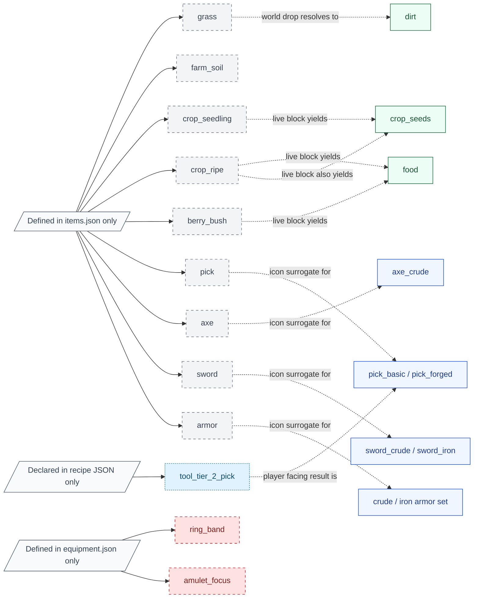

# Coheronia Item Graph

Generated: 2026-07-15

## Scope

- Audit target: `B:\dev\Coheronia\coheronia_fable_oneshot_repo` only.
- Grounded in `docs/ITEM_AND_RECIPE_MATRIX.md`, `data/items.json`, `data/equipment.json`, `data/recipes.json`, `data/blocks.json`, plus the live consumers in `scripts/player/player.gd`, `scripts/settlement/town_hall.gd`, and `scripts/ui/hud.gd`.
- The live graph below focuses on gameplay-facing acquisition and crafting flow.
- Town Hall recipes and station recipes consume Town Hall stockpile inputs in live play; the graph shows the dependency flow directly item-to-recipe for readability.
- The self-identity hand recipes `craft_wood_block` and `craft_stone_block` are intentionally omitted from the graph because they do not change the item id.

## Live Item Graph

```mermaid
flowchart LR
  classDef source fill:#f8fafc,stroke:#475569,color:#334155;
  classDef live fill:#ecfdf5,stroke:#166534,color:#14532d;
  classDef gear fill:#eff6ff,stroke:#1d4ed8,color:#1e3a8a;
  classDef recipe fill:#fff7ed,stroke:#c2410c,color:#9a3412;
  classDef station fill:#fef3c7,stroke:#b45309,color:#92400e;

  subgraph src["Starts and live sources"]
    direction TB
    start_h[/Homesteader start/]
    start_p[/Prospector start/]
    start_d[/Default character gear/]
    blk_dirt[/Dirt or Grass drop/]
    blk_wood[/Wood or Tree Trunk drop/]
    blk_stone[/Stone drop/]
    blk_coal[/Coal Seam drop/]
    blk_copper[/Copper Ore drop/]
    blk_tin[/Tin Ore drop/]
    blk_ore[/Deep Ore drop/]
    blk_iron[/Iron Ore drop/]
    blk_silver[/Silver Ore drop/]
    blk_crystal[/Raw Crystal drop/]
    blk_seedling[/Sprouting Crop drop/]
    blk_ripe[/Ripe Crop drop/]
    blk_bush[/Berry Bush drop/]
    blk_torch[/Torch block drop/]
    blk_lantern[/Lantern block drop/]
    en_slime[/Surface Slime/]
    en_thornrat[/Thornrat/]
    en_crawler[/Cave Crawler/]
    en_tick[/Ore Tick/]
    en_raider[/Raider Basic/]
    en_torchbearer[/Raider Torchbearer/]
  end

  subgraph items["Live inventory items"]
    direction TB
    i_dirt["dirt"]
    i_wood["wood"]
    i_stone["stone"]
    i_torch["torch"]
    i_food["food"]
    i_crop_seeds["crop_seeds"]
    i_lantern["lantern"]
    i_coal["coal"]
    i_copper_ore["copper_ore"]
    i_tin_ore["tin_ore"]
    i_ore["ore"]
    i_iron_ore["iron_ore"]
    i_silver_ore["silver_ore"]
    i_crystal["crystal"]
    i_copper_ingot["copper_ingot"]
    i_tin_ingot["tin_ingot"]
    i_iron_ingot["iron_ingot"]
    i_silver_ingot["silver_ingot"]
    i_bronze_ingot["bronze_ingot"]
    i_slime_gel["slime_gel"]
    i_wet_fiber["wet_fiber"]
    i_tiny_core["tiny_core"]
    i_meat["meat"]
    i_thorn_quill["thorn_quill"]
    i_hide_scrap["hide_scrap"]
    i_chitin["chitin"]
    i_silk["silk"]
    i_eyes["eyes"]
    i_ore_flecks["ore_flecks"]
    i_shell["shell"]
    i_coins["coins"]
    i_scrap_weapons["scrap_weapons"]
    i_oil_rags["oil_rags"]
    i_torch_heads["torch_heads"]
  end

  subgraph craft["Crafting and stations"]
    direction TB
    hand["Hand crafting"]
    town["Town Hall"]
    st_workbench["Workbench"]
    st_furnace["Furnace"]
    st_anvil["Anvil"]
    r_torch{{craft_torch}}
    r_seeds{{craft_seeds}}
    r_lantern{{craft_lantern}}
    r_pick{{basic_pick_upgrade}}
    r_axe{{craft_axe}}
    r_sword{{craft_sword}}
    r_armor{{craft_armor_set}}
    r_bundle{{workbench_torch_bundle}}
    r_smelt_copper{{smelt_copper}}
    r_smelt_tin{{smelt_tin}}
    r_smelt_iron{{smelt_iron}}
    r_smelt_silver{{smelt_silver}}
    r_bronze{{alloy_bronze}}
    r_iron_sword{{anvil_iron_sword}}
    r_iron_armor{{anvil_iron_armor}}
  end

  subgraph gear["Live equipment"]
    direction TB
    g_pick_basic["pick_basic"]
    g_pick_forged["pick_forged"]
    g_axe_crude["axe_crude"]
    g_sword_crude["sword_crude"]
    g_helmet_crude["helmet_crude"]
    g_torso_crude["torso_crude"]
    g_feet_crude["feet_crude"]
    g_sword_iron["sword_iron"]
    g_helmet_iron["helmet_iron"]
    g_torso_iron["torso_iron"]
    g_feet_iron["feet_iron"]
  end

  start_h --> i_dirt
  start_h --> i_wood
  start_p --> i_stone
  start_p --> i_torch
  start_d --> g_pick_basic

  blk_dirt --> i_dirt
  blk_wood --> i_wood
  blk_stone --> i_stone
  blk_coal --> i_coal
  blk_copper --> i_copper_ore
  blk_tin --> i_tin_ore
  blk_ore --> i_ore
  blk_iron --> i_iron_ore
  blk_silver --> i_silver_ore
  blk_crystal --> i_crystal
  blk_seedling --> i_crop_seeds
  blk_ripe --> i_food
  blk_ripe --> i_crop_seeds
  blk_bush --> i_food
  blk_torch --> i_torch
  blk_lantern --> i_lantern

  en_slime --> i_slime_gel
  en_slime --> i_wet_fiber
  en_slime --> i_tiny_core
  en_thornrat --> i_meat
  en_thornrat --> i_thorn_quill
  en_thornrat --> i_hide_scrap
  en_crawler --> i_chitin
  en_crawler --> i_silk
  en_crawler --> i_eyes
  en_tick --> i_ore_flecks
  en_tick --> i_shell
  en_raider --> i_coins
  en_raider --> i_scrap_weapons
  en_torchbearer --> i_oil_rags
  en_torchbearer --> i_torch_heads

  hand --> r_torch
  hand --> r_seeds
  town --> r_lantern
  town --> r_pick
  town --> r_axe
  town --> r_sword
  town --> r_armor
  st_workbench --> r_bundle
  st_furnace --> r_smelt_copper
  st_furnace --> r_smelt_tin
  st_furnace --> r_smelt_iron
  st_furnace --> r_smelt_silver
  st_furnace --> r_bronze
  st_anvil --> r_iron_sword
  st_anvil --> r_iron_armor

  i_wood -- x1 --> r_torch
  i_stone -- x1 --> r_torch
  r_torch -- x3 --> i_torch

  i_food -- x1 --> r_seeds
  r_seeds -- x2 --> i_crop_seeds

  i_ore -- x2 --> r_lantern
  i_wood -- x1 --> r_lantern
  r_lantern -- x1 --> i_lantern

  g_pick_basic -. upgraded by .-> r_pick
  i_wood -- x3 --> r_pick
  i_stone -- x5 --> r_pick
  r_pick --> g_pick_forged

  i_wood -- x4 --> r_axe
  i_stone -- x2 --> r_axe
  r_axe --> g_axe_crude

  i_wood -- x2 --> r_sword
  i_stone -- x3 --> r_sword
  r_sword --> g_sword_crude

  i_wood -- x6 --> r_armor
  i_stone -- x4 --> r_armor
  r_armor --> g_helmet_crude
  r_armor --> g_torso_crude
  r_armor --> g_feet_crude

  i_wood -- x12 --> st_workbench
  i_stone -- x6 --> st_workbench
  st_workbench -. prereq .-> st_furnace
  i_stone -- x16 --> st_furnace
  i_coal -- x4 --> st_furnace
  st_furnace -. prereq .-> st_anvil
  i_stone -- x10 --> st_anvil
  i_iron_ingot -- x3 --> st_anvil

  i_wood -- x2 --> r_bundle
  i_coal -- x1 --> r_bundle
  r_bundle -- x6 --> i_torch

  i_copper_ore -- x2 --> r_smelt_copper
  i_coal -- x1 --> r_smelt_copper
  r_smelt_copper -- x1 --> i_copper_ingot

  i_tin_ore -- x2 --> r_smelt_tin
  i_coal -- x1 --> r_smelt_tin
  r_smelt_tin -- x1 --> i_tin_ingot

  i_iron_ore -- x2 --> r_smelt_iron
  i_coal -- x1 --> r_smelt_iron
  r_smelt_iron -- x1 --> i_iron_ingot

  i_silver_ore -- x2 --> r_smelt_silver
  i_coal -- x1 --> r_smelt_silver
  r_smelt_silver -- x1 --> i_silver_ingot

  i_copper_ingot -- x1 --> r_bronze
  i_tin_ingot -- x1 --> r_bronze
  i_coal -- x1 --> r_bronze
  r_bronze -- x2 --> i_bronze_ingot

  i_iron_ingot -- x3 --> r_iron_sword
  r_iron_sword --> g_sword_iron

  i_iron_ingot -- x5 --> r_iron_armor
  r_iron_armor --> g_helmet_iron
  r_iron_armor --> g_torso_iron
  r_iron_armor --> g_feet_iron

  class start_h,start_p,start_d,blk_dirt,blk_wood,blk_stone,blk_coal,blk_copper,blk_tin,blk_ore,blk_iron,blk_silver,blk_crystal,blk_seedling,blk_ripe,blk_bush,blk_torch,blk_lantern,en_slime,en_thornrat,en_crawler,en_tick,en_raider,en_torchbearer source;
  class i_dirt,i_wood,i_stone,i_torch,i_food,i_crop_seeds,i_lantern,i_coal,i_copper_ore,i_tin_ore,i_ore,i_iron_ore,i_silver_ore,i_crystal,i_copper_ingot,i_tin_ingot,i_iron_ingot,i_silver_ingot,i_bronze_ingot,i_slime_gel,i_wet_fiber,i_tiny_core,i_meat,i_thorn_quill,i_hide_scrap,i_chitin,i_silk,i_eyes,i_ore_flecks,i_shell,i_coins,i_scrap_weapons,i_oil_rags,i_torch_heads live;
  class hand,town,st_workbench,st_furnace,st_anvil station;
  class r_torch,r_seeds,r_lantern,r_pick,r_axe,r_sword,r_armor,r_bundle,r_smelt_copper,r_smelt_tin,r_smelt_iron,r_smelt_silver,r_bronze,r_iron_sword,r_iron_armor recipe;
  class g_pick_basic,g_pick_forged,g_axe_crude,g_sword_crude,g_helmet_crude,g_torso_crude,g_feet_crude,g_sword_iron,g_helmet_iron,g_torso_iron,g_feet_iron gear;
```

## Non-live Status Graph

## Label Matrix

| Node | Status label | Why it is labeled this way | Closest live counterpart or outcome | Notes |
|---|---|---|---|---|
| `grass` | source-only | Inventory metadata exists, but the live grass block drops `dirt` instead of a `grass` item. | `dirt` | World block exists; backpack item does not. |
| `farm_soil` | source-only | Tilled-soil block state exists in the world, but no live inventory grant produces `farm_soil` as an item. | none | World-state only right now. |
| `crop_seedling` | source-only | Crop growth stage exists as a world block state, but inventory does not receive `crop_seedling`. | `crop_seeds` | The live seedling block drops seeds. |
| `crop_ripe` | source-only | Ripe crop is a world state, not a retained inventory item. | `food`, `crop_seeds` | Harvest flow resolves to outputs instead of keeping `crop_ripe`. |
| `berry_bush` | source-only | Berry bush exists as a world block, but the harvest result is `food`, not a bush item. | `food` | Preferred tool is axe in block data. |
| `pick` | source-only | Generic forge icon / metadata id, not an actual equipped gear id. | `pick_basic`, `pick_forged` | Used as a representational surface only. |
| `axe` | source-only | Generic forge icon / metadata id, not an actual equipped gear id. | `axe_crude` | Used as a representational surface only. |
| `sword` | source-only | Generic forge icon / metadata id, not an actual equipped gear id. | `sword_crude`, `sword_iron` | Used as a representational surface only. |
| `armor` | source-only | Generic forge icon / metadata id, not the wearable armor-piece ids. | `helmet_crude`, `torso_crude`, `feet_crude`, `helmet_iron`, `torso_iron`, `feet_iron` | Used as a representational surface only. |
| `ring_band` | dead | Real equipment definition with no current acquisition path. | none | Present for schema/smoke coverage only. |
| `amulet_focus` | dead | Real equipment definition with code support, but no live acquisition path. | none | Explicitly not acquirable in play today. |
| `tool_tier_2_pick` | internal | Recipe JSON output token for `basic_pick_upgrade`; the live gameplay result is the upgraded equipped pick state. | `pick_forged` | Internal bridge token, not a player-facing inventory item. |

## Notes

- 
- 
- 
