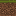
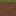
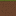
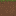

# Grass

Generated: 2026-07-21

> `Block` page.

| Field | Value |
|---|---|
| ID | `grass` |
| Page type | Block |
| Display name | Grass |
| Hardness | 0.35 |
| Required tool tier | 0 |
| Preferred tool | none |
| Placeable | False |
| Solid | True |
| Blocks light | True |
| Emits light | False |
| Light radius | 0 |
| Settlement tags | surface |
| Image path | `art/generated/blocks/grass.png` |
| Visual family | 1 canonical image + 3 variants |
| Fallback / placeholder | Generated block texture fallback when authored art is absent. |

## Summary

Grass is a current block definition loaded from `data/blocks.json`.

## Visual Family

### Block art and variants

| Asset id | Role | File |
|---|---|---|
| `grass` | Canonical image | `../../../art/generated/blocks/grass.png` |
| `grass_01` | Variant 1 | `../../../art/generated/blocks/grass_01.png` |
| `grass_02` | Variant 2 | `../../../art/generated/blocks/grass_02.png` |
| `grass_03` | Variant 3 | `../../../art/generated/blocks/grass_03.png` |

## Drops

| Drop | Quantity | Notes |
|---|---|---|
| [Dirt](../items/dirt.md) | 1 | Current drop result. |

## Related Pages

- [Blocks](../blocks.md)
- [Wiki Overview](../wiki.md)
- [Grass](../items/grass.md)
