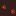
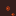

# Lava

Generated from repo data by `scripts/wiki/generate_wiki.py` (see git history for dates).

> `Block` page.

| Field | Value |
|---|---|
| ID | `lava` |
| Page type | Block |
| Display name | Lava |
| Hardness | 0.0 |
| Required tool tier | 999 |
| Preferred tool | none |
| Placeable | False |
| Solid | False |
| Blocks light | False |
| Emits light | True |
| Light radius | 4 |
| Settlement tags | none |
| Image path | `art/generated/blocks/lava.png` |
| Visual family | 1 canonical image + 3 variants |
| Fallback / placeholder | Generated block texture fallback when authored art is absent. |

## Summary

Lava is a current block definition loaded from `data/blocks.json`.

## Visual Family

### Block art and variants

| Asset id | Role | File |
|---|---|---|
| `lava` | Canonical image | `../../../art/generated/blocks/lava.png` |
| `lava_01` | Variant 1 | `../../../art/generated/blocks/lava_01.png` |
| `lava_02` | Variant 2 | `../../../art/generated/blocks/lava_02.png` |
| `lava_03` | Variant 3 | `../../../art/generated/blocks/lava_03.png` |

## Drops

This block does not currently drop carried items.

## Related Pages

- [Blocks](../blocks.md)
- [Wiki Overview](../wiki.md)
