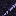
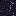
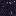

# Obsidian

Generated from repo data by `scripts/wiki/generate_wiki.py` (see git history for dates).

> `Block` page.

| Field | Value |
|---|---|
| ID | `obsidian` |
| Page type | Block |
| Display name | Obsidian |
| Hardness | 3.6 |
| Required tool tier | 2 |
| Preferred tool | pick |
| Placeable | True |
| Solid | True |
| Blocks light | True |
| Emits light | False |
| Light radius | 0 |
| Settlement tags | structure, defense |
| Image path | `art/generated/blocks/obsidian.png` |
| Visual family | 1 canonical image + 6 variants |
| Fallback / placeholder | Generated block texture fallback when authored art is absent. |

## Summary

Obsidian is a current block definition loaded from `data/blocks.json`.

## Visual Family

### Block art and variants

| Asset id | Role | File |
|---|---|---|
| `obsidian` | Canonical image | `../../../art/generated/blocks/obsidian.png` |
| `obsidian_01` | Variant 1 | `../../../art/generated/blocks/obsidian_01.png` |
| `obsidian_02` | Variant 2 | `../../../art/generated/blocks/obsidian_02.png` |
| `obsidian_03` | Variant 3 | `../../../art/generated/blocks/obsidian_03.png` |
| `obsidian_04` | Variant 4 | `../../../art/generated/blocks/obsidian_04.png` |
| `obsidian_05` | Variant 5 | `../../../art/generated/blocks/obsidian_05.png` |
| `obsidian_06` | Variant 6 | `../../../art/generated/blocks/obsidian_06.png` |

## Drops

| Drop | Quantity | Notes |
|---|---|---|
| [Obsidian](../items/obsidian.md) | 1 | Current drop result. |

## Related Pages

- [Blocks](../blocks.md)
- [Wiki Overview](../wiki.md)
- [Obsidian](../items/obsidian.md)
