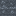

# Silver Ore

Generated: 2026-07-15

> `Block` page.

| Field | Value |
|---|---|
| ID | `silver_ore` |
| Page type | Block |
| Display name | Silver Ore |
| Hardness | 1.9 |
| Required tool tier | 2 |
| Preferred tool | pick |
| Placeable | False |
| Solid | True |
| Blocks light | True |
| Emits light | False |
| Light radius | 0 |
| Settlement tags | progression |
| Image path | `art/generated/blocks/silver_ore.png` |
| Visual family | 1 canonical image + 3 variants |
| Fallback / placeholder | Generated block texture fallback when authored art is absent. |

## Summary

Silver Ore is a current block definition loaded from `data/blocks.json`.

## Visual Family

### Block art and variants

| Asset id | Role | File |
|---|---|---|
| `silver_ore` | Canonical image | `../../../art/generated/blocks/silver_ore.png` |
| `silver_ore_01` | Variant 1 | `../../../art/generated/blocks/silver_ore_01.png` |
| `silver_ore_02` | Variant 2 | `../../../art/generated/blocks/silver_ore_02.png` |
| `silver_ore_03` | Variant 3 | `../../../art/generated/blocks/silver_ore_03.png` |

## Drops

| Drop | Quantity | Notes |
|---|---|---|
| [Silver Ore](../items/silver_ore.md) | 1 | Current drop result. |

## Related Pages

- [Blocks](../blocks.md)
- [Wiki Overview](../wiki.md)
- [Silver Ore](../items/silver_ore.md)
