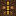

# Town Hall Core

Generated: 2026-07-21

> `Block` page.

| Field | Value |
|---|---|
| ID | `town_hall_core` |
| Page type | Block |
| Display name | Town Hall Core |
| Hardness | 9999.0 |
| Required tool tier | 999 |
| Preferred tool | none |
| Placeable | False |
| Solid | True |
| Blocks light | True |
| Emits light | False |
| Light radius | 0 |
| Settlement tags | settlement_anchor, protected |
| Image path | `art/generated/blocks/town_hall_core.png` |
| Visual family | 1 canonical image |
| Fallback / placeholder | Generated block texture fallback when authored art is absent. |

## Summary

Town Hall Core is a current block definition loaded from `data/blocks.json`.

## Visual Family

### Block art and variants

| Asset id | Role | File |
|---|---|---|
| `town_hall_core` | Canonical image | `../../../art/generated/blocks/town_hall_core.png` |

## Drops

This block does not currently drop carried items.

## Related Pages

- [Blocks](../blocks.md)
- [Wiki Overview](../wiki.md)
