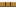

# Wooden Platform

Generated from repo data by `scripts/wiki/generate_wiki.py` (see git history for dates).

> `Block` page.

| Field | Value |
|---|---|
| ID | `wood_platform` |
| Page type | Block |
| Display name | Wooden Platform |
| Hardness | 0.4 |
| Required tool tier | 0 |
| Preferred tool | axe |
| Placeable | True |
| Solid | False |
| Blocks light | False |
| Emits light | False |
| Light radius | 0 |
| Settlement tags | none |
| Image path | `art/generated/blocks/wood_platform.png` |
| Visual family | 1 canonical image |
| Fallback / placeholder | Generated block texture fallback when authored art is absent. |

## Summary

Wooden Platform is a current block definition loaded from `data/blocks.json`.

## Visual Family

### Block art and variants

| Asset id | Role | File |
|---|---|---|
| `wood_platform` | Canonical image | `../../../art/generated/blocks/wood_platform.png` |

## Drops

| Drop | Quantity | Notes |
|---|---|---|
| [Wood Platform](../items/wood_platform.md) | 1 | Current drop result. |

## Related Pages

- [Blocks](../blocks.md)
- [Wiki Overview](../wiki.md)
- [Wooden Platform](../items/wood_platform.md)
