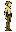
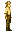
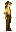
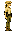

# Elf

Generated from repo data by `scripts/wiki/generate_wiki.py` (see git history for dates).

> `Ancestry` page. Current status: `live`.

| Field | Value |
|---|---|
| ID | `elf` |
| Page type | Ancestry |
| Status | live |
| Implementation phase | B |
| Implementation priority | 3 |
| Spawn band | surface |
| Preferred biomes | forest, ancient_forest, riverlands |
| Description | Forest-keepers who guided early Coheronia's growth through harmony with the land. |
| Visual families | Masculine: 1 canonical image + 2 variants; Feminine: 1 canonical image + 2 variants |

## Summary

Elf is a planned ancestry definition loaded from `data/ancestries.json`.

## Body Art Reference

This ancestry currently maps to live player body art, so the current wiki mirrors those authored visuals here.

### Masculine body (elf)

| Asset id | Role | File |
|---|---|---|
| `elf` | Canonical image | `../../../../art/generated/players/elf.png` |
| `elf_01` | Variant 1 | `../../../../art/generated/players/elf_01.png` |
| `elf_02` | Variant 2 | `../../../../art/generated/players/elf_02.png` |

### Feminine body (elf_female)

| Asset id | Role | File |
|---|---|---|
| `elf_female` | Canonical image | `../../../../art/generated/players/elf_female.png` |
| `elf_female_01` | Variant 1 | `../../../../art/generated/players/elf_female_01.png` |
| `elf_female_02` | Variant 2 | `../../../../art/generated/players/elf_female_02.png` |

## Effects

| Bucket | Effect | Value |
|---|---|---|
| player_effects | jump_bonus | 0.15 |
| player_effects | move_speed_mult | 1.08 |
| player_effects | attunement_bonus | 8 |
| player_effects | stone_ore_mining_mult | 0.85 |
| player_effects | notes | ['Jumps 15% higher', 'Moves 8% faster', 'Higher maximum Attunement', 'Mines stone and ore 15% slower'] |
| settlement_effects | tree_recovery_mult | 1.1 |
| settlement_effects | animal_aggression_reduction | 0.8 |
| settlement_effects | forest_shelter_coherence_bonus | 1.05 |
| settlement_effects | notes | ['stone-heavy industry adds more load'] |

## Related Pages

- [Character Types](../../character_types.md)
