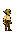
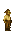
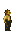
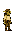
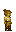
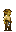

# Goblin

Generated: 2026-07-15

> `Ancestry` page. Current status: `planned`.

| Field | Value |
|---|---|
| ID | `goblin` |
| Page type | Ancestry |
| Status | planned |
| Implementation phase | B |
| Implementation priority | 4 |
| Spawn band | surface_shallow |
| Preferred biomes | surface_ruins, early_caves, hills |
| Description | Resourceful scavengers who turned Coheronia's ruins into workshops and traps. |
| Visual families | Default: 1 canonical image + 2 variants; Female: 1 canonical image + 2 variants |

## Summary

Goblin is a validated ancestry definition loaded from `data/ancestries.json`. The matching species is live/playable through `data/character_data.json`; expanded ancestry-system fields remain planned.

## Body Art Reference

This ancestry currently maps to live player body art, so the current wiki mirrors those authored visuals here.

### Default body (goblin)

| Asset id | Role | File |
|---|---|---|
| `goblin` | Canonical image | `../../../../art/generated/players/goblin.png` |
| `goblin_01` | Variant 1 | `../../../../art/generated/players/goblin_01.png` |
| `goblin_02` | Variant 2 | `../../../../art/generated/players/goblin_02.png` |

### Female body (goblin_female)

| Asset id | Role | File |
|---|---|---|
| `goblin_female` | Canonical image | `../../../../art/generated/players/goblin_female.png` |
| `goblin_female_01` | Variant 1 | `../../../../art/generated/players/goblin_female_01.png` |
| `goblin_female_02` | Variant 2 | `../../../../art/generated/players/goblin_female_02.png` |

## Effects

| Bucket | Effect | Value |
|---|---|---|
| player_effects | hitbox_reduction | 0.7 |
| player_effects | trap_cost_reduction | 0.7 |
| player_effects | material_recovery_chance | 0.25 |
| player_effects | health_reduction | 0.8 |
| player_effects | notes | ['smaller hitbox', 'cheaper traps', 'material recovery chance', 'lower health'] |
| settlement_effects | repair_cost_reduction | 0.7 |
| settlement_effects | trap_cost_reduction_settlement | 0.7 |
| settlement_effects | salvage_resilience_bonus | 1.1 |
| settlement_effects | baseline_coherence_penalty | -5 |
| settlement_effects | notes | ['lower baseline coherence/trust', 'ruins become valuable'] |

## Related Pages

- [Character Types](../../character_types.md)
