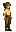

# Human

Generated: 2026-07-21

> `Ancestry` page. Current status: `planned`.

| Field | Value |
|---|---|
| ID | `human` |
| Page type | Ancestry |
| Status | planned |
| Implementation phase | B |
| Implementation priority | 1 |
| Spawn band | surface |
| Preferred biomes | plains, forest, riverlands, hills |
| Description | Coheronia's founding settlers, known for their adaptability and talent for civic organisation. |
| Visual families | Masculine: 1 canonical image + 2 variants; Feminine: 1 canonical image + 2 variants |

## Summary

Human is a planned ancestry definition loaded from `data/ancestries.json`.

## Body Art Reference

This ancestry currently maps to live player body art, so the current wiki mirrors those authored visuals here.

### Masculine body (human)

| Asset id | Role | File |
|---|---|---|
| `human` | Canonical image | `../../../../art/generated/players/human.png` |
| `human_01` | Variant 1 | `../../../../art/generated/players/human_01.png` |
| `human_02` | Variant 2 | `../../../../art/generated/players/human_02.png` |

### Feminine body (human_female)

| Asset id | Role | File |
|---|---|---|
| `human_female` | Canonical image | `../../../../art/generated/players/human_female.png` |
| `human_female_01` | Variant 1 | `../../../../art/generated/players/human_female_01.png` |
| `human_female_02` | Variant 2 | `../../../../art/generated/players/human_female_02.png` |

## Effects

| Bucket | Effect | Value |
|---|---|---|
| player_effects | learning_speed_mult | 1.05 |
| player_effects | diplomacy_mult | 1.05 |
| player_effects | notes | ['no terrain penalties'] |
| settlement_effects | civic_upgrade_speed_mult | 1.05 |
| settlement_effects | mixed_coherence_mult | 1.05 |
| settlement_effects | notes | ['better mixed-population coherence', 'no terrain specialization'] |

## Related Pages

- [Character Types](../../character_types.md)
