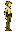
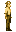
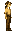
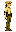
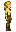
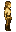

# Elf

Generated: 2026-07-21

> `Character species` page.

| Field | Value |
|---|---|
| ID | `elf` |
| Page type | Character species |
| Status | live |
| Description | Agile forest-dwellers attuned to nature. |
| Abilities | none |
| Weaknesses | none |
| Lifespan | standard |
| Visual families | Masculine: 1 canonical image + 2 variants; Feminine: 1 canonical image + 2 variants |

## Summary

Elf is a live playable species definition from `data/character_data.json`.

## Body Art

### Masculine body (elf)

| Asset id | Role | File |
|---|---|---|
| `elf` | Canonical image | `../../../../art/generated/players/elf.png` |
| `elf_01` | Variant 1 | `../../../../art/generated/players/elf_01.png` |
| `elf_02` | Variant 2 | `../../../../art/generated/players/elf_02.png` |

### Feminine body (elf_female)

| Asset id | Role | File |
|---|---|---|
| `elf_female` | Canonical image | `../../../../art/generated/players/elf_female.png` |
| `elf_female_01` | Variant 1 | `../../../../art/generated/players/elf_female_01.png` |
| `elf_female_02` | Variant 2 | `../../../../art/generated/players/elf_female_02.png` |

## Related Pages

- [Character Types](../../character_types.md)
- [Wiki Overview](../../wiki.md)
