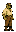
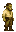
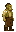
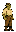
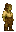
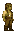

# Orc

Generated: 2026-07-15

> `Character species` page.

| Field | Value |
|---|---|
| ID | `orc` |
| Page type | Character species |
| Status | live |
| Description | Powerful and durable. High health, built for endurance. |
| Abilities | none |
| Weaknesses | none |
| Lifespan | standard |
| Visual families | Default: 1 canonical image + 2 variants; Female: 1 canonical image + 2 variants |

## Summary

Orc is a live playable species definition from `data/character_data.json`.

## Body Art

### Default body (orc)

| Asset id | Role | File |
|---|---|---|
| `orc` | Canonical image | `../../../../art/generated/players/orc.png` |
| `orc_01` | Variant 1 | `../../../../art/generated/players/orc_01.png` |
| `orc_02` | Variant 2 | `../../../../art/generated/players/orc_02.png` |

### Female body (orc_female)

| Asset id | Role | File |
|---|---|---|
| `orc_female` | Canonical image | `../../../../art/generated/players/orc_female.png` |
| `orc_female_01` | Variant 1 | `../../../../art/generated/players/orc_female_01.png` |
| `orc_female_02` | Variant 2 | `../../../../art/generated/players/orc_female_02.png` |

## Related Pages

- [Character Types](../../character_types.md)
- [Wiki Overview](../../wiki.md)
