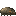
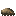
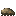
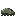

# Ore Tick

Generated: 2026-07-21

> `Enemy` page. Current status: `live`.

| Field | Value |
|---|---|
| ID | `ore_tick` |
| Page type | Enemy |
| Status | live |
| Family | underground |
| Location | Ore veins |
| Role | Ore pocket nuisance, provides metal residue |
| Image path | `art/generated/enemies/ore_tick.png` |
| Visual family | 1 canonical image + 3 variants |
| Fallback / placeholder | Code-drawn hostile shape fallback when authored sprite art is absent. |
| hp | 2 |
| contact_damage | 3 |
| speed | 30 |
| hp_mult | 0.7 |

## Summary

Ore Tick is a live enemy entry loaded from `data/enemies.json`.

## Visual Family

### Enemy art and variants

| Asset id | Role | File |
|---|---|---|
| `ore_tick` | Canonical image | `../../../art/generated/enemies/ore_tick.png` |
| `ore_tick_01` | Variant 1 | `../../../art/generated/enemies/ore_tick_01.png` |
| `ore_tick_02` | Variant 2 | `../../../art/generated/enemies/ore_tick_02.png` |
| `ore_tick_03` | Variant 3 | `../../../art/generated/enemies/ore_tick_03.png` |

## Drops

| Drop | Chance | Notes |
|---|---|---|
| [Ore Flecks](../items/ore_flecks.md) | 70% | Live drop table. |
| [Shell](../items/shell.md) | 30% | Live drop table. |

## Related Pages

- [Bestiary](../bestiary.md)
- [Items](../items.md)
- [Wiki Overview](../wiki.md)
