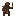
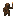
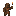
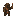

# Raider Torchbearer

Generated: 2026-07-21

> `Enemy` page. Current status: `live`.

| Field | Value |
|---|---|
| ID | `raider_torchbearer` |
| Page type | Enemy |
| Status | live |
| Family | raider |
| Location | Raider camps and raid waves |
| Role | Raider with fire attacks, supplies raid consumables |
| Image path | `art/generated/enemies/raider_torchbearer.png` |
| Visual family | 1 canonical image + 3 variants |
| Fallback / placeholder | Code-drawn hostile shape fallback when authored sprite art is absent. |
| hp | 4 |
| contact_damage | 10 |
| speed | 34 |
| hp_mult | 1.5 |

## Summary

Raider Torchbearer is a live enemy entry loaded from `data/enemies.json`.

## Visual Family

### Enemy art and variants

| Asset id | Role | File |
|---|---|---|
| `raider_torchbearer` | Canonical image | `../../../art/generated/enemies/raider_torchbearer.png` |
| `raider_torchbearer_01` | Variant 1 | `../../../art/generated/enemies/raider_torchbearer_01.png` |
| `raider_torchbearer_02` | Variant 2 | `../../../art/generated/enemies/raider_torchbearer_02.png` |
| `raider_torchbearer_03` | Variant 3 | `../../../art/generated/enemies/raider_torchbearer_03.png` |

## Drops

| Drop | Chance | Notes |
|---|---|---|
| [Oil Rags](../items/oil_rags.md) | 60% | Live drop table. |
| [Torch Heads](../items/torch_heads.md) | 40% | Live drop table. |

## Related Pages

- [Bestiary](../bestiary.md)
- [Items](../items.md)
- [Wiki Overview](../wiki.md)
