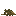
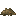
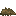
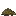

# Thornrat

Generated: 2026-07-21

> `Enemy` page. Current status: `live`.

| Field | Value |
|---|---|
| ID | `thornrat` |
| Page type | Enemy |
| Status | live |
| Family | surface |
| Location | Grasslands, farms |
| Role | Pressures early agriculture, provides leather materials |
| Image path | `art/generated/enemies/thornrat.png` |
| Visual family | 1 canonical image + 3 variants |
| Fallback / placeholder | Code-drawn hostile shape fallback when authored sprite art is absent. |
| hp | 2 |
| contact_damage | 4 |
| speed | 66 |
| hp_mult | 0.7 |

## Summary

Thornrat is a live enemy entry loaded from `data/enemies.json`.

## Visual Family

### Enemy art and variants

| Asset id | Role | File |
|---|---|---|
| `thornrat` | Canonical image | `../../../art/generated/enemies/thornrat.png` |
| `thornrat_01` | Variant 1 | `../../../art/generated/enemies/thornrat_01.png` |
| `thornrat_02` | Variant 2 | `../../../art/generated/enemies/thornrat_02.png` |
| `thornrat_03` | Variant 3 | `../../../art/generated/enemies/thornrat_03.png` |

## Drops

| Drop | Chance | Notes |
|---|---|---|
| [Meat](../items/meat.md) | 65% | Live drop table. |
| [Thorn Quill](../items/thorn_quill.md) | 30% | Live drop table. |
| [Hide Scrap](../items/hide_scrap.md) | 5% | Live drop table. |

## Related Pages

- [Bestiary](../bestiary.md)
- [Items](../items.md)
- [Wiki Overview](../wiki.md)
