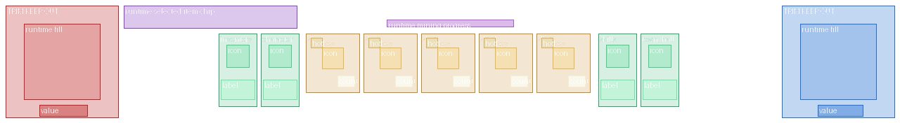
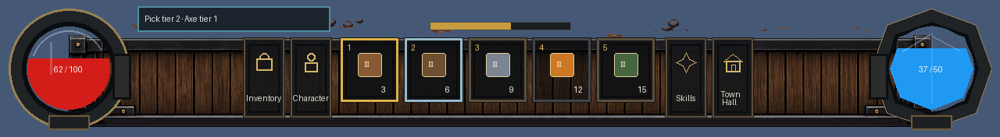

# HUD Asset Replacement Studio

Updated: 2026-07-16

This is the handoff page for replacing the primary bottom-dock artwork with ChatGPT or another image editor. The kit is intentionally drop-in: artwork can change without changing gameplay code when the filename, canvas, alpha, and layout contract stay intact.

## Is ChatGPT Image Editing Advisable?

Yes, for the painted chrome. Use image editing against the existing PNG rather than asking for a new full HUD composition. Work one asset or one tightly coupled state family at a time, validate every export, and judge it inside the running game at native size.

Do not delegate fill masks or runtime information as freeform art. Health, attunement, item icons, counts, hotkeys, selected state, cooldowns, and values remain runtime children. The two mask PNGs are geometry and should normally remain unchanged.

## Authoring And Runtime Boundary

| Purpose | Path |
|---|---|
| Drop edited source PNGs here | `art/source_templates/hud_dock/` |
| Runtime copies used by Godot | `art/generated/ui_painted/` |
| Geometry and required sizes | `art/source_templates/hud_dock/hud_dock_layout.json` |
| Safe validation and promotion | `scripts/art/sync_hud_kit.py` |
| Native composite and geometry-guide generator | `scripts/art/preview_hud_kit.py` |
| Placeholder builder; do not rerun over authored art | `scripts/art/build_hud_kit_placeholders.py` |

The source file is authoritative. Never paste a generated image directly into the runtime directory as the only copy.

When all 19 assets and the layout are valid, `hud.gd` selects this native kit first. The FQ-21 sliced four-piece band and FQ-19 modular dock remain fallback paths rather than current art targets.

## Contract V2: Replacement Versus Extension

The 19 named files are drop-in replacements: preserve filename, size, alpha contract, and occupied geometry, then no gameplay code changes are required.

Every static asset also supports an optional themed sibling named
`<base-stem>__<theme-id>.png`, for example `slot_normal__dwarf.png` or
`dock_foreground_trim__winter.png`. Theme ids use lowercase letters, digits,
and underscores. The HUD first reads the optional character
`hud_visual_theme`; when it is absent, the character species/ancestry id is
used. Resolution is asset-local: each valid themed PNG wins independently,
while a missing, unreadable, wrong-size, wrong-format, or validator-rejected
PNG falls back to the required base file. A partial theme pack is therefore
safe and never needs transparent placeholder files.

The base filenames remain the polished canonical/default appearance and must
always be present. Themes are presentation only: they never replace runtime
fills, values, labels, item icons, counts, hotkeys, cooldowns, selection data,
or control behavior. An explicit environmental or player-selected
`hud_visual_theme` can later override the ancestry default without changing
the asset contract.

Contract v2 also permits a genuinely new **non-interactive decorative layer**. Add its PNG to `asset_sizes` and `required_assets`, then declare its node name, full native rectangle, role, and integer z-index in `decorative_layers`. The runtime assembles those declared chrome layers without another custom `hud.gd` branch.

Interactive components are deliberately different. A new button, slot behavior, meter, or command still needs a registered runtime action and a documented semantic component. A PNG may supply appearance, never behavior.

The JSON also owns these internal runtime rectangles:

- `slot_content.icon_rect`, `count_rect`, and `hotkey_rect`
- `button_content.icon_rect` and `label_rect`
- vessel fill, glass, value-label, selected-item chip, and mining-progress rectangles

Do not move an art aperture or safe content window independently of these rectangles. If a deliberate geometry change is approved, update JSON and its tests in the same commit.

Two source-only review aids live beside the editable PNGs:

- `hud_dock_runtime_guide.png` is the color-coded runtime-content and trim keep-out template.
- `hud_dock_composite_preview.png` composites the current art with representative runtime fills, values, icons, counts, hotkeys, labels, selected/hover/disabled states, and progress.

Attach both aids to every image-editing task. They are never copied into the runtime directory.

The current real-game comparison capture is [`docs/screenshots/10_vessel_damage_states.png`](../screenshots/10_vessel_damage_states.png).

## Non-Negotiable Export Rules

- Keep the exact filename and exact pixel dimensions in the table below.
- Export a real RGBA PNG. Do not use JPEG, indexed color, or a flattened background.
- Keep the canvas size fixed. Do not crop, expand, rotate, or rescale the canvas.
- Use hard pixel edges and integer-aligned details. Avoid blur, glow haze, and fractional resampling.
- Preserve transparent space. Nothing may spill outside its intended canvas.
- Do not bake text, values, hotkeys, item images, counts, resource fill, selection, cooldowns, or tooltips into art.
- Review at 100 percent scale. A beautiful zoomed image can still be unreadable or noisy in the game.
- Keep visual hierarchy restrained: dark wood and iron support the content; brass is an accent, not a full outline on every object.
- Judge backplate and trim with every runtime child visible. Decorative marks must not visually imply or duplicate slots, buttons, vessels, labels, or progress bars.
- `dock_foreground_trim.png` must remain completely transparent inside both 160 x 160 vessel-frame keep-outs shown in `hud_dock_runtime_guide.png`; it renders above the vessel frames.
- The environmental trim must occupy between 0.2 and 5 percent of its canvas;
  this prevents both an accidentally empty export and a return to continuous,
  visually dominant rails.
- The environmental trim must sit on the upper backplate rail: its lowest
  occupied alpha row ends at native `y=50`. Nothing may be dressed along the
  lower rail.
- Slot and button state families must retain the exact occupied alpha silhouette of their normal state.
- Button glyphs must preserve at least two transparent pixels around the occupied icon silhouette.
- Theme variants must use `<base-stem>__<theme-id>.png`, match the base file's
  dimensions and alpha rules, and remain compatible with fallback members of
  their vessel/state family.

## File Contract

| Asset | Size | Static responsibility |
|---|---:|---|
| `dock_backplate.png` | 1280 x 176 | Dark structural bed behind all dock content |
| `dock_foreground_trim.png` | 1280 x 176 | Sparse environmental dressing and seam concealment above the structural backplate |
| `health_frame.png` | 160 x 160 | Left health-vessel chassis only |
| `health_glass_overlay.png` | 108 x 108 | Transparent glass highlights over health fill |
| `health_fill_mask.png` | 108 x 108 | Runtime clip geometry; normally do not edit |
| `attunement_frame.png` | 160 x 160 | Right attunement-vessel chassis only |
| `attunement_glass_overlay.png` | 108 x 108 | Transparent glass highlights over attunement fill |
| `attunement_fill_mask.png` | 108 x 108 | Runtime clip geometry; normally do not edit |
| `slot_normal.png` | 76 x 84 | Default hotbar slot frame |
| `slot_selected.png` | 76 x 84 | Selected variant of the same slot geometry |
| `slot_hover.png` | 76 x 84 | Hover variant of the same slot geometry |
| `slot_disabled.png` | 76 x 84 | Disabled variant of the same slot geometry |
| `button_frame_normal.png` | 54 x 104 | Default side-action button frame |
| `button_frame_hover.png` | 54 x 104 | Hover variant of the same button geometry |
| `button_frame_pressed.png` | 54 x 104 | Pressed variant of the same button geometry |
| `button_icon_inventory.png` | 32 x 32 | Inventory glyph only |
| `button_icon_character.png` | 32 x 32 | Character glyph only |
| `button_icon_skills.png` | 32 x 32 | Skills glyph only |
| `button_icon_town_hall.png` | 32 x 32 | Town Hall glyph only |

## Recommended Replacement Order

- Establish `dock_backplate.png` and `dock_foreground_trim.png` together.
- Refine the two vessel frames and their glass overlays; keep the existing masks unless the apertures deliberately change.
- Approve `slot_normal.png`, then derive selected, hover, and disabled from that exact base.
- Approve `button_frame_normal.png`, then derive hover and pressed from that exact base.
- Finish with the four button glyphs as a matched icon family.

This order keeps shared geometry and material language consistent. Do not run nineteen unrelated generations and expect their borders, lighting, and perspective to match.

## Standard ChatGPT Handoff

For each task, attach the current PNG, `hud_dock_runtime_guide.png`, `hud_dock_composite_preview.png`, and a current in-game screenshot. Tell ChatGPT to create genuinely new artwork **inside the attached asset canvas**, not to create a complete interface or imitate the placeholder styling. After it returns the image, verify the canvas and alpha before judging the style.

Use the asset-specific prompt below as the complete instruction for that task. If the result changes dimensions, loses transparency, adds labels, or changes the occupied geometry, reject it rather than repairing it by fractional scaling.

## Per-Asset ChatGPT Instructions

### Dock Backplate

> Create new artwork inside the attached `dock_backplate.png` canvas for Coheronia. Return exactly one 1280 x 176 RGBA PNG on the same canvas. Use the attached runtime guide and composite as immutable geometry references. Create a restrained original dark-fantasy pixel-art structural bed in blackened iron and dark smoked wood with sparse aged-brass accents. It must sit behind every other HUD layer and visually connect the left and right vessels without drawing or implying either vessel, any slot, any button, any icon, any label, any value, progress, or state. Preserve transparent areas outside the dock silhouette. Use hard integer-aligned pixel edges, quiet material variation, and no blur, bloom, outside shadow, canvas resize, named-game imitation, or painted runtime content.

### Dock Foreground Trim

> Create new artwork inside the attached `dock_foreground_trim.png` canvas for Coheronia. Return exactly one 1280 x 176 RGBA PNG on the same canvas. Use the attached runtime guide, current backplate, composite, and in-game screenshot as immutable geometry references. The backplate already owns the rails and structural hardware; do not redraw, trace, brighten, or duplicate them. Paint only sparse, low-contrast environmental dressing and seam concealment resting on the upper backplate rail. The lowest occupied alpha must end at native y=50; do not place dirt, rubble, moss, vines, or wear on the lower rail. Use a little dirt accumulation, two or three tiny stone/rubble clusters near major seams, occasional restrained moss or a short vine, and subtle wear near the outer dock edges. Both 160 x 160 vessel keep-outs must remain fully transparent. Nothing may obstruct a button, slot, label, icon, count, hotkey, value, or control silhouette. Most of the canvas must remain transparent. Avoid continuous lines, symmetrical decoration, saturated green, bright highlights, large foliage, repeated motifs, glow, blur, shadows outside the dressing, an opaque background, named-game imitation, or canvas resize.

### Health Frame

> Edit the attached `health_frame.png` for Coheronia. Return exactly one 160 x 160 RGBA PNG on the same canvas. Refine the left-side circular health-vessel chassis in blackened steel, dark iron, and restrained aged-brass accents. Preserve the central 108 x 108 fill aperture and the right-facing dock connection implied by the source. The aperture and exterior canvas must remain transparent. Draw only static frame hardware; do not draw red liquid, health text, numbers, glass shine, glow, or status effects. Use crisp pixel-art edges and do not resize or shift the vessel.

### Health Glass Overlay

> Edit the attached `health_glass_overlay.png` for Coheronia. Return exactly one 108 x 108 RGBA PNG. Create only subtle translucent glass reflections and a small amount of surface depth for the circular health aperture. The image must remain overwhelmingly transparent and must not contain a red fill, frame, border, text, numbers, glow cloud, or opaque background. Highlights must stay inside the aperture and remain readable over any runtime fill level. Use crisp controlled pixels without blur and keep the exact canvas.

### Health Fill Mask

> Treat the attached `health_fill_mask.png` as engineering geometry, not decorative art. Return exactly one 108 x 108 RGBA PNG only if a replacement is explicitly required. Preserve the same centered circular silhouette, using fully opaque white inside and fully transparent pixels outside, with no gray, feathering, texture, shadow, color, decoration, or canvas change. This file clips the runtime-driven health fill and should otherwise remain unchanged.

### Attunement Frame

> Edit the attached `attunement_frame.png` for Coheronia. Return exactly one 160 x 160 RGBA PNG on the same canvas. Refine the right-side faceted attunement-vessel chassis as a deliberate counterpart to the health frame, using the same blackened metal, aged-brass accent weight, lighting direction, and pixel density. Preserve the central 108 x 108 faceted fill aperture and the left-facing dock connection implied by the source. Keep the aperture and exterior canvas transparent. Do not draw blue liquid, text, numbers, glass shine, glow, or runtime effects. Do not resize or shift the vessel.

### Attunement Glass Overlay

> Edit the attached `attunement_glass_overlay.png` for Coheronia. Return exactly one 108 x 108 RGBA PNG. Create only subtle translucent glass facets and controlled highlights for the angular attunement aperture. The image must remain mostly transparent. Do not include blue fill, the outer frame, text, numbers, bloom, an opaque background, or details outside the aperture. Match the health glass lighting and pixel density while retaining a more crystalline faceted character. Keep the exact canvas and hard pixel-art edges.

### Attunement Fill Mask

> Treat the attached `attunement_fill_mask.png` as engineering geometry, not decorative art. Return exactly one 108 x 108 RGBA PNG only if a replacement is explicitly required. Preserve the same centered faceted silhouette, using fully opaque white inside and fully transparent pixels outside, with no gray, feathering, texture, shadow, color, decoration, or canvas change. This file clips the runtime-driven attunement fill and should otherwise remain unchanged.

### Normal Hotbar Slot

> Edit the attached `slot_normal.png` for Coheronia. Return exactly one 76 x 84 RGBA PNG on the same canvas. Create the approved default hotbar-slot frame with a quiet blackened-metal and dark-wood construction. Preserve a large clean interior window for runtime item art, count, and hotkey children. The outside silhouette and interior window placement must remain fixed so all five slots align without gaps or notches. Do not draw an item, count, hotkey, selection, cooldown, tooltip, or glow. Use restrained contrast and crisp pixel-art edges.

### Selected Hotbar Slot

> Edit the attached `slot_selected.png` using the approved `slot_normal.png` as the immutable geometry base. Return exactly one 76 x 84 RGBA PNG. Preserve every structural pixel and the same clean runtime-content window; add only a clear selected-state treatment through restrained warm brass, a focused inner highlight, or similarly compact emphasis. Do not make the frame thicker, change its silhouette, add an item, count, hotkey, cooldown, text, or large glow. The state must read at 100 percent scale without looking like a different slot design.

### Hover Hotbar Slot

> Edit the attached `slot_hover.png` using the approved `slot_normal.png` as the immutable geometry base. Return exactly one 76 x 84 RGBA PNG. Preserve every structural pixel and the runtime-content window; add only a subtle cool or neutral hover response that is visibly weaker than the selected state. Do not alter the silhouette, frame thickness, or interior geometry, and do not add an item, count, hotkey, tooltip, text, or glow cloud. Keep hard pixel edges and the exact canvas.

### Disabled Hotbar Slot

> Edit the attached `slot_disabled.png` using the approved `slot_normal.png` as the immutable geometry base. Return exactly one 76 x 84 RGBA PNG. Preserve all structural geometry and the content window while reducing contrast and saturation enough to communicate disabled state. Do not erase the frame, change its size, add an X, lock, item, count, hotkey, text, or opaque wash outside the slot. It must remain part of the same slot family and retain crisp pixel edges.

### Normal Action Button Frame

> Edit the attached `button_frame_normal.png` for Coheronia. Return exactly one 54 x 104 RGBA PNG on the same canvas. Create a compact vertical action-button chassis that belongs to the dock but reads as a complete button across its full hit area. Preserve a clean centered region for a 32 x 32 runtime icon and a lower label child. Do not draw the icon, label, hover, press, tooltip, or runtime state. Keep the outer silhouette, content alignment, and dimensions stable so Inventory, Character, Skills, and Town Hall share one frame.

### Hover Action Button Frame

> Edit the attached `button_frame_hover.png` using the approved `button_frame_normal.png` as the immutable geometry base. Return exactly one 54 x 104 RGBA PNG. Preserve every structural pixel and the full button silhouette; add a restrained hover highlight across the entire button, not only the icon area. Do not add an icon, text, tooltip, glow cloud, or change in dimensions. The response should be clear at 100 percent scale and visually weaker than the pressed state.

### Pressed Action Button Frame

> Edit the attached `button_frame_pressed.png` using the approved `button_frame_normal.png` as the immutable geometry base. Return exactly one 54 x 104 RGBA PNG. Preserve the exact silhouette and content regions; create a convincing pressed state through a compact inset, darker top edge, brighter lower edge, or similarly pixel-precise treatment across the whole button. Do not shift the eventual runtime icon or label, add text, draw an icon, or change the canvas.

### Inventory Button Icon

> Edit the attached `button_icon_inventory.png` as one member of a four-icon Coheronia HUD family. Return exactly one 32 x 32 RGBA PNG with a transparent background. Draw a simple readable inventory or satchel glyph in muted warm metal or parchment tones, using the same lighting, outline weight, and pixel density as the other three icons. Center it optically with safe transparent padding. Do not include a button frame, label, text, glow, shadow outside the glyph, or canvas resize.

### Character Button Icon

> Edit the attached `button_icon_character.png` as one member of a four-icon Coheronia HUD family. Return exactly one 32 x 32 RGBA PNG with a transparent background. Draw a simple readable character, helm, or bust glyph in the same muted warm palette, lighting, outline weight, and pixel density as the Inventory, Skills, and Town Hall glyphs. Center it optically with safe transparent padding. Do not include a button frame, label, text, glow, or canvas resize.

### Skills Button Icon

> Edit the attached `button_icon_skills.png` as one member of a four-icon Coheronia HUD family. Return exactly one 32 x 32 RGBA PNG with a transparent background. Draw a simple readable skill, spark, or constellation glyph in the same muted warm palette, lighting, outline weight, and pixel density as the other dock icons. Keep the silhouette compact and centered with safe transparent padding. Do not include a button frame, label, text, large magical glow, or canvas resize.

### Town Hall Button Icon

> Edit the attached `button_icon_town_hall.png` as one member of a four-icon Coheronia HUD family. Return exactly one 32 x 32 RGBA PNG with a transparent background. Draw a simple readable civic hall or peaked-roof glyph that echoes the in-world Town Hall without becoming a miniature screenshot. Match the Inventory, Character, and Skills icons in palette, lighting, outline weight, and pixel density. Center it with safe transparent padding. Do not include a button frame, label, text, glow, or canvas resize.

## Validation And Promotion Loop

Check one returned file before promoting it:

`python scripts/art/sync_hud_kit.py --check --asset dock_backplate.png`

The same command accepts a themed file, for example:

`python scripts/art/sync_hud_kit.py --check --asset dock_foreground_trim__forest.png`

If it passes, copy the validated source into the runtime directory:

`python scripts/art/sync_hud_kit.py --sync --asset dock_backplate.png`

For a completed family, omit `--asset` to check or sync the whole kit. Whole-kit
sync also removes stale themed runtime copies that no longer exist in the
authored source directory. The sync tool does not crop, rescale, repaint, or
repair an image. A contract failure must go back to the image-editing task.

Confirm that promoted runtime files exactly match their authored sources:

`python scripts/art/sync_hud_kit.py --verify-runtime`

Regenerate the native review aids:

`python scripts/art/preview_hud_kit.py`

After each coherent family, run the repository validator and inspect an in-game screenshot at the target window size. Run the full smoke suite before calling the HUD batch complete. Functional smoke does not replace visual review; both gates are required.

## Visual Review Checklist

- The dock occupies one intentional band and does not appear cut off at the bottom.
- The backplate is continuous behind the center controls; the trim has no slot-shaped notches.
- Health and attunement frames sit around their fills instead of appearing pasted over the dock.
- The two vessels feel related, while health remains round and attunement remains faceted.
- All five slot interiors align; selected, hover, and disabled states do not change geometry.
- Action hover and press treatments cover the entire button silhouette.
- Runtime icons, labels, hotkeys, counts, and values remain sharp and unobstructed.
- The command-center widget stays separate from the primary dock chrome.

## Related Pages

- [Wiki Overview](wiki.md)
- [Image Continuation](image_continuation.md)
- [UI Asset Gaps](../UI_ASSET_GAPS.md)
