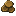

# Raider Coins

Generated: 2026-07-15

> `Item` page. Current status: `source-only`.

| Field | Value |
|---|---|
| ID | `coins` |
| Page type | Item |
| Current status | source-only |
| Storage | inventory |
| Player-facing? | Yes |
| Description | Worn coinage taken from raiders. |
| Status explanation | A live source exists, but the current game still lacks a meaningful downstream sink. |
| Image path | `art/generated/items/coins.png` |
| Fallback / placeholder | Generated 16x16 swatch via `BlockRegistry.item_icon()` if the canonical item icon is absent. |

## Summary

Raider Coins is live and obtainable, but it still ends in a source-only branch.

## Acquisition

| Source type | Source | Quantity / chance | Notes |
|---|---|---|---|
| Enemy drop | [Raider Basic](../enemies/raider_basic.md) | 75% drop chance | Live acquisition only if the enemy is live. |
| Enemy drop | [Hungry Deserter](../enemies/hungry_deserter.md) | 50% drop chance; planned only | Live acquisition only if the enemy is live. |
| Enemy drop | [False Taxman](../enemies/false_taxman.md) | 85% drop chance; planned only | Live acquisition only if the enemy is live. |

## Current Uses

No meaningful live downstream use is currently defined.

## Related Pages

- [Items](../items.md)
- [Wiki Overview](../wiki.md)
