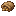

# Crop Seeds

Generated: 2026-07-21

> `Item` page. Current status: `complete`.

| Field | Value |
|---|---|
| ID | `crop_seeds` |
| Page type | Item |
| Current status | complete |
| Storage | inventory |
| Player-facing? | Yes |
| Description | Plant on tilled soil (G) to grow food. |
| Status explanation | A live source and a live downstream use both exist. |
| Image path | `art/generated/items/crop_seeds.png` |
| Fallback / placeholder | Generated 16x16 swatch via `BlockRegistry.item_icon()` if the canonical item icon is absent. |

## Summary

Crop Seeds is a live item with both acquisition and active use in the current build.

## Acquisition

| Source type | Source | Quantity / chance | Notes |
|---|---|---|---|
| Block drop | [Sprouting Crop](../blocks/crop_seedling.md) | 1x | Current block harvest result. |
| Block drop | [Ripe Crop](../blocks/crop_ripe.md) | 1x | Current block harvest result. |
| Recipe output | Crop Seeds | 2x at [Hand](../stations/hand.md) | Output route: inventory. |

## Current Uses

| Use type | Use | Quantity | Notes |
|---|---|---|---|
| Plant | Farming use | - | Plants on tilled soil. |

## Related Pages

- [Items](../items.md)
- [Wiki Overview](../wiki.md)

## Notes

- No additional manual notes.
