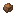

# Dirt

Generated: 2026-07-15

> `Item` page. Current status: `complete`.

| Field | Value |
|---|---|
| ID | `dirt` |
| Page type | Item |
| Current status | complete |
| Storage | inventory; stockpile input; world block |
| Player-facing? | Yes |
| Description | Soft ground. Quick to place, quick to mine. |
| Status explanation | A live source and a live downstream use both exist. |
| Image path | `art/generated/items/dirt.png` |
| Fallback / placeholder | Generated 16x16 swatch via `BlockRegistry.item_icon()` if the canonical item icon is absent. |

## Summary

Dirt is a live item with both acquisition and active use in the current build.

## Acquisition

| Source type | Source | Quantity / chance | Notes |
|---|---|---|---|
| Block drop | [Dirt](../blocks/dirt.md) | 1x | Current block harvest result. |
| Block drop | [Grass](../blocks/grass.md) | 1x | Current block harvest result. |
| Block drop | [Tilled Soil](../blocks/farm_soil.md) | 1x | Current block harvest result. |
| Starting role | [Homesteader](../characters/roles/homesteader.md) | 10x | Granted during character setup. |

## Current Uses

| Use type | Use | Quantity | Notes |
|---|---|---|---|
| Placement | World block placement | - | Placeable into the world as a block. |
| Stockpile | Town Hall deposit | - | Depositable into the Town Hall stockpile. |

## Related Pages

- [Items](../items.md)
- [Wiki Overview](../wiki.md)
- [Dirt](../blocks/dirt.md)

## Notes

- No additional manual notes.
