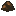

# Tilled Soil

Generated: 2026-07-15

> `Item` page. Current status: `source-only`.

| Field | Value |
|---|---|
| ID | `farm_soil` |
| Page type | Item |
| Current status | source-only |
| Storage | world block metadata |
| Player-facing? | World-only |
| Description | Tilled earth. Crops grow on it. |
| Status explanation | This id exists on the world-state side; mining or harvesting it resolves to other carried items instead of preserving this token in the backpack. |
| Image path | `art/generated/items/farm_soil.png` |
| Fallback / placeholder | Generated 16x16 swatch via `BlockRegistry.item_icon()` if the canonical item icon is absent. |

## Summary

Tilled Soil is a world-state item token, not a normal carried resource.

## Acquisition

No live acquisition route is currently defined.

## Current Uses

No meaningful live downstream use is currently defined.

## Related Pages

- [Items](../items.md)
- [Wiki Overview](../wiki.md)
- [Tilled Soil](../blocks/farm_soil.md)

## Notes

- Current runtime behavior resolves this token through the world block, not the backpack.
