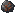

# Iron Ore

Generated: 2026-07-21

> `Item` page. Current status: `complete`.

| Field | Value |
|---|---|
| ID | `iron_ore` |
| Page type | Item |
| Current status | complete |
| Storage | inventory; stockpile input |
| Player-facing? | Yes |
| Description | A deeper ore. Needs a tier-2 pick. |
| Status explanation | A live source and a live downstream use both exist. |
| Image path | `art/generated/items/iron_ore.png` |
| Fallback / placeholder | Generated 16x16 swatch via `BlockRegistry.item_icon()` if the canonical item icon is absent. |

## Summary

Iron Ore is a live item with both acquisition and active use in the current build.

## Acquisition

| Source type | Source | Quantity / chance | Notes |
|---|---|---|---|
| Block drop | [Iron Ore](../blocks/iron_ore.md) | 1x | Current block harvest result. |

## Current Uses

| Use type | Use | Quantity | Notes |
|---|---|---|---|
| Recipe input | Smelt Iron | 2x at [Furnace](../stations/furnace.md) | Live crafting dependency. |
| Stockpile | Town Hall deposit | - | Depositable into the Town Hall stockpile. |

## Related Pages

- [Items](../items.md)
- [Wiki Overview](../wiki.md)
- [Iron Ore](../blocks/iron_ore.md)

## Notes

- No additional manual notes.
