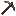

# Pick

Generated: 2026-07-15

> `Item` page. Current status: `source-only`.

| Field | Value |
|---|---|
| ID | `pick` |
| Page type | Item |
| Current status | source-only |
| Storage | UI surrogate icon |
| Player-facing? | UI-only |
| Description | Forge icon. |
| Status explanation | This id is used as a UI surrogate icon, mainly around Town Hall forge surfaces, rather than as real backpack or equipped gear. |
| Image path | `art/generated/items/pick.png` |
| Fallback / placeholder | Generated 16x16 swatch via `BlockRegistry.item_icon()` if the canonical item icon is absent. |

## Summary

Pick is a surrogate icon id used by the current UI rather than a real inventory or equipment entry.

## Acquisition

No live acquisition route is currently defined.

## Current Uses

No meaningful live downstream use is currently defined.

## Related Pages

- [Items](../items.md)
- [Wiki Overview](../wiki.md)

## Notes

- Current runtime behavior uses this id for UI display rather than for true character equipment.
