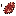

# Venison

Generated from repo data by `scripts/wiki/generate_wiki.py` (see git history for dates).

> `Item` page. Current status: `complete`.

| Field | Value |
|---|---|
| ID | `venison` |
| Page type | Item |
| Current status | complete |
| Storage | inventory |
| Player-facing? | Yes |
| Description | Rich game meat from a Hollow Stag. Cook one into premium food at the Town Hall. |
| Status explanation | A live source and a live downstream use both exist. |
| Image path | `art/generated/items/venison.png` |
| Fallback / placeholder | Generated 16x16 swatch via `BlockRegistry.item_icon()` if the canonical item icon is absent. |

## Summary

Venison is a live item with both acquisition and active use in the current build.

## Acquisition

| Source type | Source | Quantity / chance | Notes |
|---|---|---|---|
| Enemy drop | [Hollow Stag](../enemies/hollow_stag.md) | 90% drop chance | Live acquisition only if the enemy is live. |

## Current Uses

| Use type | Use | Quantity | Notes |
|---|---|---|---|
| Recipe input | Cook Venison | 1x at [Town Hall](../stations/town_hall.md) | Live crafting dependency. |

## Related Pages

- [Items](../items.md)
- [Wiki Overview](../wiki.md)

## Notes

- No additional manual notes.
